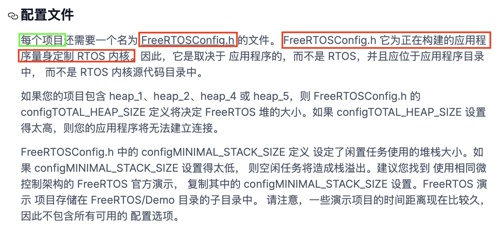

# freertos
开源、实时操作系统 免费开源 可裁剪 可移植 优先级不限 任务不限
支持抢占式、协程式、时间片流转任务调度
[freeRTOS官网](https://www.freertos.org/ "学习资料")

## 裸机系统
**裸机系统通常分为轮询系统和前后台系统**
  - 轮询系统：在裸机编程时 先初始化好相关硬件 然后让主程序在一个死循环中不断循环、顺序的做各种事  （轮询响应事件 轮询处理事件）
    
  - 前后台系统：在轮询的基础上加入中断 （实时响应事件 轮询处理事件）
    *  前台：中断服务程序接收异步中断 来通知后台 后台收到中断请求后进行处理
    *  后台：应用程序通常是一个无限循环 
    

## 多任务系统freeRTOS
多任务系统中 每个任务都是独立的 任务跟中断一样 也具有优先级 优先级高的任务会被优先执行
（实时响应事件 实时处理事件）


## freeRTOS基础知识
- **任务**
    在 FreeRTOS 中，任务（Task） 是系统调度的基本执行单元，可以理解为 独立的线程或轻量级进程。每个任务拥有自己的栈空间、程序计数器（PC）和状态，由 FreeRTOS 内核调度器管理，实现多任务并发执行（伪并行，单核 CPU 通过时间片轮转模拟并行）
- **任务调度简介**
    调度器就是使用相关的调度算法来决定当前需要执行哪个任务
    freeRTOS支持三种任务调度：
    * 抢占式调度    
            ==针对优先级不同的任务== 每个任务都有一个优先级 优先级高的任务可以抢占优先级低的任务
            优先级的数值越大 优先级越高
    * 时间片调度
            ==针对优先级相同的任务== 当多个任务的优先级相同时 任务调度器会在每一次系统时钟节拍到的时候切换任务 一个时间片大小 取决于滴答定时器中断频率
    * 协程式调度 
            （仅知道就行）当前执行任务将一直执行 高优先级任务不会抢占低优先级任务
- **任务状态**
    * 运行态 ：正在执行的任务 该任务就处于运行态 在stm32中 同一时间仅一个任务在执行
    * 就绪态 ：若该任务已经能够被执行 但当前还未被执行 那么该任务就处于就绪态
    * 阻塞态 ：如果一个任务因延时或等待外部事件发生 那么该任务就处于阻塞态
    * 挂起态 ：类似暂停 调用函数 `vTaskSuspen()` 进入挂起态 需要调用解挂函数 `vTaskResume()` 才可以进入就绪态

- **四种任务状态之间的转换图**
    
    这四种状态中 除了运行态 其他三种任务状态的任务都有对应的 ==任务状态列表==（非常重要‼️）
    * 就绪列表：`pxReadyTasksLists[x]` 其中x代表任务优先级数值 范围是：0～31 共32个 当列表的哪个置1 就代表所对应的优先级就绪了  
      相同优先级任务会连接在同一个就绪列表上 假设优先级都为1的话 那么就是连接在 pxReadyTasksLists[1]
    * 阻塞列表：`pxDelayedTaskList`
    * 挂起列表：`xSuspendedTaskList`

**调度器总是在处于就绪列表的任务中 选择具有最高优先级的任务执行**
    处于相同优先级的任务数量不限。如果 `configUSE_TIME_SLICING` 未经定义，或者如果 `configUSE_TIME_SLICING` 设置为 `1`，则具有相同优先级的若干就绪状态任务将 通过==时间切片轮询调度方案共享可用的处理时间==

**configUSE_TIME_SLICING:**
  1. 功能定义
    启用/禁用时间片轮转调度：
        当 `configUSE_TIME_SLICING` 设置为 1（默认值）时:
            FreeRTOS 会在 相同优先级的任务之间自动切换，
            每个任务运行固定的时间片（由 `configTICK_RATE_HZ` 定义的时间片长度）。
        当设置为 0 时:
            同级任务必须主动让出 CPU（通过 `taskYIELD()` 或阻塞操作），否则会一直占用 CPU。

  2. 系统节拍（Tick）：
    FreeRTOS 通过硬件定时器产生周期性中断（称为 Tick 中断），用于任务调度、延时管理等。
    `configTICK_RATE_HZ` 表示 每秒的 Tick 次数（单位：Hz）。
    Tick 周期（时间片长度） = 1 秒 / configTICK_RATE_HZ。
    假设 configTICK_RATE_HZ = 1000，Tick = 1/1000 = 0.001s = 1ms

  3. 时间片（Time Slice）：
    在启用时间片轮转 `（configUSE_TIME_SLICING=1）`时 每个同级任务每次最多运行一个 Tick 周期
    然后切换到下一个同级任务。

- **任务创建**
    调用 `xTaskCreate()` 或 `xTaskCreateStatic()`  动态/静态创建任务
    调用 `vTaskDelete()` 删除任务
    - **动态创建任务**
        任务的任务控制块及任务的栈空间所需内存 由FreeRTOS从自身管理的堆中分配

        ```c
        (1) xTaskCreate()
            BaseType_t xTaskCreate(
                TaskFunction_t pvTaskCode,      // 任务函数（如 void vTask(void *pvParams)）
                const char * const pcName,      // 任务名称（字符串，用于调试）
                configSTACK_DEPTH_TYPE usStackDepth, // 栈深度（单位：字，如 128=128*4字节）
                void *pvParameters,             // 传递给任务的参数（void* 类型）
                UBaseType_t uxPriority,         // 优先级（0~configMAX_PRIORITIES-1）
                TaskHandle_t *pxCreatedTask     // 任务句柄（可选，用于后续管理任务）
            );
        /*  
         *  返回值：
         *      pdPASS  -> 任务创建成功
         *      errCOULD_NOT_ALLOCATE_REQUIRED_MEMORY   --> 任务创建失败
         */
        ```

        ==动态创建任务流程：==
        [动态创建任务函数使用实例](/dynamicTaskCreateFunc/freertos-yz-38/User/freertos_demo.c)
        1. 将宏 `configSUPPORT_DYNAMIC_ALLOCATION` 配置为 `1`
        1. 定义函数入口参数
        3. 编写任务函数
        ***此函数创建的任务会立刻进入就绪态 由任务调度器调度运行***
        动态创建任务函数内部实现要点：
           - 申请堆栈内存 & 任务控制块内存
           - TCB 结构体成员赋值
           - 添加新任务到就绪列表中 
        ```c    
        TCB结构体成员介绍
            typedef struct tskTaskControlBlock {
                /*----------------------- 栈管理 -----------------------*/
                volatile StackType_t *pxTopOfStack;  // 当前栈顶指针（用于上下文切换）‼️
                StackType_t *pxStack;                // 栈的起始地址 ‼️
                UBaseType_t usStackDepth;            // 栈深度（单位：字）

                /*----------------------- 任务状态 ---------------------*/
                eTaskState eCurrentState;            // 任务状态（就绪、阻塞、挂起等）
                UBaseType_t uxPriority;              // 任务优先级（0最低） ‼️
                ListItem_t xStateListItem;           // 状态列表节点（挂载到就绪/阻塞列表）‼️

                /*----------------------- 调试与统计 -------------------*/
                char pcTaskName[configMAX_TASK_NAME_LEN]; // 任务名称（调试用） ‼️
                UBaseType_t uxCriticalNesting;       // 临界区嵌套计数
                TickType_t xTicksToDelay;            // 阻塞剩余时间（用于vTaskDelay）

                /*----------------------- 通信与同步 -------------------*/
                void *pvThreadLocalStorage;          // 线程本地存储指针（TLS）
                EventBits_t uxEventBits;             // 事件组标志位（用于事件驱动）
                QueueHandle_t xMsgQueue;             // 任务的消息队列

                ListItem_t xEventListItem;           // 事件列表项 ‼️


                #if (configUSE_TASK_NOTIFICATIONS == 1)
                    uint32_t ulNotifiedValue;        // 任务通知值
                #endif
            } tskTCB;
        ```    
  
    - **静态创建任务**
        任务的任务控制块及任务的栈空间所需内存 需用户自己分配
    ```c
        (2) xTaskCreateStatic()
            TaskHandle_t xTaskCreateStatic(
                TaskFunction_t pvTaskCode,
                const char * const pcName,
                uint32_t ulStackDepth,
                void *pvParameters,
                UBaseType_t uxPriority,
                StackType_t *pxStackBuffer,     // 用户提供的栈数组
                StaticTask_t *pxTaskBuffer      // 用户提供的任务控制块内存
            );
        /**
         * 返回值:
         *      NULL    -->     用户未提供相应内存 任务创建失败
         *      其他    -->     任务句柄 任务创建成功
        */
    ```

    ==静态创建任务流程：==
        [静态创建任务函数使用实例](/staticTaskCreateFunc/User/freertos_demo.c)
    1. 将宏 `configSUPPORT_STATIC_ALLOCATION` 配置为 `1`
    2. 定义空闲任务 & 定时器任务 的任务堆栈及TCB
    3. 实现两个接口函数
       - `vApplicationGetIdelTaskMemory()`
        *FreeRTOS 中的一个可选钩子函数，用于为 Idle 任务（空闲任务）提供自定义的内存分配。*
        ```c
            (1) 函数说明
            /*
                函数原型：
                    void vApplicationGetIdleTaskMemory( 
                        StaticTask_t **ppxIdleTaskTCBBuffer, 
                        StackType_t **ppxIdleTaskStackBuffer, 
                        uint32_t *pulIdleTaskStackSize );
                函数作用:
                    允许用户为 Idle 任务提供静态分配的内存，而不是使用 FreeRTOS 默认的动态内存分配
                    在内存受限的系统中避免使用动态内存分配
                    提供对 Idle 任务堆栈和任务控制块(TCB)的完全控制
                参数说明：
                    ppxIdleTaskTCBBuffer: 指向 StaticTask_t 类型指针的指针，用于返回 Idle 任务的 TCB（任务控制块）内存地址
                    ppxIdleTaskStackBuffer: 指向 StackType_t 类型指针的指针，用于返回 Idle 任务堆栈的内存地址
                    pulIdleTaskStackSize: 指向 uint32_t 的指针，用于返回 Idle 任务堆栈的大小（以字为单位） 通常使用 configMINIMAL_STACK_SIZE 作为参考

            */

            (2) 使用示例
            /* 定义 Idle 任务的内存 */
            static StaticTask_t xIdleTaskTCB;
            static StackType_t xIdleStack[configMINIMAL_STACK_SIZE];

            void vApplicationGetIdleTaskMemory( 
                StaticTask_t **ppxIdleTaskTCBBuffer, 
                StackType_t **ppxIdleTaskStackBuffer, 
                uint32_t *pulIdleTaskStackSize )
            {
                *ppxIdleTaskTCBBuffer = &xIdleTaskTCB;
                *ppxIdleTaskStackBuffer = xIdleStack;
                *pulIdleTaskStackSize = configMINIMAL_STACK_SIZE;
            }

        ```

       - `vApplicationGetTimerTaskMermory()`
        *FreeRTOS 中的一个可选钩子函数，用于为 Timer 服务任务（软件定时器服务任务）提供静态分配的内存。*
        ```c
            (1) 函数说明
            /*
                函数原型：
                  void vApplicationGetTimerTaskMemory( 
                    StaticTask_t **ppxTimerTaskTCBBuffer, 
                    StackType_t **ppxTimerTaskStackBuffer, 
                    uint32_t *pulTimerTaskStackSize );
                函数作用:
                    允许用户为 Timer 服务任务提供静态分配的内存，替代默认的动态内存分配
                    在禁用动态内存分配的系统中使用软件定时器功能
                    提供对 Timer 服务任务堆栈和任务控制块(TCB)的完全控制
                参数说明：
                    ppxTimerTaskTCBBuffer: 指向 StaticTask_t 类型指针的指针，用于返回 Timer 任务的 TCB 内存地址
                    ppxTimerTaskStackBuffer: 指向 StackType_t 类型指针的指针，用于返回 Timer 任务堆栈的内存地址
                    pulTimerTaskStackSize: 指向 uint32_t 的指针，用于返回 Timer 任务堆栈的大小（以字为单位） 通常使用 configTIMER_TASK_STACK_DEPTH 作为参考

            */

            (2) 使用示例
            /* 定义 Timer 任务的内存 */
            // configUSE_TIMERS 1  必须启用定时器功能
            static StaticTask_t xTimerTaskTCB;
            static StackType_t xTimerStack[configTIMER_TASK_STACK_DEPTH];

            void vApplicationGetTimerTaskMemory( 
                StaticTask_t **ppxTimerTaskTCBBuffer, 
                StackType_t **ppxTimerTaskStackBuffer, 
                uint32_t *pulTimerTaskStackSize )
            {
                *ppxTimerTaskTCBBuffer = &xTimerTaskTCB;
                *ppxTimerTaskStackBuffer = xTimerStack;
                *pulTimerTaskStackSize = configTIMER_TASK_STACK_DEPTH;
            }

        ```
    4. 定义函数入口参数
    5. 编写任务函数
    ***此函数创建的任务会立刻进入就绪态 由任务调度器调度运行***
    静态创建任务函数内部实现要点：
      - TCB 结构体成员赋值
      - 添加新任务到就绪列表中 
  
  - **任务删除函数**
    ```c
        /**
         * @brief 用于删除已经被创建的函数
         * @param xTaskToDelete 待删除任务的句柄
         * ‼️ 当传入参数为NULL 代表删除任务自身
        */
        void vTaskDelete(TaskHandle_t xTaskToDelete);

    ```
    ***空闲任务会负责释放被删除任务中由系统分配的内存 但用户自己申请的内存需要自行在删除任务前释放 否则会造成内存泄漏***
    ==删除任务流程：==
      - 使用删除任务函数 需要将宏 `INCLUDE_vTaskDelete` 配置为 1
      - 入口参数输入需要删除的任务句柄
    
    删除函数内部实现要点：
      - 获取所要删除任务的控制块
            通过传入的任务句柄 判断哪个任务需要删除 NULL代表删除自身
      - 将被删除任务 移除所在列表
            将该任务在所在列表中移除 包括：就绪 阻塞 挂起 事件等列表 
      - 判断所需要删除的任务
            删除任务自身 需先添加到等待删除列表 内存释放将在空闲任务执行
            删除其他任务 释放内存 任务数量--
      - 更新下个任务的阻塞时间    
            更新下一个任务的阻塞超时时间 以防别删除的任务就是下一个阻塞超时的任务
    
- **任务挂起与恢复**
  使用时将 `INCLUDE_vTaskSuspend` 配置为1
  调用 `vTaskSuspend()` 挂起任务 
  调用  `vTaskResume()` 恢复被挂起的任务
  调用  `xTaskResumeFromISR()` 在中断恢复被挂起的任务
  挂起类似任务暂停 可以恢复
  [任务挂起与恢复示例](/taskSuspendResumeFunc/User/freertos_demo.c)
    - ***任务挂起函数介绍***
        注意事项⚠️：
        1. 与调度器关系：
            - 在调度器启动前调用会导致未定义行为
            - 挂起所有任务会导致空闲任务运行
        2. 资源管理：
            - 挂起持有互斥量的任务可能导致优先级反转或死锁
            - 挂起期间任务仍占用内存资源
        3. 与删除的区别：
            - 挂起可恢复，删除是永久性的
            - 挂起不释放任务资源，删除会释放
        4. 系统影响：
            - 过度使用可能导致系统响应性问题
            - 关键任务被挂起可能影响系统功能
        ```c
        /**
         * @brief 将指定任务置于挂起状态，使其不再参与调度。
         * @param xTaskToSuspend: 要挂起的任务句柄。传入 NULL 表示挂起调用本函数的任务自身
         */
            void vTaskSuspend( TaskHandle_t xTaskToSuspend );
        
        
        (1) 使用示例一：挂起其他任务
        TaskHandle_t xTaskHandle;

        void vATaskFunction( void *pvParameters )
        {
            // 创建另一个任务
            xTaskCreate( vOtherTask, "OtherTask", configMINIMAL_STACK_SIZE, NULL, 1, &xTaskHandle );
            
            // 挂起创建的任务
            vTaskSuspend( xTaskHandle );
        }

        (2) 使用示例二：挂起自身
        void vTaskFunction( void *pvParameters )
        {
            for( ;; )
            {
                // 任务工作...
                
                // 条件满足时挂起自己
                if( xConditionMet == pdTRUE )
                {
                    vTaskSuspend( NULL );
                }
            }
        }
        ```
    
    - ***任务恢复函数介绍***
    - 
        1. 状态恢复机制：
            - 将被挂起的任务重新置为就绪状态
            - 任务恢复后，其优先级保持不变
            - 恢复的任务将根据优先级参与调度
        2. 与挂起的对应关系：
            - 一对一唤醒：无论任务被挂起多少次，只需一次 vTaskResume() 即可唤醒
            - 不能恢复未挂起的任务（调用无效但不报错）
        3. 调度影响：
            - 如果恢复的任务优先级高于当前运行任务，将立即触发任务切换
            - 恢复的任务会保持其原始优先级顺序
        ```c
        /**
         * @brief 用于恢复被挂起任务的关键函数，与vTaskSuspend()配合使用，共同实现对任务执行状态的控制。
            * @param xTaskToResume: 要恢复的任务句柄。必须是已被 vTaskSuspend() 挂起的有效任务
        */
        void vTaskResume( TaskHandle_t xTaskToResume );

        使用示例：
        TaskHandle_t xTaskHandle;

        void vTaskA(void *pvParams) {
            // 挂起自己
            vTaskSuspend(NULL);
        }

        void vControllerTask(void *pvParams) {
            xTaskCreate(vTaskA, "TaskA", configMINIMAL_STACK_SIZE, NULL, 2, &xTaskHandle);
            
            // ...其他操作...
            
            // 恢复被挂起的任务
            vTaskResume(xTaskHandle);
        }
        ``` 

    - ***在中断中恢复任务函数介绍***
        需要配置 `INCLUDE_xTaskResumeFromISR` 为 1
        ```c
        /**
         * @brief FreeRTOS专门为中断服务程序(ISR)设计的任务恢复函数, 用于从中断上下文恢复被vTaskSuspend()挂起的任务
         * @param xTaskToResume: 要恢复的任务句柄，必须是已被vTaskSuspend()挂起的有效任务
         * @return pdTRUE: 表示恢复的任务优先级>=当前执行任务的优先级，需要在中断退出后强制上下文切换
         *         pdFALSE: 表示不需要立即切换，或恢复的任务优先级较低
         */
        BaseType_t xTaskResumeFromISR( TaskHandle_t xTaskToResume );

        使用示例
        // 全局任务句柄
        TaskHandle_t xProcessingTaskHandle;

        // 中断服务程序
        void vAnISR(void) {
            BaseType_t xHigherPriorityTaskWoken = pdFALSE;
            
            // 恢复被挂起的任务
            xHigherPriorityTaskWoken = xTaskResumeFromISR(xProcessingTaskHandle);
            
            // 必要时触发上下文切换
            portYIELD_FROM_ISR(xHigherPriorityTaskWoken);
        }
        ```

- **中断管理**
  [中断示例](/FreeRTOS中断管理实验-课堂源码/User/freertos_demo.c)
    - 中断：让cpu打断正常运行的程序 转而去处理紧急的事件
    - 中断执行机制：
      - 中断请求：外设产生中断请求（GPIO外部中断、定时器中断等）
      - 响应中断：CPU停止执行当前程序 转而去执行中断处理程序（ISR）
      - 退出中断：执行完毕 返回被打断的程序处 继续往下执行
    - 中断优先级分组设置
        ARM Cortex-M 使用 **8位宽** 的寄存器来配置中断的优先等级 这个寄存器就是**中断优先级配置寄存器**
        STM32 只用了中断优先级配置寄存器的**高4位[7:4]** 所以STM32提供了最大 **16(即2^4^)** 级的中断优先等级
        
        ***STM32的中断优先级可以分为抢占优先级和子优先级***  ==中断优先级数值越小越优先==
        - 抢占优先级：抢占优先级高的中断可以打断正在执行但抢占优先级低的中断
        - 子优先级：当同时发生具有相同抢占优先级的两个中断时 子优先级数值小的优先执行
            
        - 中断优先级的5个分组
            |优先级分组|抢占优先级|子优先级|优先级配置寄存器高4位|
            |:---:|:---:|:---:|:---:|
            |NVIC_PriorityGroup_0|0 级抢占优先级|0～15 级子优先级|0bit位于抢占优先级 4bit位于子优先级|
            |NVIC_PriorityGroup_1|0～1 级抢占优先级|0～7 级子优先级|1bit位于抢占优先级 3bit位于子优先级|
            |NVIC_PriorityGroup_2|0～3 级抢占优先级|0～3 级子优先级|2bit位于抢占优先级 2bit位于子优先级|
            |NVIC_PriorityGroup_3|0～7 级抢占优先级|0～1 级子优先级|3bit位于抢占优先级 1bit位于子优先级|
            |==NVIC_PriorityGroup_4==|==0～15 级抢占优先级==|==0 级子优先级==|==4bit位于抢占优先级 0bit位于子优先级==|
            
            调用函数 `HAL_NVIC_SetPriorityGrouping(NVIC_PriorityGroup_4)` 可完成设置 中断为仅有抢占优先级（freertos常用）
            
            - 特点：
              1. 低于 `configMAX_SYSCALL_INTERRUPT_PRIORITY` 优先级的中断里才允许调用FreeRTOS的API函数  (也就是中断优先级在5～15之间)
              2. 建议将所有优先级位指定为抢占优先级位 方便FreeRTOS管理
    - 中断相关寄存器
        - 三个系统中断优先级配置寄存器 分别为SHPR1 SHPR2 SHPR3
            SHPR1寄存器地址：0xE000ED18
            SHPR2寄存器地址：0xE000ED1C
            SHPR3寄存器地址：0xE000ED20
        - 中断屏蔽寄存器 
            |名字 |功能描述|
            |:---|:---|
            |**PRIMASK**|只有1个位的寄存器 置1时 关掉所有可屏蔽的异常 只剩下NMI和硬fault可以响应 其缺省值为0 表示没有关中断|
            |**FAULTMASK**|同上 但只有NMI中断可以响应|
            |**BASEPRI**|最多有9个位的寄存器 它定义了被屏蔽优先级的阈值 当它被设置为某个值后 所有**优先级号大于等于此值**的中断都被关闭 其缺省值为0 表示没有关中断|

            比如：BASEPRI设置为0x50， 代表中断优先级在5-15内的都被屏蔽 0-4的中断优先级正常执行 （0x50 :(5 << 4) 即优先级为5 ）

- **临界段代码保护**
    临界段：临界段代码也叫做临界区 指那些必须完整运行 不能被打断的代码段 
    使用场合：
    - 外设：需要严格按照时序初始化的外设 IIC、SPI等
    - 系统：系统自身需求
    - 用户：用户自身需求
    ==临界区是直接屏蔽了中断 任务系统调度靠中断 ISR也靠中断==
  - 临界段代码保护函数介绍
    Freertos在进入临界段代码的时候需要关闭中断 当处理完临界段代码以后再打开中断
     
    |函数|描述|
    |:---|:---|
    |taskENTER_CRITICAL()|任务级进入临界段|
    |taskEXIT_CRITICAL()|任务级退出临界段|
    |taskENTER_CRITICAL_FROM_ISR()|中断级进入临界段|
    |taskEXIT_CRITICAL_FROM_ISR()|中断级退出临界段|  

    - **特点：**
      1. 成对使用
      2. 支持嵌套
      3. 尽量保持临界段耗时短 

    - 任务级临界区调用格式示例：
    ```c
    taskENTER_CRITICAL();
    {
        ....    /* 临界区 */
    }
    taskEXIT_CRITICAL();
    ``` 
    - 中断级临界区调用格式示例：
    ```c
    uint32_t save_status;
    save_status = taskENTER_CRITICAL_FROM_ISR();
    {
        ...
    }
    taskEXIT_CRITICAL_FROM_ISR(save_status);
    ```
        
  - 任务调度器的挂起和恢复
      挂起任务调度器 调用此函数不需要关闭中断
      `vTaskSuspendAll()` 挂起任务调度器
      `xTaskResumeAll()` 恢复任务调度器
      使用格式示例：
      ```c
      vTaskSuspendAll();
      {
          ...  /* 内容 */
      }
      xTaskResumeAll();
      ```
      **特点：**
      1. 与临界区不一样的是 挂起任务调度器 未关闭中断
      2. 仅仅防止任务之间的资源争夺 中断可以照常响应
      3. 挂起调度器的方式 适用于临界区位于任务任务之间 既不用延时中断 又可以做到临界区的安全

- ==**Freertos的列表和列表项**‼️==
    - **列表和列表项的简介**
        列表是freertos中的一个数据结构 概念上与链表相似 列表被用来跟踪freertos中的任务
        列表项就是存放在列表中的项目 
        列表的特点：列表项间的地址非连续的 是人为连接到一起到 列表项的数目是由后期添加的个数决定的 随时可以改变
        **列表相当于链表 列表项相当于节点 freertos中的列表是一个双向循环链表**
        

        ==有关列表的东西均在list.c和list.h中==
        - 列表相关结构体：
        ```c
        typedef struct xLIST
        {
            listFIRST_LIST_INTEGRITY_CHECK_VALUE      /* 校验值 默认不开启 */
            configLIST_VOLATILE UBaseType_t uxNumberOfItems;    /* 列表中的列表项数量 （不包括xListEnd）*/
            ListItem_t * configLIST_VOLATILE pxIndex; /* 用于遍历列表项的指针 */
            MiniListItem_t xListEnd;                  /* 末尾列表项 是一个迷你列表项 排在最末尾*/
            listSECOND_LIST_INTEGRITY_CHECK_VALUE     /* 校验值 默认不开启 */
        } List_t;
        ```
        

        - 列表项是列表中用于存放数据的地方 相关结构体：
            ```c
            struct xLIST_ITEM
            {
                listFIRST_LIST_ITEM_INTEGRITY_CHECK_VALUE           /* 用于检测列表项的数据完整性 未使用*/
                configLIST_VOLATILE TickType_t xItemValue;          /* 列表项的值 */
                struct xLIST_ITEM * configLIST_VOLATILE pxNext;     /* 下一个列表项 */
                struct xLIST_ITEM * configLIST_VOLATILE pxPrevious; /* 上一个列表项 */
                void * pvOwner;                                     /* 列表项的拥有者 */
                struct xLIST * configLIST_VOLATILE pxContainer;     /* 列表项所在列表 */
                listSECOND_LIST_ITEM_INTEGRITY_CHECK_VALUE          /* 用于检测列表项的数据完整性 未使用*/
            };
            typedef struct xLIST_ITEM ListItem_t;
            ``` 
            `xItemValue` 该值多用于按升序对列表中的列表项进行排序
            `pvOwner` 指向包含任务列表的对象（通常是任务控制块）
            

            - **迷你列表项**
                迷你列表项只用于标记列表的末尾和挂在其他插入列表项中的列表项 因此不需要`pvOwner`和`pxContainer` 以节省内存开销
                ```c
                struct xMINI_LIST_ITEM
                {
                    listFIRST_LIST_ITEM_INTEGRITY_CHECK_VALUE /* 用于检测数据完整性 */
                    configLIST_VOLATILE TickType_t xItemValue; /* 列表项的值 */
                    struct xLIST_ITEM * configLIST_VOLATILE pxNext; /* 上一个列表项 */ 
                    struct xLIST_ITEM * configLIST_VOLATILE pxPrevious; /*下一个列表项 */
                };
                typedef struct xMINI_LIST_ITEM MiniListItem_t;
                ```
                

        - 列表、列表项关系及插入列表项：
                       
                                                               
    - **列表相关API函数介绍**
    [ 列表项的插入和删除 ](/FreeRTOS列表项的插入和删除实验-课堂源码/User/freertos_demo.c) 
    ==初始化列表：== `vListInitialise(List_t *const pxList)` 
    ```c
        /**
         * @brief 初始化列表 
         * @param pxList: 待初始化列表
        */
        void vListInitialise( List_t * const pxList )
        {
            /* 初始化时 列表中只有xListEnd 因此pxIndex指向xListEnd */            
            pxList->pxIndex = ( ListItem_t * ) &( pxList->xListEnd );
            /* xListEnd的值初始化为最大值 用于列表项升序排序时 排在最后 */
            pxList->xListEnd.xItemValue = portMAX_DELAY;
            /* 初始化时 列表中只有xListEnd 因此上下列表项都是xListEnd本身 */
            pxList->xListEnd.pxNext = ( ListItem_t * ) &( pxList->xListEnd );
            pxList->xListEnd.pxPrevious = (ListItem_t* ) &(pxList->xListEnd);
            /* 初始化时 列表中的列表项个数为0 （不包含xListEnd）*/
            pxList->uxNumberOfItems = ( UBaseType_t ) 0U;

            listSET_LIST_INTEGRITY_CHECK_1_VALUE( pxList );
            listSET_LIST_INTEGRITY_CHECK_2_VALUE( pxList );
        }
    ```
    

    ==初始化列表项：== `vListInitialiseItem()`
    ```c
    /**
     * @brief 初始化列表项 
     * @param pxItem: 待初始化列表项
    */
    void vListInitialiseItem( ListItem_t * const pxItem )
    {
        /* 初始化时 列表项所在列表设为空 */
        pxItem->pxContainer = NULL;

        listSET_FIRST_LIST_ITEM_INTEGRITY_CHECK_VALUE( pxItem );
        listSET_SECOND_LIST_ITEM_INTEGRITY_CHECK_VALUE( pxItem );
    }
    ```
    

    ==列表项按照升序插入列表：== `vListInsert()`
    ```c
    /**
     * @brief 将待插入列表的列表项按照列表值升序进行排序 有序插入到列表中
     * @param pxList: 列表   pxNewListItem: 待插入列表项
    */
    void vListInsert( List_t * const pxList, ListItem_t * const pxNewListItem )
    {
        ListItem_t * pxIterator;

        /* 获取列表项的数值 依据数值升序排列 */
        const TickType_t xValueOfInsertion = pxNewListItem->xItemValue;

        /* 检查参数是否正确 */
        listTEST_LIST_INTEGRITY( pxList );
        listTEST_LIST_ITEM_INTEGRITY( pxNewListItem );

        if( xValueOfInsertion == portMAX_DELAY )
        {
            pxIterator = pxList->xListEnd.pxPrevious;  /* 当值与末尾列表项相等时 插入的位置为列表xListEnd前面 */
        }
        else
        {
            /* 遍历列表中的列表项 找到插入位置 */
            for( pxIterator = ( ListItem_t * ) &( pxList->xListEnd ); pxIterator->pxNext->xItemValue <= xValueOfInsertion; pxIterator = pxIterator->pxNext )
            {
                /* There is nothing to do here, just iterating to the wanted
                * insertion position. */
            }
        }

        /* 将待插入列表项插入指定位置 */
        pxNewListItem->pxNext = pxIterator->pxNext;
        pxNewListItem->pxNext->pxPrevious = pxNewListItem;
        pxNewListItem->pxPrevious = pxIterator;
        pxIterator->pxNext = pxNewListItem;

        /* 更新完成插入的列表项的所在列表 */
        pxNewListItem->pxContainer = pxList;

        /* 更新列表中的列表项数量 */
        ( pxList->uxNumberOfItems ) = ( UBaseType_t ) ( pxList->uxNumberOfItems + 1U );
    }
    ```

    ==无序插入法:== `vListInsertEnd()`
    ```c
     /**
     * @brief 将待插入列表的列表项插入到列表pxIndex指针指向的列表项前面 是一种无序的插入方法
     * @param pxList: 列表   pxNewListItem: 待插入列表项
    */
    void vListInsertEnd( List_t * const pxList, ListItem_t * const pxNewListItem )
    {
        /* 获取列表 pxIndex 指向的列表项 */
        ListItem_t * const pxIndex = pxList->pxIndex;
        
        /* 更新待插入列表项的指针成员变量 */
        pxNewListItem->pxNext = pxIndex;
        pxNewListItem->pxPrevious = pxIndex->pxPrevious;

        /* 更新列表中原本列表项的指针成员变量 */
        pxIndex->pxPrevious->pxNext = pxNewListItem;
        pxIndex->pxPrevious = pxNewListItem;

        /* 更新插入列表项的所在列表 */
        pxNewListItem->pxContainer = pxList;

        /* 更新列表中列表项的数量 */
        ( pxList->uxNumberOfItems ) = ( UBaseType_t ) ( pxList->uxNumberOfItems + 1U );
    }
    ```
    

    ==列表项的删除函数:== `uxListRemove()`
    ```c
    /**
     * @brief 将列表项从列表项所在列表中移除
     * @param pxItemToRemove 待移除列表项
     * @return 列表项移除后 所在列表剩余列表项数量
    */
    UBaseType_t uxListRemove( ListItem_t * const pxItemToRemove )
    {
        /* 获取待删除列表项所在列表 */
        List_t * const pxList = pxItemToRemove->pxContainer;

        /* 从列表中移除列表项 */
        pxItemToRemove->pxNext->pxPrevious = pxItemToRemove->pxPrevious;
        pxItemToRemove->pxPrevious->pxNext = pxItemToRemove->pxNext;

        /* 如果 pxIndex 正指向待移除的列表项 */
        if( pxList->pxIndex == pxItemToRemove )
        {
            /* pxIndex 指向上一个列表项 */
            pxList->pxIndex = pxItemToRemove->pxPrevious;
        }
        else
        {
            mtCOVERAGE_TEST_MARKER();
        }

        /* 将待移除的列表项的所属列表指针清空*/
        pxItemToRemove->pxContainer = NULL;

        /* 更新列表中列表项的数量 */
        ( pxList->uxNumberOfItems ) = ( UBaseType_t ) ( pxList->uxNumberOfItems - 1U );

        /* 返回移除后的列表中列表项的数量 */
        return pxList->uxNumberOfItems;
    }
    ``` 

- **启动任务调度器**
    - 开启任务调度器 `vTaskStartScheduler()`    :用于启动任务调度器 任务调度器启动后 freertos便会开始进行任务调度。
    
- **任务切换** 
任务切换的本质：就是CPU寄存器的切换

PendSV中断如何触发的：
  1. 滴答定时器中断调用
  2. 执行freertos提供的相关API函数：portYIELD()
本质：通过向中断控制和状态寄存器ICSR的bit28写入1挂起PendSV来启动PendSV中断    


==**Freertos任务调度总结**==


- **时间片调度**
[时间片调度](/FreeRTOS时间片调度实验-课堂源码/User/freertos_demo.c) 
    **同等优先级任务**轮流地享有相同的CPU时间 叫时间片 在FreeRTOS中 一个时间片就等于SysTick中断周期
    - 同等优先级任务 轮流执行；时间片流转
    - 一个时间片大小 取决于滴答定时器中断频率
    - 没有用完的时间片不会再使用 下次任务执行还是按照一个时间片的时钟节拍运行
 
    使用时间片调度需要把 `configUSE_TIME_SLICING` 和 `configUSE_PREEMPTION` 置 1

- **FreeRTOS任务相关API函数**
    [任务状态查询代码示例](/FreeRTOS任务状态查询API实验-课堂源码/User/freertos_demo.c)
    ```c 
    /**
     * @brief 获取指定任务的任务优先级 使用该函数需将 INCLUDE_uxTaskPriorityGet 置1
     * @param xTask： 任务句柄 NULL代表自身
     * @return 任务优先级数值
    */
    UBaseType_t uxTaskPriorityGet(const TaskHandle_t xTask);
    
    (1) 使用示例：
    // 定义任务1 的任务句柄
    TaskHandle_t task1Handle;
    
    ...  // 任务创建 

    void task1()
    {
        UBaseType_t priorityNum = 0;
    
        priorityNum = uxTaskPriorityGet(task1Handle);
        
        // priorityNum = uxTaskPriorityGet(NULL); 等效于上句
    }


    /**
     * @brief 设置某个任务的优先级 使用该函数需将 INCLUDE_uxTaskPrioritySet 置1
     * @param xTask： 任务句柄 NULL代表自身  uxNewPriority：需要设置的任务优先级
    */
    void vTaskPrioritySet( TaskHandle_t xTask, UBaseType_t uxNewPriority )
    
    (2)使用示例：
    // 定义任务1 的任务句柄
    TaskHandle_t task2Handle;
    
    ...  // 任务创建 

    void task2(void)
    {
        UBaseType_t priorityNum = 0;
        vTaskPrioritySet(task2Handle, 30);
        priorityNum = uxTaskPriorityGet(task2Handle);
    }


    /**
     * @brief 获取系统中任务的数量
     * @return 系统中任务的数量
    */
    UBaseType_t uxTaskGetNumberOfTasks( void )

    (3) 使用示例
    ...  // 任务创建 

    void task3()
    {
        UBaseType_t taskNum = 0;
        taskNum = uxTaskGetNumberOfTasks();
    }


    /**
     * @brief 获取系统中所有任务的任务状态信息 使用该函数需要将 configUSE_TRACE_FACILITY 置1
     * @param pxTaskStatusArray:指向TaskStaus_t结构体数组首地址   uxArraySize:接收信息的数组大小    pulTotalRunTime:系统总运行时间 NULL则省略该值
     * @return 获取信息的任务数量
    */
    UBaseType_t uxTaskGetSystemState(TaskStatus_t *const pxTaskStatusArray, const UBaseType_t uxArraySize, configRUN_TIME_COUNTER_TYPE * const pulTotalRunTime)
    
    (4)使用示例
    TaskStatus_t * taskStatusBuf = NULL;
    UBaseType_t taskNum = 0;
    UBaseType_t taskNum2 = 0;

    taskNum = uxTaskGetNumberOfTasks();

    taskStatusBuf = mymalloc(SRAMIN,(sizeof(TaskStatus_t)*taskNum));
    
    taskNum2 = uxTaskGetSystemState(taskStatusBuf, taskNum, NULL);


    /**
     * @brief 获取指定的单个任务状态信息 使用该函数需要将 configUSE_TRACE_FACILITY 置1
     * @param xTask: 指定获取信息的任务句柄   pxTaskStatus: 接收任务信息的变量    xGetFreeStackSpace: "pdTRUE" 任务栈历史剩余最小值  "pdFALSE"跳过     eState:任务状态 可直接赋值
     * @return 获取信息的任务数量
    */
    void vTaskGetInfo( TaskHandle_t xTask, TaskStatus_t * pxTaskStatus, BaseType_t      xGetFreeStackSpace, eTaskState eState )

    // eTaskState结构体说明
    typedef enum
    {
        eRunning = 0,   /* 运行态 */
        eReady,         /* 就绪态 */
        eBlocked,       /* 阻塞态 */
        eSuspended,     /* 挂起态 */
        eDeleted,       /* 任务被删除 */
        eInvalid,       /* 无效 */
    }eTaskState;

    (5)使用示例
    // 定义任务1 的任务句柄
    TaskHandle_t task1Handle;
    
    ...  // 任务创建 

    TaskStatus_t * taskStatusBuf = NULL;
    taskStatusBuf = mymalloc(SRAMIN,(sizeof(TaskStatus_t)));
    vTaskGetInfo(task1Handle, taskStatusBuf, pdTRUE, eInvalid);


    /**
     * @brief 通过任务名获取任务句柄 使用该函数需将 `INCLUDE_xTaskGetHandle` 置1
     * @param pcNameToQuery 任务名
     * @return 任务句柄
    */
    TaskHandle_t xTaskGetHandle(const char* pcNameToQuery);

    (6)使用示例
    TaskHandle_t getTaskHandle;
    ...  // 任务创建 

    TaskHandle_t task1Handle;  // task1的句柄
    void task1()
    {
        UBaseType_t priorityNum = 0;
        ....
    }

    getTaskHandle = xTaskGetHandle("task1");    // 那么 getTaskHandle 应该是等于 task1Handle


    /**
     * @brief 获取指定任务的任务栈历史最小剩余堆栈
     * @param xTask 任务句柄
     * @return 任务栈道历史剩余最小值
    */
    UBaseType_t uxTaskGetStackHighWaterMark( TaskHandle_t xTask )

    (7)使用示例
    TaskHandle_t task1Handle;  // task1的句柄
    void task1()
    {
        UBaseType_t priorityNum = 0;
        ....
    }

    UBaseType_t taskStackMin = 0;

    taskStackMin = uxTaskGetStackHighWaterMark(task1Handle);


    /**
     * @brief 查询某个任务的运行状态 使用此函数 需要将INCLUDE_eTaskGetState 置1
     * @param xTask 任务句柄
     * @return 任务状态
    */
    eTaskState eTaskGetState( TaskHandle_t xTask );

    (8)使用示例
    TaskHandle_t task1Handle;  // task1的句柄
    void task1()
    {
        UBaseType_t priorityNum = 0;
        ....
    }

    eTaskState tastStatus ;
    tastStatus = eTaskGetState(task1Handle);


    /**
     * @brief 以表格形式获取系统中任务的信息 使用此函数需将 `configUSE_TRACE_FACILITY`和`configUSE_STATS_FORMATTING_FUNCTIONS` 置1
     * @param pcWriteBuffer 接收任务信息的缓存指针
    */
    void vTaskList(char * pcWriteBuffer);

    (9)使用示例
    char taskBuf[300];
    vTaskList(taskBuf);

    ```
- **时间统计API函数**
    [任务运行时间统计](/FreeRTOS任务运行时间统计API实验-课堂源码/User/freertos_demo.c)
    ```c
        /**
         * @brief 统计任务的运行时间信息 使用此函数需将 `configGENERATE_RUN_TIME_STATS` 和 `configUSE_STATS_FORMATTING_FUNCTIONS` 置 1
         * @param pcWriteBuffer 接收任务运行时间信息的缓存指针
         * 
         * 结果解释：
         * Task：任务名称
         * Abs Time：任务实际运行的总时间
         * %Time：占总处理时间的百分比
        */
        void vTaskGetRunTimeStats(char* pcWriteBuffer);

        /* configGENERATE_RUN_TIME_STATS 该宏置1后 还需实现两个宏
            1. portCONFIGURE_TIMER_FOR_RUNTIME_STATE() 
            2. portGET_RUN_TIME_COUNTER_VALUE()
        */

       (1) 使用示例
       char taskBuf[300];

       // 必须定义 名字也要一模一样
       uint32_t FreeRTOSRunTimeTicks;

       // 在头文件声明
       void ConfigureTimeForRunTimeStats(void);

       
       // 实现portCONFIGURE_TIMER_FOR_RUNTIME_STATE()该宏对应的函数 ConfigureTimeForRunTimeStats()
       void ConfigureTimeForRunTimeStats(void)
       {
            /*调用系统时钟的初始化 */
            btim_timx_int_init(10-1, 90-1); /* 100倍的系统时钟节拍 */
            FreeRTOSRunTimeTicks = 0；
       }

       // 在 HAL_TIM_PeriodElapsedCallback(TIM_HandleTypeDef *htim) 这个函数中 FreeRTOSRunTimeTicks进行累加
       void HAL_TIM_PeriodElapsedCallback()
       {
            if(...)
            {
                FreeRTOSRunTimeTicks++;
                ...
            }else if(...) {
                ...
            }
       }

       vTaskGetRunTimeStats(taskBuf); 
    ``` 

- **延时函数**
[延时函数](/FreeRTOS延时函数演示实验-课堂源码/User/freertos_demo.c)
`vTaskDelay()` 相对延时：每次延时都是从执行函数 **vTaskDelay** 开始 直到延时指定的时间结束
`xTaskDelayUntil()` 绝对延时：把整个任务运行周期看成一个整体 适用于需要按照一定频率运行的任务


- **任务创建宏**
    任务创建宏 是用来快速定义和创建任务的宏，本质是对 `xTaskCreate()` 或 `xTaskCreateStatic()` 的封装，目的是简化代码编写、提高可读性，或适配特定硬件平台
    使用 `portTASK_FUNCTION` 或 `portTASK_FUNCTION_PROTO` 宏定义任务函数
  - **常见的封装宏示例**
    ```c 
        (1) 简化参数传递的宏
        #define TASK_CREATE(name, func, stack, prio) \
        xTaskCreate(func, name, stack, NULL, prio, NULL)
        
        // 使用示例：创建一个名为 "LED_Task" 的任务
        TASK_CREATE("LED_Task", vTaskLED, 128, 2);
        
        (2) 带默认参数的宏      
        #define TASK_DEFAULT(func, prio) \
        xTaskCreate(func, #func, 128, NULL, prio, NULL)

        // 使用示例：函数名自动作为任务名
        TASK_DEFAULT(vTaskSensor, 1);
        
        (3) 静态任务创建宏
        static StackType_t xTaskStack[128];
        static StaticTask_t xTaskTCB;

        #define STATIC_TASK_CREATE(func, prio) \
        xTaskCreateStatic(func, #func, 128, NULL, prio, xTaskStack, &xTaskTCB)

        // 使用示例
        STATIC_TASK_CREATE(vTaskControl, 3);
    ```

- **函数指针**
    函数指针是指向函数内存地址的变量，允许通过指针动态调用函数
```c
    void foo(int x) {
            printf("值: %d\n", x);
        }
    
    (1) 普通函数指针例程
        // 定义函数指针变量并指向 foo
        void (*funcPtr)(int) = foo;
        funcPtr(42);  // 通过指针调用 foo，输出 "值: 42"

    (2) Callback 类型例程
        // 作为函数参数传递
        void registerCallback(Callback cb) {
            cb(100);  // 调用传入的回调函数
        }

        registerCallback(foo);  // 输出 "值: 100"
```

- **回调函数**
    回调函数 是一种 通过函数指针调用的函数 由开发者预先定义 在特定事件或条件触发时由系统或另一段代码自动执行 
    回调函数的本质
    -  函数指针的传递：将函数A的地址作为参数传递给函数B，函数B在适当的时候调用函数A。
    -  控制反转（IoC）：调用方（如库、框架）决定何时执行回调，而非开发者显式调用。
 - **回调函数的实现方式**
``` c   
    // 定义回调函数类型
    /**
     * typedef：定义新类型别名。
     *  void (*Callback)(int)：
     *      void：函数返回类型（无返回值）。
     *      (*Callback)：声明一个名为 Callback 的函数指针。
     *      (int)：函数接受的参数类型（这里是 int）。
    */
    typedef void (*Callback)(int);

    // 注册回调的函数
    void registerCallback(Callback cb) {
        int event = 42;
        cb(event);  // 触发回调
    }

    // 用户定义的回调函数
    void myCallback(int data) {
        printf("回调数据: %d\n", data);
    }

    int main() {
        registerCallback(myCallback);  // 传递函数指针
        return 0;
    }
```
- **任务钩子函数**
  - 作用
        在任务切换（Task Context Switch） 时自动触发，用于监控任务调度行为（如调试、性能分析）。
  - 触发时机
    * 当一个任务被切换出去（taskSWITCHED_OUT）时。
    * 当另一个任务被切换进来（taskSWITCHED_IN）时。
  - 配置方法
    在 FreeRTOSConfig.h 中启用并实现钩子函数：
    ```c
        #define configUSE_TASK_SWITCH_HOOK    1  // 启用任务切换钩子

        // 钩子函数实现（函数名固定）
        void vApplicationTaskSwitchedHook(void) {
            TaskHandle_t xCurrentTask = xTaskGetCurrentTaskHandle();
            const char *pcTaskName = pcTaskGetName(xCurrentTask);
            printf("任务切换至: %s\n", pcTaskName);  // 打印切换的任务名
        }
    ```

- **空闲钩子函数**
  - 作用
        在 空闲任务（Idle Task） 的每次循环中调用，用于执行低优先级后台操作（如休眠、内存清理）。
  - 触发条件
        当没有其他任务运行时（即 CPU 空闲时）。
        注意：钩子函数内不能阻塞（如调用 vTaskDelay()），否则会阻止空闲任务运行！
  - 配置方法
    ```c
        #define configUSE_IDLE_HOOK          1  // 启用空闲钩子

        // 钩子函数实现（函数名固定）
        void vApplicationIdleHook(void) {
            static uint32_t ulIdleCycleCount = 0;
            ulIdleCycleCount++;
            
            if (ulIdleCycleCount % 1000 == 0) {
                printf("CPU 空闲周期: %lu\n", ulIdleCycleCount);  // 每1000次打印一次
            }
            
            // 可在此处进入低功耗模式（如 __WFI()）
        }
    ```
    


- **队列**
[队列操作](/FreeRTOS队列操作实验-课堂源码/User/freertos_demo.c)
队列是任务到任务、任务到中断、中断到任务数据交流的一种机制 （消息传递）
 
在队列中可以存储数量有限、大小固定的数据 队列中的每一个数据叫做 **队列项目** 队列能够存储队列项目的最大数量称为队列的长度
在创建队列时 就要指定队列长度及队列项目的大小

  - **队列特点：**
    1. **数据入队出队方式 :** 通常采用 **先进先出** （FIFO） 也有后进先出 一般不使用
    2. **数据传递方式:** 采用实际值传递 将数据拷贝到队列中进行传递 即拷贝数据传递 也可以传递指针 在传递较大数据的时候采用
    3. **多任务访问：** 队列不属于某个任务 任何任务和中断都可以向队列 发送/读取 消息
    4. **出队、入队阻塞** 当任务向一个队列发送消息时 可以指定一个阻塞时间 假如此时队列已满
        - 若阻塞时间为0: 直接返回不等待
        - 若阻塞时间为0～port_MAX_DELAY: 等待设定的阻塞时间 若在该时间内还无法入队 超时返回
        - 若阻塞时间为port_MAX_DELAY: 死等，一直到可以入队为止
         
  - **队列操作基本过程**
    1. 创建队列
    2. 往队列写入第一个消息
    3. 往队列写入第二个消息
    4. 从队列读取第一个消息
    
  - **队列结构体介绍**  
    ```c
    typedef struct QueueDefinition
        {
            int8_t *pcHead;             /* 指向队列存储区开始位置 */
            int8_t *pcWriteTo;          /* 指向下一个写入位置 */
            
            union {
                QueuePointers_t xQueue;     /* 用作队列 */
                SemaphoreData_t xSemaphore; /* 用作互斥量*/
            } u;
            
            List_t xTasksWaitingToSend;  /* 等待发送数据的任务列表 */
            List_t xTasksWaitingToReceive; /* 等待接收数据的任务列表 */
            
            volatile UBaseType_t uxMessagesWaiting; /* 当前队列中的消息数量 */
            UBaseType_t uxLength;        /* 队列长度（能存储的最大消息数） */
            UBaseType_t uxItemSize;      /* 每个消息项的大小（字节数） */
            
            volatile BaseType_t xRxLock; /* 接收锁，用于队列上锁时存储锁状态 */
            volatile BaseType_t xTxLock; /* 发送锁，用于队列上锁时存储锁状态 */
            
            /* 其他一些条件编译 */
        } xQUEUE;

        // 用作队列时
        typedef struct QueuePointers {
            int8_t * pcTail;    /* 存储区的介绍地址 */
            int8_t * pcReadFrom; /* 最后一个读取队列的地址 */
        }QueuePointers_t;
    ``` 
    

  - **队列相关API函数**
    - `xQueueCreate()` 动态方式创建队列 由FreeRTOS管理从堆中分配 ✅
    - `xQueueCreateStatic()` 静态方式创建队列 由用户自行分配
    ```c
    /**
     * 底层实现
     * @param uxQueueLength: 队列长度   uxItemSize: 队列项目大小
     * @return 创建成功返回队列句柄    NULL - 失败  
     * queueQUEUE_TYPE_BASE 代表队列
     */
    #define xQueueCreate(uxQueueLength, uxItemSize) \
            xQueueGenericCreate((uxQueueLength), (uxItemSize),(queueQUEUE_TYPE_BASE))

    
    (1) 使用示例
    // 创建一个能存储10个int类型数据的队列
    #include "FreeRTOS.h"
    #include "queue.h"

    QueueHandle_t xIntQueue;

    void vCreateQueue(void)
    {
        xIntQueue = xQueueCreate(10, sizeof(int));
        if(xIntQueue == NULL)
        {
            // 处理创建失败的情况
        }
    }
    ```
    - **往队列写入消息API函数**
    ```c

    /**
     * 底层实现
     * @brief 往队列尾部写入消息
     * @param xQueue:待写入的队列    pvItemToQueue:待写入消息   xTicksToWait：阻塞超时时间  xCopyPosition: 写入的位置
     * @return pdTRUE - 成功    errQUEUE_FULL - 失败
     */
    BaseType_t xQueueGenericSend(QueueHandle_t xQueue, const void* const pvItemToQueue, TickType_t xTicksToWait, const BaseType_t xCopyPosition);

    /* ------------------------以下都是对上面这个函数的调用----------------------- */

    /**
     * 底层实现
     * @brief 往队列尾部写入消息
     * @param xQueue:待写入的队列    pvItemToQueue:待写入消息   xTicksToWait：阻塞超时时间
     * @return pdTRUE - 成功    errQUEUE_FULL - 失败
     * 写入的位置 --> queueSEND_TO_BACK：写入队列尾部
     */
    #define xQueueSend(xQueue, pvItemToQueue, xTicksToWait)     \
            xQueueGenericSend((xQueue), (pvItemToQueue), (xTicksToWait), queueSEND_TO_BACK)
    
    (1) 使用示例1.1 值传递
    QueueHandle_t xQueue = xQueueCreate(5, sizeof(int));  // 创建队列

    void vSenderTask(void *pvParameters) {
        int value = 100;
        if (xQueueSend(xQueue, &value, portMAX_DELAY) != pdPASS) {
            // 发送失败处理
        }
    } 
    
    (2) 使用示例1.2 址传递
    // 创建存储指针的队列（指针大小由平台决定）
    QueueHandle_t xPtrQueue = xQueueCreate(5, sizeof(void *));
    typedef struct {
        float temperature;
        uint8_t sensor_id;
    } SensorData;

    SensorData data = {25.5, 1};
    // 错误做法：发送的是临时变量的地址
    xQueueSend(xPtrQueue, &data, portMAX_DELAY); 

    // 正确做法：发送堆内存或全局变量地址
    SensorData *pData = pvPortMalloc(sizeof(SensorData));
    pData->temperature = 25.5;
    pData->sensor_id = 1;
    xQueueSend(xPtrQueue, &pData, portMAX_DELAY);

    /* ------------------------------------------------------------------------  */

    /**
     * 底层实现
     * @brief 往队列尾部写入消息
     * @param xQueue:待写入的队列    pvItemToQueue:待写入消息   xTicksToWait：阻塞超时时间
     * @return pdTRUE - 成功    errQUEUE_FULL - 失败
     * 写入的位置 --> queueSEND_TO_BACK：写入队列尾部
     */
    #define xQueueSendToBack(xQueue, pvItemToQueue, xTicksToWait)     \
        xQueueGenericSend((xQueue), (pvItemToQueue), (xTicksToWait), queueSEND_TO_BACK)

    (2) 使用示例
    QueueHandle_t xQueue = xQueueCreate(5, sizeof(int));  // 创建队列

    void vTaskSender(void *pvParameters) {
        float sensorData = 3.14f;
        if (xQueueSendToBack(xQueue, &sensorData, pdMS_TO_TICKS(200)) != pdPASS) {
            // 200ms 后队列仍满，发送失败
        }
    }

    /* ------------------------------------------------------------------------  */

    /**
     * 底层实现
     * @brief 往队列头部写入消息
     * @param xQueue:待写入的队列    pvItemToQueue:待写入消息   xTicksToWait：阻塞超时时间
     * @return pdTRUE - 成功    errQUEUE_FULL - 失败
     * 写入的位置 --> queueSEND_TO_FRONT：写入队列头部
     */
    #define xQueueSendToFront(xQueue, pvItemToQueue, xTicksToWait)     \
        xQueueGenericSend((xQueue), (pvItemToQueue), (xTicksToWait), queueSEND_TO_FRONT)

    (3) 使用示例
    QueueHandle_t xCommandQueue = xQueueCreate(10, sizeof(int));

    void vHighPriorityTask(void *pvParameters) {
        int emergencyCmd = 0xFF; // 紧急命令
        // 将命令插入队列头部，确保优先处理
        xQueueSendToFront(xCommandQueue, &emergencyCmd, portMAX_DELAY);
    }

    /* ------------------------------------------------------------------------  */

    /**
     * @brief 覆写队列消息 （队列长度仅为1）
     * @param xQueue:待写入的队列    pvItemToQueue:待写入消息
     * @return pdTRUE - 成功    errQUEUE_FULL - 失败
     * 写入的位置 --> queueOVERWRITE ：覆写队列
     */
    #define xQueueOverwrite(xQueue, pvItemToQueue)     \
        xQueueGenericSend((xQueue), (pvItemToQueue), 0, queueOVERWRITE)
    
    (4) 使用示例
    QueueHandle_t xStatusQueue = xQueueCreate(1, sizeof(uint8_t)); // 单状态队列

    void vEmergencyHandler(void) {
        uint8_t emergencyFlag = 1;
        xQueueOverwrite(xStatusQueue, &emergencyFlag); // 覆盖旧状态
    }

    ``` 

    - **从队列读取消息API函数**
    ```c
    /**
     * @brief 从队列头部读取消息 ⚠️并删除消息
     * @param xQueue:待读取的队列    pvBuffer:信息读取缓冲区    xTicksToWait: 阻塞超时时间
     * @return pdTRUE - 成功    pdFALSE - 失败
     */
    BaseType_t xQueueReceive(QueueHandle_t xQueue, void *const pvBuffer, TickType_t xTicksToWait);

    (1) 使用示例
    QueueHandle_t xDataQueue = xQueueCreate(5, sizeof(int));

    void vTaskReceiver(void *pvParameters) {
        int receivedData;
        if (xQueueReceive(xDataQueue, &receivedData, portMAX_DELAY) == pdPASS) {
            // 成功处理数据
        }
    }

    
    
    /**
     * @brief 从队列头部读取消息
     * @param xQueue:待读取的队列    pvBuffer:信息读取缓冲区    xTicksToWait: 阻塞超时时间
     * @return pdTRUE - 成功    pdFALSE - 失败
     */
    BaseType_t xQueuePeek(QueueHandle_t xQueue, void *const pvBuffer, TickType_t xTicksToWait);

    (2) 使用示例
    QueueHandle_t xSensorQueue = xQueueCreate(3, sizeof(float));

    void vMonitorTask(void *pvParameters) {
        float currentValue;
        while (1) {
            if (xQueuePeek(xSensorQueue, &currentValue, 0) == pdPASS) {
                // 实时显示最新传感器值（不消费数据）
                printf("Current value: %.2f\n", currentValue);
            }
            vTaskDelay(pdMS_TO_TICKS(100));
        }
    }

    ```


- **信号量**
信号量：用于传递状态

  - **二值信号量** 
    [二值信号量示例](/14-信号量-课堂源码/FreeRTOS二值信号量实验-课堂源码/User/freertos_demo.c)
    二值信号量本质是一个队列长度为1的队列 该队列就只有两种状况空或满  二值信号量适合用于同步
    二值信号量使用过程：创建二值信号量 --> 释放二值信号量 --> 获取二值信号量
    - **动态创建二值信号量**
        ```c
        /**
        /* 底层实现
         * queueQUEUE_TYPE_BINARY_SEMAPHORE 代表的就是二值信号量
        */
        #define xSemaphoreCreateBinary()    \
                xQueueGenericCreate(1, semSEMAPHORE_QUEUE_ITEM_LENGTH, queueQUEUE_TYPE_BINARY_SEMAPHORE )
        #define semSEMAPHORE_QUEUE_ITEM_LENGTH  ((uint8_t)0U)

        /**
         * 函数原型
         * 返回二值信号量句柄 - 成功    NULL - 失败
        */
        SemaphoreHandle_t xSemaphoreCreateBinary(void);

        ``` 

    - **释放信号量**
        ```c
        /* 底层实现 */
        #define xSemaphoreGive(xSemaphore)    \
                xQueueGenericSend((QueueHandle_t)xSemaphore, NULL, semGIVE_BLOCK_TIME, queueSEND_TO_BACK )
        #define semGIVE_BLOCK_TIME  ((TickType_t)0U)

        /**
        /* 函数原型 
         * @param xSemaphore: 要释放的信号量句柄
        * @return pdPASS - 成功    errQUEUE_FULL - 失败
        */
        BaseType_t xSemaphoreGive(xSemaphore);
        ```

    - **获取信号量**
        ```c
        /**
         * @param xSemaphore: 要获取的信号量句柄    xBlockTime: 阻塞时间
        * @return pdTRUE - 成功    pdFALSE - 失败
        */
        BaseType_t xSemaphoreTake(xSemaphore, xBlockTime);
            
        ```

    - **二值信号量API函数使用示例**
        ```c
        // 创建信号量
        SemaphoreHandle_t xBinarySem = xSemaphoreCreateBinary();

        // 任务A：释放信号量
        void vTaskA(void *pvParameters) {
            xSemaphoreGive(xBinarySem); // 使信号量可用
            vTaskDelete(NULL);
        }

        // 任务B：等待信号量
        void vTaskB(void *pvParameters) {
            if (xSemaphoreTake(xBinarySem, portMAX_DELAY) == pdTRUE) {
                // 成功获取信号量
            }
        }
        ``` 
  - **计数型信号量**
  [计数型信号量示例](/14-信号量-课堂源码/FreeRTOS计数型信号量实验-课堂源码/User/freertos_demo.c)
  计数型信号量相当于队列长度大于1的队列 因此计数型信号量能够容纳多个资源 这在信号量被创建时确定
     - **创建计数型信号量**
        ```c
        /**
         * 底层实现
         * @param uxMaxCount: 信号量最大计数值   uxInitialCount: 计数值的初始值
         * @return 成功返回计数型信号量的句柄   NULL - 失败
        */
        #define xSemaphoreCreateCounting(uxMaxCount, uxInitialCount)    \
                xQueueCreateCountingSemaphore((uxMaxCount), (uxInitialCount))
        
        /* 函数原型 */
        SemaphoreHandle_t xSemaphoreCreateCounting(UBaseType_t uxMaxCount, UBaseType_t uxInitialCount);

        (1) 使用示例
        #define MAX_RESOURCES 3  // 最大3个资源实例

        SemaphoreHandle_t xResourceSem ; 
        xResourceSem = xSemaphoreCreateCounting(MAX_RESOURCES,MAX_RESOURCES); // 初始全部可用

        // 任务获取资源
        void vTaskUser(void *pvParameters) {
            if (xSemaphoreTake(xResourceSem, pdMS_TO_TICKS(100))) {
                // 成功获取资源
                use_resource();
                xSemaphoreGive(xResourceSem); // 释放资源
            } else {
                // 超时处理
            }
        }

        ``` 
     - **获取信号量计数值** 
        ```c
        /**
         * 底层实现
         * @param xSemaphore: 信号量句柄
         * @return 成功返回信号量计数值大小
        */
        #define xSemaphoreGetCount(xSemaphore)    \
                xQueueMessagesWaiting((QueueHandle_t)(xSemaphore))
        
        /* 函数原型 */
        UBaseType_t xSemaphoreGetCount(SemaphoreHandle_t xSemaphore);

        (1) 使用示例
        #define MAX_RESOURCES 3  // 最大3个资源实例

        SemaphoreHandle_t xResourceSem ; 
        /* 创建信号量 */
        xResourceSem = xSemaphoreCreateCounting(MAX_RESOURCES,MAX_RESOURCES); 
        
        UBaseType_t semaphoreNum；
        /* 获取信号量计数值 */
        semaphoreNum = xSemaphoreGetCount(xResourceSem);

        ``` 
  - **优先级翻转**
  [优先级翻转示例](/14-信号量-课堂源码/FreeRTOS优先级翻转实验-课堂源码/User/freertos_demo.c)
  优先级翻转：高优先级的任务慢执行 低优先级的任务优先执行
   

  - **互斥信号量** （不适用于中断）
    [互斥信号量示例](/14-信号量-课堂源码/FreeRTOS互斥信号量实验-课堂源码/User/freertos_demo.c)
    资源互斥访问：确保共享资源（如外设、内存）的独占使用
    优先级反转预防：通过优先级继承机制保障高优先级任务实时性
    ```c
    /**
     * @brief 创建互斥信号量     
     * 初始状态：创建后处于未锁定（可用）状态
     * 内存占用：16字节（基于StaticSemaphore_t结构体）
     * @return 成功返回句柄，失败返回NULL（内存不足）
    */
    SemaphoreHandle_t xSemaphoreCreateMutex(void);

    /**
     * @brief 获取互斥信号量     
    */
    BaseType_t xSemaphoreTake( SemaphoreHandle_t xMutex, TickType_t xTicksToWait);
    /**
     * @brief 释放     
    */
    BaseType_t xSemaphoreGive(SemaphoreHandle_t xMutex);

    (1) 使用示例
    SemaphoreHandle_t xMutex = NULL;

    void vTaskExample(void) {
        // 创建互斥锁
        xMutex = xSemaphoreCreateMutex();
        
        if (xMutex != NULL) {
            // 获取锁（阻塞式）
            if (xSemaphoreTake(xMutex, portMAX_DELAY) == pdTRUE) {
                // 临界区操作
                access_shared_resource();
                
                // 释放锁
                xSemaphoreGive(xMutex);
            }
        }
    }
    ```

    - **优先级继承与还原的完整流程**
      1. 优先级继承触发条件
          当高优先级任务尝试获取已被低优先级任务持有的 Mutex 时
          系统自动将持有者任务（低优先级）的优先级提升到与等待任务（高优先级）相同
      2. 优先级还原时机
          当持有者任务调用 `xSemaphoreGive()` 释放 Mutex 时
          系统自动将持有者任务的优先级恢复为原来的优先级
  

- **队列集**
  [队列集示例](/FreeRTOS队列集操作实验-课堂源码/User/freertos_demo.c)
  - 队列集介绍及API函数介绍
  在任务之间传递不同数据类型的消息时 则可以使用队列集
  作用：对多个队列或信号量进行“监听” 其中不管哪一个消息到来 都可以让任务退出阻塞状态
  通过使用队列集，任务可以阻塞在一个集合上，并等待该集合中任意一个成员有数据可用或可写，从而高效地实现多路复用的同步机制。
  在处理需要从多个不同事件源接收信息的任务时特别有用，避免了为每个事件源创建独立任务或使用轮询方式的复杂性。
  使用队列集需要将 `configUSE_QUEUE_SETS` ==**置1**==
    - `xQueueCreateSet()` **创建队列集**
        ```c
        /**
         * @brief 创建队列集
         * @param uxEventQueueLength : 队列集能够同时容纳的事件项的最大数值
         * @return 成功返回队列集句柄   失败 - NULL
         */
        QueueSetHandle_t xQueueCreateSet( const UBaseType_t uxEventQueueLength );

        (1) 使用示例
        QueueSetHandle_t xMyQueueSet;
        xMyQueueSet = xQueueCreateSet( 10 );  
        if( xMyQueueSet == NULL ) {
            // 创建失败，处理错误
        }

        ``` 
    
    - `xQueueAddToSet()` **队列添加到队列集中** ⚠️ 队列在被添加到队列集之前 队列中不能有有效消息
        ```c
        /**
         * @brief  将一个队列或信号量添加到指定的队列集中
         * @param xQueueOrSemaphore: 待添加到队列集中的队列或信号量的句柄    xQueueSet: 目标队列集的句柄（由 xQueueCreateSet() 成功创建后返回的有效句柄）
         * @return pdPASS - 成功    pdFAIL - 失败
         */
        BaseType_t xQueueAddToSet( QueueSetMemberHandle_t xQueueOrSemaphore, QueueSetHandle_t xQueueSet );

        (1) 使用示例
        /* 定义句柄 */
        QueueHandle_t xDataQueue;
        SemaphoreHandle_t xBinarySemaphore;
        QueueSetHandle_t xMyQueueSet;

        void vInitializationFunction( void )
        {
            /* 1. 创建队列和信号量 */
            xDataQueue = xQueueCreate( 10, sizeof( uint32_t ) );
            xBinarySemaphore = xSemaphoreCreateBinary();

            /* 2. 创建队列集，容量设置为两个成员的长度之和 (10 + 1) */
            xMyQueueSet = xQueueCreateSet( 10 + 1 );

            /* 3. 将队列和信号量添加到队列集中 */
            if( xQueueAddToSet( xDataQueue, xMyQueueSet ) != pdPASS ) {
                // 处理添加队列失败的错误
            }

            if( xQueueAddToSet( xBinarySemaphore, xMyQueueSet ) != pdPASS ) {
                // 处理添加信号量失败的错误
            }

            /* 现在，xDataQueue 和 xBinarySemaphore 已经成为 xMyQueueSet 的成员 */
            /* 任何任务都不应再直接阻塞在 xDataQueue 或 xBinarySemaphore 上 */
        }

        void vTaskThatWaitsOnSet( void *pvParameters )
        {
            QueueSetMemberHandle_t xActivatedMember;
            uint32_t receivedData;

            for( ;; ) {
                /* 4. 阻塞等待集合中的任一成员就绪 */
                xActivatedMember = xQueueSelectFromSet( xMyQueueSet, portMAX_DELAY );

                /* 5. 检查是哪个成员被激活并处理 */
                if( xActivatedMember == xDataQueue ) {
                    // 从队列中非阻塞地读取数据
                    if( xQueueReceive( xDataQueue, &receivedData, 0 ) == pdPASS ) {
                        // 处理 receivedData
                    }
                } else if( xActivatedMember == xBinarySemaphore ) {
                    // 非阻塞地获取信号量
                    if( xSemaphoreTake( xBinarySemaphore, 0 ) == pdPASS ) {
                        // 执行信号量对应的操作
                    }
                }
            }
        }

        ``` 
    - `xQueueRemoveFromSet()` **从队列集中移除队列**  ⚠️ 队列在从队列集移除之前 必须没有有效消息
        ```c
        /**
         * @brief 将一个队列或信号量从指定的队列集中移除
         * @param xQueueOrSemaphore: 要从队列集中移除的队列或信号量的句柄   xQueueSet: 源队列集的句柄
         * @return pdPASS - 成功        pdFAIL - 失败
         */
        BaseType_t xQueueRemoveFromSet( QueueSetMemberHandle_t xQueueOrSemaphore, QueueSetHandle_t xQueueSet );

        (1) 使用示例
        /* 定义句柄 */
        QueueHandle_t xDataQueue;
        QueueSetHandle_t xMainQueueSet;

        ...

        void vDynamicReconfiguration( void )
        {
            BaseType_t xResult;
            
            /* 1. 从队列集中移除 xDataQueue */
            xResult = xQueueRemoveFromSet( xDataQueue, xMainQueueSet );
            if( xResult == pdPASS ) {
                // 移除成功，现在可以安全地直接操作 xDataQueue
                // 或者将其添加到其他队列集
            } else {
                // 移除失败，处理错误
            }
        }
       
        ``` 

    - `xQueueSelectFromSet()` **获取队列集中有有效消息的队列**
        ```c
        /**
         * @brief 在任务中获取队列集中有有效消息的队列
         * @param xQueueSet: 队列集   xTicksToWait: 阻塞超时时间
         *                             设置为 portMAX_DELAY：无限期阻塞，直到至少有一个成员就绪。
         *                             设置为 0：非阻塞模式，立即返回当前状态。
         *                             设置为具体 tick 数：阻塞指定时间，可以使用 pdMS_TO_TICKS() 宏将毫秒转换为 tick。
         * @return 成功返回获取到消息的队列句柄     NULL - 失败
         */
        QueueSetMemberHandle_t xQueueSelectFromSet( QueueSetHandle_t xQueueSet, TickType_t xTicksToWait);

        (1) 使用示例
        QueueSetHandle_t xMainQueueSet;

        ...

        void vTaskWithTimeout( void *pvParameters )
        {
            QueueSetMemberHandle_t xActiveMember;
            const TickType_t xTimeout = pdMS_TO_TICKS( 1000 ); // 1秒超时
            
            for( ;; ) {
                xActiveMember = xQueueSelectFromSet( xMainQueueSet, xTimeout );
                
                if( xActiveMember == NULL ) {
                    /* 超时处理：没有成员在1秒内就绪 */
                    vHandleTimeout();
                    continue;
                }
                
                /* 处理就绪的成员 */
                if( xActiveMember == xSensorQueue ) {
                    // ... 处理传感器数据
                }
                // ... 其他成员处理
            }
        }

        ```


- **事件标志组**
  [事件标志组示例](/FreeRTOS事件标志组实验-课堂源码/User/freertos_demo.c)
  事件标志位: 用一个位 来表示事件是否发生 
  事件标志组: 一组事件标志位的集合 
  事件标志组特点:
  - 它的每一位表示一个事件 （高8位不算）
  - 每一位事件的含义 由用户自己决定 如bit0表示按键是否按下 bit1表示是否接收到消息... （1 表示事件发生  0 表示事件未发生）
  - 任意任务或中断都可以读写这些位
  - 可以等待某一位成立 或等待多位同时成立
  使用 **16** 或 **32位** 无符号数据类型变量来存储事件标志 其中的高8位用作存储事件标志组的控制信息 低8位或24位用作存储事件标志 因此一个事件组最多可以存储24个事件标志 ==FreeRTOS中是24个事件标志==
  
  事件标志组是一种同步机制，允许任务之间、任务与中断之间通过一组“事件位（Event Bits）”进行通信和同步。一个任务可以等待事件组中的多个位被设置，另一个任务或中断服务程序则可以设置或清除这些位。
  - 事件标志组相关API函数介绍
    ```c
    #include "FreeRTOS.h"
    #include "event_groups.h"

    /**
     * @brief 动态创建一个事件标志组
     * @param no
     * @return 成功返回事件标志组句柄   NULL - 失败
     */
    EventGroupHandle_t xEventGroupCreate(void);

    (1) 使用示例

    /* 1. 创建事件组 */
    EventGroupHandle_t xSyncEventGroup = xEventGroupCreate();
    if( xSyncEventGroup == NULL )
    {
        /* 创建失败，可能是内存不足，需要错误处理 */
        printf( "Event Group creation failed!\n" );
        return;
    }


    /**
     * @brief 清除事件标志位
     * @param xEventGroup: 待操作的事件标志组句柄   uxBitsToClear: 待清零的事件标志位(如 要清除位 0 和位 2，可以传入 (1 << 0) | (1 << 2))
     * @return 清零事件标志位之前事件组中事件标志位的值
     */ 
    EventBits_t xEventGroupClearBits( EventGroupHandle_t xEventGroup, const EventBits_t uxBitsToClear );    
    
    (2) 使用示例
    /* 定义事件位 */
    #define DATA_CLEAR_BIT    ( 1 << 2 )
    
    /* 事件组句柄 */
    EventGroupHandle_t xMyEventGroup;

    ...
    
    // 数据处理完成后，我们想手动清除一个自定义的"处理中"状态位（例如位2）
    EventBits_t uxPreviousBits = xEventGroupClearBits(xMyEventGroup, DATA_CLEAR_BIT); 


    /**
     * @brief 设置事件标志位
     * @param xEventGroup: 待操作的事件标志组句柄       uxBitsToSet: 待设置的事件标志位
     * @return 事件组中事件标志位的值
     */
    EventBits_t xEventGroupSetBits(EventGroupHandle_t xEventGroup, const EventBits_t uxBitsToSet);

    (3) 使用示例
    /* 定义事件位 */
    #define SENSOR_DATA_READY_BIT ( 1 << 0 )

    EventGroupHandle_t xSystemEventGroup;

    ...

    /* 数据就绪，设置相应的事件位 */
    xEventGroupSetBits(xSystemEventGroup, SENSOR_DATA_READY_BIT);


    /**
     * @brief 等待事件标志位  可以等待某一位 可以等待多位 等到期望的事件后 还可以清除某些位
     * @param xEventGroup:等待的事件标志组句柄  uxBitsToWaitFor:等待的事件标志位   xClearOnExit:等待到事件标志位后 清除事件组中对应的事件标志位 pdTRUE清除 pdFALSE不清除    xWaitForAllBits:等待中的所有事件标志位 pdTRUE等待的位全部为1  pdFALSE等待的位某个为1     xTicksToWait:等待的阻塞时间
     * @return 事件组中等待到的事件标志位的值
     */
    EventBits_t xEventGroupWaitBits(EventGroupHandle_t xEventGroup, const EventBits_t uxBitsToWaitFor,
                                 const BaseType_t xClearOnExit, const BaseType_t xWaitForAllBits,
                                 TickType_t xTicksToWait);
    
    (4) 使用示例
    /* ----------------等待所有位---------------------- */
    #define TASK_A_DONE (1 << 0)
    #define TASK_B_DONE (1 << 1)
    #define ALL_TASKS_DONE (TASK_A_DONE | TASK_B_DONE)

    void SyncTask(void *pvParameters)
    {
        EventBits_t uxBits;
        
        // 等待两个任务都完成（AND条件）
        uxBits = xEventGroupWaitBits(
            xEventGroup,
            ALL_TASKS_DONE,  // 等待这两位
            pdTRUE,          // 成功后自动清除这两位
            pdTRUE,          // 等待ALL位设置
            portMAX_DELAY    // 无限期等待
        );
        
        // 只有当两个位都被设置后才会执行到这里
        printf("All tasks completed! Event bits: 0x%02X\n", uxBits);
    }

    /* ---------------------等待任意位---------------------- */
    #define BUTTON_PRESSED  (1 << 0)
    #define TIMEOUT_OCCURRED (1 << 1)
    #define ANY_EVENT (BUTTON_PRESSED | TIMEOUT_OCCURRED)

    void WaitForInputTask(void *pvParameters)
    {
        EventBits_t uxBits;
        
        // 等待按钮按下或超时（OR条件）
        uxBits = xEventGroupWaitBits(
            xEventGroup,
            ANY_EVENT,       // 等待这两位中的任意一个
            pdFALSE,         // 不自动清除位（让其他任务也能看到）
            pdFALSE,         // 等待ANY位设置
            pdMS_TO_TICKS(5000) // 等待5秒
        );
        
        if ((uxBits & BUTTON_PRESSED) != 0) {
            printf("Button was pressed!\n");
        } else if ((uxBits & TIMEOUT_OCCURRED) != 0) {
            printf("Timeout occurred!\n");
        } else {
            printf("WaitBits returned unexpectedly: 0x%02X\n", uxBits);
        }
    }


    /**
     * @brief 同步函数
     * @param xEventGroup:等待事件标志所在事件组句柄  uxBitsToSet:达到同步点后要设置的事件标志   uxBitsToWaitFor: 等待的事件标志    xTicksToWait:等待的阻塞时间
     * @return 成功返回等待到的事件标志位   失败返回事件组中的事件标志位
     */
    EventBits_t xEventGroupSync( EventGroupHandle_t xEventGroup, const EventBits_t uxBitsToSet,
                             const EventBits_t uxBitsToWaitFor, TickType_t xTicksToWait );
    
    
    (5) 使用示例 三任务同步
    #define TASK_1_READY_BIT (1 << 0)
    #define TASK_2_READY_BIT (1 << 1) 
    #define TASK_3_READY_BIT (1 << 2)
    #define ALL_TASKS_READY (TASK_1_READY_BIT | TASK_2_READY_BIT | TASK_3_READY_BIT)

    EventGroupHandle_t xSyncEventGroup;

    void Task1(void *pvParameters)
    {
        for (;;) {
            // 执行一些工作...
            vTaskDelay(pdMS_TO_TICKS(100));
            
            // 到达同步点：设置自己的位，等待所有任务就绪
            xEventGroupSync(
                xSyncEventGroup,     // 同步事件组
                TASK_1_READY_BIT,    // 设置自己的标志位
                ALL_TASKS_READY,     // 等待所有任务的标志位
                portMAX_DELAY        // 无限期等待
            );
            
            // 所有任务都同步后，继续执行...
            printf("Task1: All tasks synchronized!\n");
        }
    }

    void Task2(void *pvParameters)
    {
        for (;;) {
            vTaskDelay(pdMS_TO_TICKS(200));
            xEventGroupSync(xSyncEventGroup, TASK_2_READY_BIT, ALL_TASKS_READY, portMAX_DELAY);
            printf("Task2: All tasks synchronized!\n");
        }
    }

    void Task3(void *pvParameters)
    {
        for (;;) {
            vTaskDelay(pdMS_TO_TICKS(300));
            xEventGroupSync(xSyncEventGroup, TASK_3_READY_BIT, ALL_TASKS_READY, portMAX_DELAY);
            printf("Task3: All tasks synchronized!\n");
        }
    }
    
    ``` 

- **任务通知及API函数**
    任务通知：用来通知任务 
    
    **任务通知值的更新方式：**
    - 不覆盖接受任务的通知值
    - 覆盖接受任务的通知值
    - 更新接受任务通知值的一个或多个bit
    - 增加接受任务的通知值
    
    **任务通知值的优势及劣势**
    *优势：*
      - 效率更高：使用任务通知向任务发送事件或数据比使用队列、事件标志组或信号量快得多
      - 使用内存更小：使用其他方法时都要先创建对应的结构体 使用任务通知时无需额外创建结构体
    *劣势：*
      - 无法发送数据给ISR：ISR没有任务结构体 无法给ISR发送数据 ISR可使用任务通知的功能发送数据给任务
      - 无法广播给多个任务：任务通知只能是被指定的一个任务接收并处理
      - 无法缓存多个数据：任务通知是通过更新任务通知值来发送数据的 任务结构体中只有一个任务通知值 只能保持一个数据
      - 发送受阻不支持阻塞：发送方无法进入阻塞等待状态
    
    **任务通知值和通知状态** 
    任务都有一个结构体：任务控制块TCB 里边有两个结构体成员变量：
    ```c
    tyepdef struct tskTaskControlBlock {
        ...
        #if(configUSE_TASK_NOTIFICATIONS == 1)
        volatile uint32_t ulNotifiedValue[configTASK_NOTIFICATION_ARRY_ENTRIES];
        volatile uint8_t ucNotifyState[configTASK_NOTIFICATION_ARRY_ENTRIES];
        #endif
        ...
    } tskTCB;
    #define configTASK_NOTIFICATION_ARRY_ENTRIES 1  /* 定义任务通知数组的大小 默认：1 */
    ```
    ***uint32_t 类型 用来表示通知值***
    ***uint8_t 类型 用来表示通知状态***

    ==任务通知值：==
    - 计数值 （数值累积 类似信号量）
    - 相应位 置1 （类似事件标志组）
    - 任意数值  （支持覆写和不覆写 类似队列）

    ==任务通知状态==
    - 任务未等待通知：任务通知默认的初始化状态
    `#define taskNOT_WAITING_NOTIFICATION ((uint8_t)0)     /* 任务未等待通知 */` 
    - 等待通知：接收方已经准备好了（调用了接收任务通知函数） 等待发送方给个通知
    `#define taskWAITING_NOTIFICATION  ((uint8_t)1)     /* 任务在等待通知 */`
    - 等待接收：发送方已经发送出去（调用了发送任务通知函数）等待接收方接收
    `#define taskNOTIFICATION_RECEIVED  ((uint8_t)2)     /* 任务在等待接收 */`
    
    **任务通知相关API函数**
    ```c
    1️⃣ 发送通知相关API函数：

    /**
     * @brief 发送通知 带有通知值并且保留接收任务的原通知值
     * @param xTaskToNotify:接收任务通知的目标任务句柄     ulValue:任务通知值     eAction: 通知操作类型    pulPreviousNotificationValue: 存储通知前的目标任务通知值 为NULL则不保存
     * @return pdPASS - 成功    pdFAIL - 失败
     */
    BaseType_t xTaskNotifyAndQuery( TaskHandle_t xTaskToNotify, uint32_t ulValue,
                                eNotifyAction eAction, uint32_t *pulPreviousNotificationValue );
    
    /* eNotifyAction 枚举值 */
    typedef enum {
        eNoAction = 0,                  /* 无操作 */
        eSetBits,                       /* 更新指定 bit */
        eIncrement,                     /* 通知值加1 */
        eSetValueWithOverwrite,         /* 覆写的方式更新通知值 */
        eSetValueWithoutOverwrite,      /* 不覆写通知 */
    } eNotifyAction;

    (1) 使用示例
    /* 定义通知位 */
    #define DATA_READY_BIT    (1UL << 0)
    #define ERROR_BIT         (1UL << 1)
    #define PROCESSING_BIT    (1UL << 2)

    void ProducerTask(void *pvParameters)
    {
        TaskHandle_t xConsumerTask = (TaskHandle_t)pvParameters;
        uint32_t ulPreviousValue;
        
        for (;;) {
            // 生产数据...
            vTaskDelay(pdMS_TO_TICKS(100));
            
            // 设置数据就绪位，并查询先前的状态
            BaseType_t xResult = xTaskNotifyAndQuery(xConsumerTask, DATA_READY_BIT, eSetBits, &ulPreviousValue);
            
            if (xResult == pdPASS) {
                printf("Previous notification value: 0x%08lX\n", ulPreviousValue);
                if ((ulPreviousValue & DATA_READY_BIT) != 0) {
                    printf("Warning: Data was already ready!\n");
                }
            }
        }
    }
    
    
    
    /**
     * @brief 发送通知 带有通知值
     * @param xTaskToNotify:接收任务通知的目标任务句柄     ulValue:任务通知值     eAction: 通知操作类型
     * @return pdPASS - 成功    pdFAIL - 失败
     */
    BaseType_t xTaskNotify( TaskHandle_t xTaskToNotify,
                        uint32_t ulValue,
                        eNotifyAction eAction );
    
    (2) 使用示例
    // 发送信号
    void ProducerTask(void *pvParameters)
    {
        TaskHandle_t xConsumerTask = (TaskHandle_t)pvParameters;
        
        for (;;) {
            // 生产数据...
            vTaskDelay(pdMS_TO_TICKS(100));
            
            // 发送通知（相当于释放信号量）
            xTaskNotify(xConsumerTask, 0, eNoAction);
        }
    }
    // 接收信号
    void ConsumerTask(void *pvParameters)
    {
        uint32_t ulNotificationValue;
        
        for (;;) {
            // 等待通知（相当于获取信号量）
            xTaskNotifyWait(0, 0, &ulNotificationValue, portMAX_DELAY);
            
            // 处理数据...
            printf("Data received!\n");
        }
    }


    /**
     * @brief 发送通知 不带通知值
     * @param xTaskToNotify:接收任务通知的目标任务句柄
     * @return 总是返回pdPASS
     */
    BaseType_t xTaskNotifyGive( TaskHandle_t xTaskToNotify );

    (3) 使用示例 计数信号量替代
    // 多个生产者给予通知
    void Producer1Task(void *pvParameters)
    {
        for (;;) {
            vTaskDelay(pdMS_TO_TICKS(200));
            xTaskNotifyGive(xConsumerTaskHandle);
        }
    }

    void Producer2Task(void *pvParameters)
    {
        for (;;) {
            vTaskDelay(pdMS_TO_TICKS(300));
            xTaskNotifyGive(xConsumerTaskHandle);
        }
    }

    // 消费者处理累积的通知
    void ConsumerTask(void *pvParameters)
    {
        uint32_t ulNotificationCount;
        
        for (;;) {
            // xClearCountOnExit = pdFALSE：获取但不清零，模拟计数信号量
            ulNotificationCount = ulTaskNotifyTake(pdFALSE, portMAX_DELAY);
            
            printf("Received %lu notifications\n", ulNotificationCount);
            
            // 处理累积的事件
            for (uint32_t i = 0; i < ulNotificationCount; i++) {
                ProcessEvent();
            }
        }
    }

    2️⃣ 接收通知相关API函数

    /**
     * @brief 获取任务通知 可设置在退出此函数时将任务通知值清零或减一   当任务通知用作二值信号量或计数信号量时 使用此函数来获取信号量
     * @param xClearCountOnExit: 指定在函数退出时如何修改任务的通知值   pdTRUE - 在函数退出时，将任务的通知值清零（二值信号量）  pdFALSE - 在函数退出时，将任务的通知值减一(计数型信号量)
              xTicksToWait: 指定任务进入阻塞状态以等待通知的最大时间
     * @return  在函数退出前任务的通知值 > 0        0：表示在等待超时之前，没有收到任何通知
     */
    uint32_t ulTaskNotifyTake( BaseType_t xClearCountOnExit, TickType_t xTicksToWait );

    (4) 使用示例 模拟二值信号量
    void vTaskA( void * pvParameters )
    {
        for( ;; )
        {
            // 等待信号量（通知），无限期阻塞，成功后清零
            ulTaskNotifyTake( pdTRUE, portMAX_DELAY );

            // 收到信号量，开始执行关键区域代码
            doSomethingCritical();

            // ... 其他处理
        }
    }

    void vTaskB( void * pvParameters )
    {
        for( ;; )
        {
            // ... 某些条件满足后
            xTaskNotifyGive( xTaskAHandle ); // 向任务A发送通知（释放信号量）
        }
    }
    

    
    /**
     * @brief 获取任务通知 可获取通知值和清除通知值的指定位
     * @param ulBitsToClearOnEntry: 在函数开始等待之前，先清除任务通知值的指定位 
              ulBitsToClearOnExit: 在函数成功收到通知并退出之前，清除任务通知值的指定位
              pulNotificationValue: 指向一个 uint32_t 变量的指针，用于输出函数退出时的任务通知值
              xTicksToWait: 指定任务进入阻塞状态以等待通知的最大时间
     * @return  pdPASS - 成功获得了通知     pdFALSE - 等待超时，在指定的时间内没有收到通知
     */
    BaseType_t xTaskNotifyWait( uint32_t ulBitsToClearOnEntry, uint32_t ulBitsToClearOnExit,
                            uint32_t *pulNotificationValue, TickType_t xTicksToWait );
    
    
    (5) 使用示例 等待事件
    void vTaskA( void * pvParameters )
    {
        uint32_t ulNotifiedValue;
        const uint32_t ulBitsToWaitFor = ( BIT_0 | BIT_1 ); // 等待事件0和事件1

        for( ;; )
        {
            // 等待前不清除任何位，等到后清除我们关心的位
            if( xTaskNotifyWait( 0,              // 进入时不清除位
                                ulBitsToWaitFor, // 退出时清除BIT_0和BIT_1，表示已处理
                                &ulNotifiedValue, // 获取通知时的值
                                portMAX_DELAY ) == pdPASS )
            {
                // 检查是哪些事件发生了
                if( ( ulNotifiedValue & BIT_0 ) != 0 )
                {
                    // 处理事件0
                    processEvent0();
                }
                if( ( ulNotifiedValue & BIT_1 ) != 0 )
                {
                    // 处理事件1
                    processEvent1();
                }
                // 注意：BIT_0和BIT_1已在退出时被自动清除
            }
        }
    }
    
    ```


    ==`ulTaskNotifyTake` **函数工作逻辑**==


==`xTaskNotifyWait` **函数工作逻辑**==


- **任务通知模拟信号量**
[ 任务模拟二值信号量 ](/17-任务通知/FreeRTOS任务通知模拟二值信号量实验-课堂源码/User/freertos_demo.c)
[ 任务模拟计数型信号量 ](/17-任务通知/FreeRTOS任务通知模拟计数型信号量实验-课堂源码%20-%20副本/User/freertos_demo.c)
[ 任务模拟消息邮箱（即队列） ](/17-任务通知/FreeRTOS任务通知模拟消息邮箱实验-课堂源码/User/freertos_demo.c)
[ 任务模拟事件标志组 ](/17-任务通知/FreeRTOS任务通知模拟事件标志组实验-课堂源码/User/freertos_demo.c)


- **软件定时器及API函数**
  [软件定时器示例](/FreeRTOS软件定时器实验-课堂源码/User/freertos_demo.c)
  - 定时器：从指定的时刻开始 经过一个指定时间 然后触发一个超时事件 用户可自定义定时器的周期
  - 硬件定时器：芯片本身自带的定时器模块 硬件定时器的精度一般很高 每次在定时时间到达之后就会自动触发一个中断 用户在**中断服务函数**中处理信息
  - 软件定时器：指具有定时功能的软件 可设置定时周期 当指定时间到达后要调用回调函数函数（也称超时函数） 用户在**回调函数**中处理信息 
  - 软件定时器优缺点：
    - 优点：硬件定时器数量有限 而软件定时器理论上只需有足够内存 就可以创建多个  使用简单、成本低
    - 缺点：精度没有那么高 （它以系统时钟为基准 系统时钟的中断优先级最低 容易被打断） 对于高精度要求场合 不建议使用
  - FreeRTOS软件定时器特点
    - 可裁剪：软件定时器是可裁剪可配置的功能 如果要使能软件定时器 需将 `configUSE_TIMERS` 配置项配置成1
    - 单次和周期：软件定时器支持设置成：单次定时器或周期定时器
      - 单次定时器：启动后只执行一次回调函数 然后进入休眠状态
      - 周期定时器：启动后周期性的执行回调函数 直至被手动停止
    - 基于Tick： 其定时精度取决于系统节拍周期 `configTICK_RATE_HZ`  例如 如果节拍频率是 `1000Hz` 那么定时器的最小精度是 `1ms`
      - 计算方式：==周期 (T) = 1 / 频率 (f)==
        - 频率 (f)： 指系统节拍的频率 也就是每秒心跳多少次 在本例中 f=1000Hz
        - 周期 (T)： 指一次心跳所持续的时间 也就是两次节拍中断之间的时间间隔 这就是我们能测量的最小时间单位
        - 1/1000 = 0.001s = 1ms 故当系统节拍频率为 1000Hz 时，一个节拍的周期就是 1ms
        假如系统节拍频率为 1000Hz时：
          1. FreeRTOS 内核每 1ms 会发生一次节拍中断
          2. 任何基于时间的操作（如任务延时 vTaskDelay()、软件定时器、阻塞超时等）其精度和最小单位都是1ms
  
  - 软件定时器的实现原理
    1. 守护任务(软件定时器服务任务)： 当启用软件定时器（在 `FreeRTOSConfig.h` 中设置`configUSE_TIMERS`为1），内核在启动调度器（`vTaskStartScheduler()`）时会自动创建一个名为 `Tmr Svc` 的守护任务。这个任务的优先级和堆栈大小由 `configTIMER_TASK_PRIORITY` 和 `configTIMER_TASK_STACK_DEPTH` 配置。
    2. 命令队列： 应用程序任务通过一个队列向守护任务发送命令（例如“启动定时器A”、“停止定时器B”）。这些命令是异步的。
    3. 超时检查： 守护任务的大部分时间都处于阻塞状态，等待命令或等待下一个定时器超时。当超时时间到达时，守护任务解除阻塞，执行相应的回调函数。
    ‼️重要提示： 定时器的回调函数在守护任务的上下文中运行。这意味着：
       - 回调函数不能调用任何会导致任务进入阻塞状态的函数（如 vTaskDelay(), 队列接收xQueueReceive 等）。
       - 回调函数应尽可能保持简短，不能陷入死循环，否则会阻塞其他定时器的操作，因为所有定时器共享同一个守护任务 
 - API函数
   - 创建定时器 - `xTimerCreate()`
        ```c
        /**
         * @brief  创建一个软件定时器
         * @param   pcTimerName：定时器的描述性名称，用于调试，字符串形式。
                    xTimerPeriodInTicks：定时周期，以系统节拍数（Ticks）为单位。可以用 pdMS_TO_TICKS() 宏将毫秒时间转换为节拍数。例如 pdMS_TO_TICKS(100) 表示 100ms
                    uxAutoReload：定时器类型。设置为 pdTRUE 表示周期定时器；pdFALSE 表示单次定时器
                    pvTimerID： 一个用户标识符（ID），可以用来区分同一个回调函数被多个定时器使用的情况。可以是一个数字、一个指针或 NULL。
                    pxCallbackFunction： 定时器超时时要执行的回调函数指针。函数原型为 void vCallbackFunction( TimerHandle_t xTimer );。
         * @return  成功返回创建的定时器句柄   失败 - NULL
         */
        TimerHandle_t xTimerCreate(const char * const pcTimerName, TickType_t xTimerPeriodInTicks, UBaseType_t uxAutoReload, void * pvTimerID, TimerCallbackFunction_t pxCallbackFunction);

        (1) 使用示例
        // 定义一个回调函数
        void vMyTimerCallback( TimerHandle_t xTimer ) {
            // 超时处理逻辑
        }

        // 创建一个周期为 500ms 的自动重载定时器
        TimerHandle_t xAutoReloadTimer = xTimerCreate(
            "AutoReloadTimer",
            pdMS_TO_TICKS(500), // 500ms
            pdTRUE,             // Auto-reload
            (void *) 0,         // ID = 0
            vMyTimerCallback    // Callback function
        );
        ```  
   - 启动定时器 - `xTimerStart()` 
        ```c
        /**
         * @brief 启动一个处于休眠状态的定时器，或者重置（重启）一个正在运行的定时器
         * @param   xTimer: 要启动的定时器
                    xTicksToWait: 命令发送到定时器命令队列的最大等待时间。如果队列已满，任务会进入阻塞状态等待空间可用。设置为 0 表示不等待；设置为 portMAX_DELAY 表示无限等待直到成功
         * @return  pdPASS: 命令成功发送到队列      pdFAIL: 命令在指定时间内未能发送到队列（队列满）
        */
        BaseType_t xTimerStart( TimerHandle_t xTimer, TickType_t xTicksToWait );
        ``` 
   -  停止定时器 - `xTimerStop()`
        ```c
        /**
         * @brief   停止一个正在运行的定时器
         * @param   xTimer：要停止的定时器
                    xTicksToWait：命令发送到定时器命令队列的最大等待时间。如果队列已满，任务会进入阻塞状态等待空间可用。设置为 0 表示不等待；设置为 portMAX_DELAY 表示无限等待直到成功
         * @return  pdPASS: 命令成功发送到队列      pdFAIL: 命令在指定时间内未能发送到队列（队列满）
        */
        BaseType_t xTimerStop( TimerHandle_t xTimer, TickType_t xTicksToWait );
        ```  
   - 重置定时器 - `xTimerReset()`
        重置一个定时器，等同于xTimerStop() 后紧接着 xTimerStart()。它的参数和返回值与启动/停止函数完全一致 
        ```c
        /**
         * @brief   停止一个正在运行的定时器
         * @param   xTimer：要重置的定时器
                    xTicksToWait：命令发送到定时器命令队列的最大等待时间。如果队列已满，任务会进入阻塞状态等待空间可用。设置为 0 表示不等待；设置为 portMAX_DELAY 表示无限等待直到成功
         * @return  pdPASS: 命令成功发送到队列      pdFAIL: 命令在指定时间内未能发送到队列（队列满）
        */
        BaseType_t xTimerReset( TimerHandle_t xTimer, TickType_t xTicksToWait );
        ```
   - 更改定时周期 - `xTimerChangePeriod()`
        ```c
        /**
         * @brief   动态更改软件定时器周期
         * @param   xTimer: 要修改周期的目标定时器的句柄
                    xNewPeriod: 新的定时周期，以系统节拍数（Ticks） 为单位
                    xTicksToWait:   命令发送到定时器命令队列的最大等待时间。如果队列已满，任务会进入阻塞状态等待空间可用。设置为 0 表示不等待；设置为 portMAX_DELAY 表示无限等待直到成功
         * @return  pdPASS: 命令成功发送到队列      pdFAIL: 命令在指定时间内未能发送到队列（队列满）
        */
        BaseType_t xTimerChangePeriod( TimerHandle_t xTimer, TickType_t xNewPeriod, TickType_t xTicksToWait );

        (1) 使用示例
        TimerHandle_t xMyTimer;

        // 定时器回调函数
        void vTimerCallback( TimerHandle_t xTimer ) {
            static int count = 0;
            count++;

            // 每执行5次回调，就将周期缩短一倍
            if(count == 5) {
                TickType_t xCurrentPeriod = xTimerGetPeriod(xTimer); // 获取当前周期
                TickType_t xNewPeriod = xCurrentPeriod / 2;

                if(xNewPeriod > pdMS_TO_TICKS(10)) { // 确保周期不小于10ms
                    // 更改周期， 如果队列满则等待10ms
                    if(xTimerChangePeriod(xTimer, xNewPeriod, pdMS_TO_TICKS(10)) == pdPASS) {
                        printf("Period changed to %lu ticks\n", xNewPeriod);
                    } else {
                        printf("Failed to change period!\n");
                    }
                }
                count = 0;
            }
        }

        void main_function() {
            // 创建一个初始周期为1000ms的自动重载定时器
            xMyTimer = xTimerCreate("MyTimer", pdMS_TO_TICKS(1000), pdTRUE, NULL, vTimerCallback);

            if(xMyTimer != NULL) {
                // 启动定时器， 等待命令发送成功
                if(xTimerStart(xMyTimer, portMAX_DELAY) != pdPASS) {
                    // 错误处理
                }
            }

            // ... 其他任务逻辑
            vTaskStartScheduler();
        }
        ```
        工作流程：
        ```mermaid
        graph TD
            A[任务调用 xTimerChangePeriod] --> B{定时器命令队列有空间?}
            B -- 有 --> C[发送命令到队列]
            C --> D[函数返回 pdPASS]
            B -- 无 --> E{等待 xTicksToWait?}
            E -- 是 --> F[任务阻塞 等待队列空闲]
            F --> G[超时前等到空闲?]
            G -- 是 --> C
            G -- 否 --> H[函数返回 pdFAIL]
            E -- 否<br>xTicksToWait=0 --> H

            I[定时器守护任务] -- 从队列取出命令 --> J[执行更改周期操作]
            J --> K[根据新周期重置定时器]
        ```
   - 查询定时器状态
      - xTimerIsTimerActive(): 查询定时器是否处于活动状态（正在运行）。
      - pvTimerGetTimerID(): 获取创建定时器时设置的 pvTimerID。
      - xTimerGetTimerDaemonTaskHandle(): 获取定时器守护任务的句柄。 

 - **定时器的使用流程**
    1. 配置： 在 FreeRTOSConfig.h 中确保 configUSE_TIMERS 设置为 1，并合理设置 configTIMER_TASK_PRIORITY 和 configTIMER_TASK_STACK_DEPTH。
    2. 创建： 在任务或函数中，使用 xTimerCreate() 创建定时器，获取句柄。
    3. 启动： 使用 xTimerStart() 启动定时器。切记，创建定时器后它默认是休眠的，必须手动启动。
    4. 处理回调： 编写好简短高效的回调函数。
    5. 管理（可选）： 在程序其他地方，可以使用 xTimerStop(), xTimerReset(), xTimerChangePeriod() 等函数来管理定时器。
    6. 删除（可选）： 如果定时器不再使用，可以使用 vTimerDelete() 将其删除以释放资源。

- **Tickless低功耗模式**
[低功耗Tickless示例](/FreeRTOS低功耗Tickless模式实验-课堂源码/User/freertos_demo.c)
Tickless 模式（或称无节拍模式）是 FreeRTOS 提供的一种低功耗运行模式。其核心思想是：当系统空闲（Idle）时，完全停止（或大幅降低）CPU 的周期性的节拍（Tick）中断，让 MCU 进入最深的睡眠模式，直到下一个预期的事件发生才被唤醒 
  - 传统周期性节拍中断模式： 即使系统无事可做，节拍中断依然定期发生（例如每 1ms），导致 CPU 和外围设备频繁被唤醒，无法进入深度睡眠，功耗较高。
  - **Tickless 模式：** 在空闲时段，系统“心跳”暂停，MCU 得以长时间保持在低功耗状态，显著降低平均功耗 
    - 工作原理：Tickless 模式的工作原理可以概括为“预测-睡眠-补偿”
    - **工作步骤：**
      1. 进入空闲任务（Idle Task）：
        - 当所有用户任务都进入阻塞状态（如延时、等待信号量等）后，FreeRTOS 调度器会运行空闲任务。
      2. 计算睡眠时间：
        - 空闲任务会查询 FreeRTOS 内核，找出下一个需要处理的内核事件（xNextTaskUnblockTime）。
        - 这个事件可能是：
           - 一个任务的延时到期
           - 一个软件定时器超时
           - 一个阻塞超时（如 xQueueReceive 的超时）
        - 计算出自当前时刻到下一个事件发生的时间间隔。这个时间就是系统可以安全睡眠的最大时长。
      3. 配置并启动低功耗睡眠：
        - 空闲任务调用一个名为 `portSUPPRESS_TICKS_AND_SLEEP()` 的函数（此函数需要由用户根据具体 MCU 实现）。
        - 该函数会：
           - 关闭节拍中断。
           - 根据计算出的睡眠时间，配置一个能够充当唤醒源的硬件外设（通常是 MCU 的低功耗定时器，如 RTC、LPTIM等）。
           - 执行设备特定的指令（如 WFI - Wait For Interrupt），使 MCU 进入预设的深度睡眠模式。
      4. 被事件唤醒：
        - 在预设的睡眠时间到达后，低功耗定时器产生中断，将 MCU 从睡眠中唤醒。
        - 或者，被一个外部中断（如按键、传感器数据就绪）提前唤醒。
      5. 补偿节拍计数：
        - 唤醒后，portSUPPRESS_TICKS_AND_SLEEP() 函数会计算实际睡眠了多长时间（通常通过读取低功耗定时器的计数器值）。
        - 关键一步： 由于系统在睡眠期间错过了很多个节拍中断，FreeRTOS 内核的节拍计数器 xTickCount 会落后。因此，需要根据实际睡眠时间，一次性将 xTickCount 增加相应的节拍数。
        - 这个补偿操作确保了所有基于时间的功能（任务延时、软件定时器等）在系统看来就像是正常经历了这段时间一样，行为正确无误。
      6. 恢复并调度：
        - 节拍中断被重新开启。
        - 由于节拍计数器已被更新，内核会检查是否有任务因延时到期而需要解除阻塞。
        - 调度器运行，执行就绪的最高优先级任务。如果没有任务就绪，则再次进入 Tickless 睡眠。 
    - **在 `FreeRTOSConfig.h` 中进行配置：**
    ```c
    /* 启用低功耗Tickless模式 */
    #define configUSE_TICKLESS_IDLE 1

    /* 设置期望进入Tickless模式的最小空闲时间。
    * 例如设为2，则只有可睡眠时间大于2个节拍时，才进入Tickless模式。
    * 这是为了规避短时间睡眠-唤醒带来的开销可能大于省电收益的情况。
    */
    #define configEXPECTED_IDLE_TIME_BEFORE_SLEEP 2

    /* 如果需要使用软件定时器，且希望在Tickless模式下也能工作，必须定义为1 */
    #define configUSE_TIMERS 1

    /* 通知内核，用户提供了自定义的 `portSUPPRESS_TICKS_AND_SLEEP` 实现 */
    #define configOVERRIDE_DEFAULT_TICK_CONFIGURATION 1
    ``` 
- **FreeRTOS内存管理及API函数**
[内存管理示例](/FreeRTOS内存管理实验-课堂源码/User/freertos_demo.c) 
  - **核心API函数**
    所有内存管理方案都提供以下两个统一的 API 函数，它们实际上是对底层移植层函数 pvPortMalloc() 和 vPortFree() 的宏封装：
    `void * pvPortMalloc( size_t xWantedSize );`
    -   **功能：** 从堆（heap）中动态分配一块指定大小的内存。
    -   **参数：** xWantedSize - 希望分配的字节数。
    -   **返回值：**
        -   成功： 返回一个指向已分配内存块的 void 指针。内存已对齐（通常是 8 字节对齐）。
        -   失败： 返回 NULL。
    -   **注意：** 在 FreeRTOS 中，禁止使用标准 C 库的 malloc()，必须使用此函数。

    `void vPortFree( void * pv );`
    -   **功能：** 释放之前通过 pvPortMalloc() 分配的内存。
    -   **参数：** pv - 要释放的内存块的指针。
    -   **注意：** 如果传入 NULL，则函数不执行任何操作。禁止使用标准 C 库的 free()。 


- **线程本地存储（TLS）**
  - 定义： `TLS` 是一种为多线程程序中每个线程提供独立变量副本的技术，避免共享变量的竞争条件。
  - 特点：
    每个线程对 `TLS` 变量的修改仅影响自身副本。
    适用于需要线程隔离的数据（如线程ID、错误码、全局变量的线程私有版本）。

- **线程本地存储指针（TLS Pointer）**
  - 定义：`TLS指针`是一个 指向线程局部变量的指针，通过它可以直接访问当前线程的 TLS 数据。
  - 其核心用途包括：
    - 动态访问 TLS 变量：在运行时通过指针操作线程私有数据。
    - 跨函数共享线程状态：传递 TLS 指针避免重复查询（如性能优化）。


## freeRTOS移植
* **FreeRTOS源码内容**
    - FreeRTOS  -->  FreeRTOS内核
        - ==FreeRTOS-Kernel：==
            - Demo  --> FreeRTOS演示例程
            - License   -->     FreeRTOS相关许可
            - Source    -->     ==FreeRTOS源码==
                1. inlcude      -->     ==包含FreeRTOS的头文件‼️==
                2.  portable    -->     ==包含FreeRTOS移植文件‼️==
                    
                        三个相对重要的文件：
                            Keil    --> 指向 RVDS 文件夹
                            RVDS    --> 不同内核芯片的移植文件
                            MemMang --> 内存管理文件
                3.  croutine.c  -->     协程相关文件
                4.  event_groups.c  --> 事件相关文件
                5.  list.c          --> ==列表相关文件‼️==
                6.  queue.c         --> ==队列相关文件‼️==
                7.  stream_buffer.c --> 流式缓冲区相关文件
                8.  tasks.c     -->     ==任务相关文件‼️==
                9.  timers.c    -->     软件定时器相关文件
            - example      -->     公用及移植层测试代码
        - FreeRTOS-Plus-TCP 库     --> FreeRTOS组件 基于套接字的轻量级线程感知 TCP/IP 堆栈 同时支持 IPv4 和 IPv6 以及多接口和多端点
    - tools     -->     工具
    - GitHub-FreeRTOS-Home  -->     FreeRTOS的GitHub仓库链接
    - Quick_Start_Guide     -->     快速入门指南官方文档链接
    - Upgrading-to-FreeRTOS-xxx     -->     升级到指定FreeRTOS版本官方文档链接
    - History.txt       -->     FreeRTOS历史更新记录
  
* **FreeRTOS移植步骤**
    1. ==添加freeRTOS源码:== 将FreeRTOS源码添加至基础工程 、头文件路径等
        
        
        
    2. ==FreeRTOSConfig.h:== 添加FreeRTOSConfig.h配置文件
        
    3. ==修改SYSTEM文件:== 修改SYSTEM文件中的sys.c、delay.c、usart.c
    4. ==修改中断相关文件:== 修改Systick中断、SVC中断、PendSV中断
    5. ==添加应用程序:== 验证移植是否成功
    


* **系统配置文件详解**
    相关宏大致可以分为三类：
        “include”   ：配置FreeRTOS中可选的API函数
        “config”    ：完成FreeRTOS的功能和裁剪
        “其他配置项”    ：PendSV宏定义、SVC宏定义


## 使用keil新建工程进行仿真

**一个freertos工程文件包含的内容**
- Doc
        
        一个说明文档，包含了相关的功能介绍、使用方法、注意事项
- freertos

        与freertos息息相关 包含：
        include文件夹   ->  头文件放在这里
        portable文件夹    ->  芯片接口相关
- Project
  
        工程根目录 工程就放在这里 
- User
  
        用户编写的文件 


### 使用keil新建工程
* 打开keil -> 点击Project -> New uVision Project -> 选择已经创建好的文件夹 如 ==freertosfile/Project==  -> 给工程命名 如 ==fire_freeRTOS== 保存
* 芯片选择
    在弹出的 ==Select Device for Target ...== 窗口中选择芯片
    
* 软件组件选择
    在弹出的 ==Manage Run-Time Environment== 窗口中选择需要的软件组件 -> ok
    

* 系统就自动为我们生成了一个工程
    
* 在keil创建文件分组
    按照图示步骤点击相应菜单栏 创建一个User、FreeRTOS/Ports、FreeRTOS/Source、doc   ->  ok
    
* 添加文件
    在自己创建的 ==freertosfile/User== 文件夹下创建一个main.c（主要是包含main函数）   ->  按照图示 右键点击工程分组里的user -> 选择 ==Add New Item to Group ...== -> 找到刚才创建好的main.c -> Add 
    
    

    也可以将自己创建的 ==freertosfile/Doc/readme.txt添加到工程分组的doc 文件类型勾选为 ==All files== 就可以找到了
* 配置仿真时钟
    参考图片与相关文档
    
    
    
* 添加头文件路径
    按照图示步骤 添加你想要的文件就可以了
    
    
    