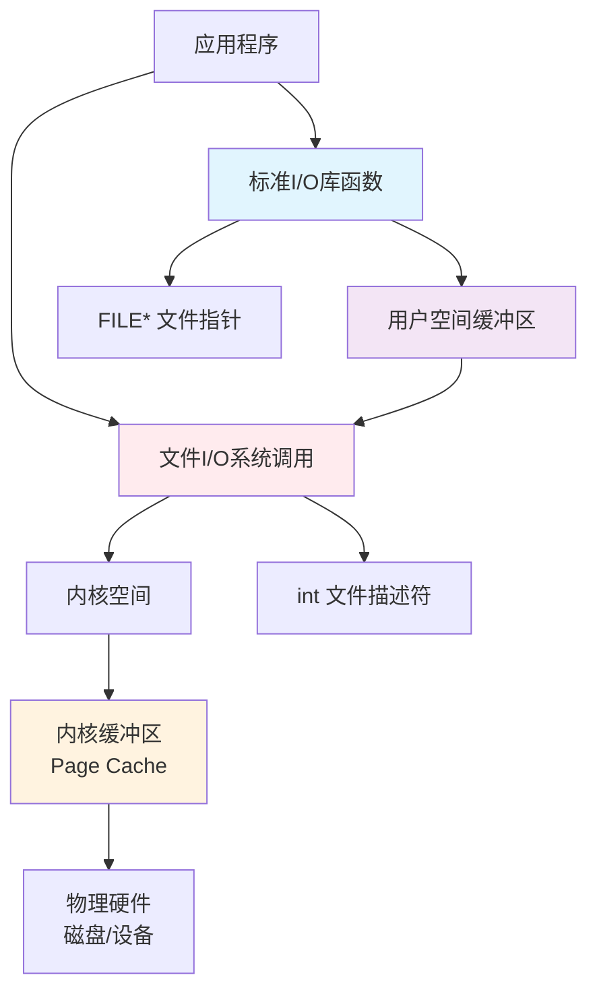
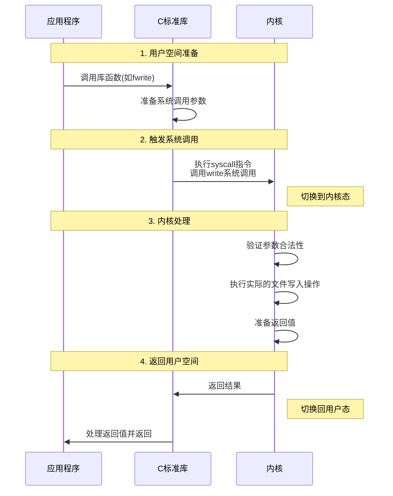
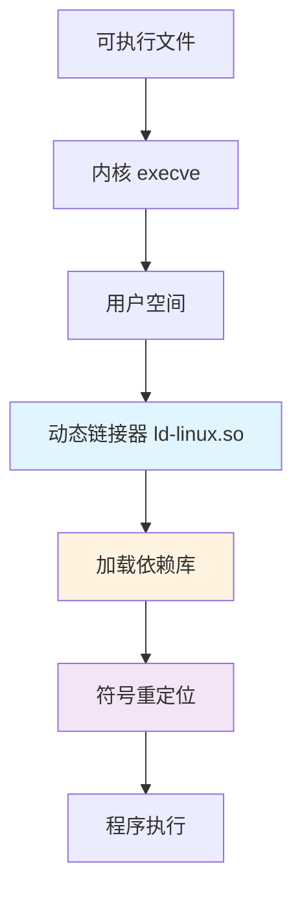

### 文件IO（系统调用级）
- **文件IO及相关API介绍**
  - **定义 ：**  操作系统提供的一组**无缓冲**、最接近底层硬件的输入/输入操作原语 她直接通过 **系统调用（用户态到内核态的切换）** 与内核进行交互
  - **核心特点：**  无缓冲、每次读写操作都直接发起系统调用 由内核处理
  - **操作对象：** ==文件描述符== 一个非负整数 用于在进程内唯一标识一个打开的文件
    -  `0` - 标准输入（stdin）
    -  `1` - 标准输出（stdout）
    -  `2` - 标准错误（stderr）
    [stdin_out_err示例](/stdin_out_err_test.c)  
  - **常用API**
    - `open()`   [open( )用法示例](/unistd_test.c)
    - `close()`   
    - `read()`  [open_read_write_close用法示例](/system_call_test.c)
    - `write()`
    - `lseek()`
- **每次读写都涉及到用户态到内核态的切换 开销大 效率较低** 
- ==文件IO工作流程==
   

### 标准IO（库函数级）
- **标准IO及相关API介绍**
  - **定义：** c语言标准库提供的一组 **带缓冲** 的输入/输出函数 它构建在文件IO之上 通过引用缓冲区来 **减少系统调用**的次数 从而提高效率
  - **核心特点：** 带缓冲、它在用户空间维护一个缓冲区 只有满足特定条件(如缓冲区慢、换行符、手动刷新)  才将缓冲区的内容通过一次系统调用写入内核
  - **操作对象：** ==文件指针== 一个指向 `FILE` 结构体的指针(如`FILE*`)   `FILE`结构体包含了管理文件流的所有信息，包括对应的文件描述符、缓冲区指针、缓冲区大小、错误标志等
  - **三种缓冲模式**
    - **全缓冲**：通常用于**磁盘文件** 只有当`缓冲区被填满`时 才执行实际的 I/O 操作  使用 `fflush()` 可以强制刷新缓冲区
    - **行缓冲**: 通常用于 **终端**（stdout） 当遇到换行符 `\n` 或`缓冲区满时` 执行 I/O 操作
    - **无缓冲**: 不对字符进行缓冲 标准错误 `stderr`  通常是无缓冲的 以确保错误信息能**立即**被输出
  - **常用API**
    - `fopen()`     [fopen( )函数解析](/fopen_test.c)
    - `fclose()`    [fclose（ ）函数解析](/fclose_test.c)
    - `fread()`     [fread（ ）函数解析](/fread_test.c)
    - `fwrite()`    [fwrite（ ）函数解析](/fwrite_test.c)
    - `fprintf()`   [fprintf（ ）函数解析](/fprintf_test.c)
    - `fscanf()`    [fscanf（ ）函数解析](/fscanf_test.c)
    - `fgetc()`     [fgetc（ ）函数解析](/fgetc_test.c)
    - `fputc()`     [fputc（ ）函数解析](/fputc_test.c)
    - `fgets()`     [fgets（ ）函数解析](/fgets_test.c)
    - `fputs()`     [fputs（ ）函数解析](/fputs_test.c)

- ==**标准IO工作流程**==


### 二者核心区别：缓冲

- **缓冲区**
  - **定义：** 缓冲区是一块预留的内存区域，用作数据在传输过程中的临时“中转站”或“等待区”
  - **目的：** 
    - **减少系统调用，提高效率**
      - 系统调用是昂贵的操作 它需要从用户态切换到内核态 执行完后再切换回来 这种上下文切换的开销远大于在用户空间内存中操作数据的开销
      - 缓冲区将多次小的逻辑操作集合成一次大的物理操作 从而大幅减少系统调用的次数
    - **协调速度差异（平滑数据流）**
      - `CPU vs 磁盘/网络:` CPU 处理数据的速度（纳秒级）远远快于磁盘或网络读写数据的速度（毫秒级）。如果没有缓冲区，高速的 CPU 将不得不频繁地等待低速的 I/O 设备，造成资源浪费。缓冲区让 CPU 可以快速地将数据“扔”到缓冲区，然后继续去处理其他任务，由缓冲区来负责与低速设备打交道。
    - **提供便捷的操作**
      - 缓冲区使得 `回退`、`按行读取`等高级操作成为可能，因为这些操作可以在用户空间的缓冲区里轻松完成，而不必每次都劳烦内核
  - **用户缓冲区:** 由标准I/O库（如glibc）在用户空间维护 这就是`FILE结构体`中所包含的缓冲区
  - **内核缓冲区:** 由操作系统内核维护 当数据通过 `write()` 系统调用进入内核后，并不会立即写入硬盘 内核会将其放入自己的缓冲区缓存（Page Cache）中 在适当的时机（如缓冲区满、一定时间后、或调用 `sync()/fsync()`）再写入磁盘 这是为了**减少物理磁盘的读写次数**

  - **因此 即使使用无缓冲的 文件I/O(write)  数据也只是从用户空间拷贝到了内核空间 并不会立刻落盘 要确保数据物理写入磁盘 需要调用 fsync(fd)**

- **缓冲区就类似：快递仓库**
想象一下网上购物的物流过程：

- **没有缓冲区（无缓冲I/O）：** 快递员每打包好一件商品，就立刻开车送到你家。送完一件，再回来打包下一件。这会非常低效，因为大部分时间都花在了路上（系统调用开销）。
  - 对应：每次调用 `write()` 只写1个字节到文件 就会发起一次系统调用。
- **有缓冲区（带缓冲I/O）：** 快递员不会立刻送出一件商品 他把多件商品收集到本地仓库(缓冲区)里 直到：
  1. 仓库堆满了（缓冲区满）。
  2. 或者到了一天的固定发货时间（强制刷新，如 `fflush()`）。
  3. 或者有一个加急的订单必须立刻发出（遇到换行符`\n` 行缓冲模式）。
    这时，他才开一趟车，把仓库里所有的商品一次性送到分拣中心（内核）。
  - 对应：调用 `fputc()` 多次，字符先被存入内存缓冲区，在特定条件下才发起一次 `write()` 系统调用，将整块数据写入内核。
这个“本地仓库”就是缓冲区。它通过减少运输次数（系统调用次数） 来极大地提升整体效率 

- ==文件I/O、标准I/O、缓冲区与内核关系图==

- ==数据流动==
 

- ==函数转换关系==
 

### 系统调用
- **系统调用**是应用程序与操作系统内核之间的编程接口 用户程序通过系统调用请求内核为其执行特权操作 如文件操作、进程管理、网络通信等
  - 用户程序无法直接执行特权指令
  - 需要通过系统调用接口请求内核代劳
    - 例如：用户程序不能直接读写磁盘
    - 必须通过 `open()`, `read()`, `write()` 等系统调用
- **CPU特权级别**
 

- **系统调用工作流程**


### 动态库
- 动态库（Shared Library）是在**程序运行时被动态加载的代码库**，多个程序可以共享同一份库代码在内存中的副本
- **动态库的优势**
  - **节省内存**：多个进程共享同一份代码
  - **节省磁盘空间**：无需在每个可执行文件中包含库代码
  - **易于更新**：更新库无需重新编译所有程序
  - **运行时加载**：可以动态加载和卸载
- **动态库的创建和使用**
 - **库文件的命名规则**
    - `-l<name>  → 查找 lib<name>.so（动态库）或 lib<name>.a（静态库）`
      所以 -lmylib 会让链接器查找：
      - 动态库: libmylib.so（优先）
      - 静态库: libmylib.a（如果动态库不存在）
  - **创建动态库**
    ```bash
        # 编译为位置无关代码
        gcc -fPIC -c helper1.c helper2.c
        # 创建动态库
        gcc -shared -o libmylib.so helper1.o helper2.o

        # 或者一步完成
        gcc -fPIC -shared -o libmylib.so helper1.c helper2.c
    ```
  - **编译链接动态库**
    ```bash
        # 编译时链接动态库
        gcc -o myapp main.c -L. -lmylib

        # 运行前需要设置库路径
        export LD_LIBRARY_PATH=.:$LD_LIBRARY_PATH
        ./myapp
    ```
    
  - **示例说明** 
  假设有以下文件： 
    ```t
    .
    ├── main.c
    └── libmylib.so    # 这就是要链接的库
    ```
    执行命令后：
    ```bash
    gcc -o myapp main.c -L. -lmylib
    ```
    链接器会：
    - 在当前目录（.）中查找
    - 找到 libmylib.so（因为 -lmylib → lib + mylib + .so）
    - 将其链接到可执行文件 myapp 中
  - **重要提示**
    - 顺序很重要：库的链接顺序会影响符号解析
    ```bash
        # 正确的顺序：依赖的库放在后面
        gcc main.o -lmyapp -lmylib  # myapp 依赖 mylib
    ``` 
    - 路径优先级: `-L` 指定的路径优先于系统路径
    - 版本控制: 如果需要特定版本，可以直接指定文件名：
    ```bash
        gcc -o myapp main.c /path/to/libmylib.so.1.2.3
    ``` 
   **-lmylib 表示链接名为 mylib 的库，实际查找的文件是 libmylib.so（或 libmylib.a）**
- **动态库查找机制**
  - 库搜索路径
    ```bash
        # 查看默认搜索路径  verbose:输出链接器的详细配置信息 SEARCH_DIR: 只显示包含 "SEARCH_DIR" 的行
        ld --verbose | grep SEARCH_DIR

        # 查看系统库配置
        cat /etc/ld.so.conf
        ls /etc/ld.so.conf.d/

        # 更新库缓存
        sudo ldconfig
    ``` 
  - 环境变量控制
    ```bash
        # 临时添加库路径
        export LD_LIBRARY_PATH=/path/to/libs:$LD_LIBRARY_PATH

        # 设置预加载库
        export LD_PRELOAD=/path/to/libdebug.so

        # 设置库加载器
        export LD_DEBUG=libs  # 调试信息
    ```
    
    
  - 版本控制
    ```bash
        # 1. 创建带版本号的共享库
        gcc -shared -Wl,-soname,libmylib.so.1 -o libmylib.so.1.0.0 helper.c
        # 2. 创建主版本号符号链接
        ln -sf libmylib.so.1.0.0 libmylib.so.1
        # 3. 创建通用符号链接
        ln -sf libmylib.so.1 libmylib.so
    ```
    
    
- **使用工具和调试**
  - **库管理工具**
    ```bash
        # 查看程序依赖的库
        ldd myapp

        # 查看库中的符号
        nm -D libmylib.so

        # 查看符号表
        objdump -T libmylib.so

        # 查看库信息
        readelf -d libmylib.so
    ```
  - **调试动态库**
    ```bash
        # 设置调试环境变量
        export LD_DEBUG=files  # 显示文件操作
        export LD_DEBUG=bindings  # 显示符号绑定
        export LD_DEBUG=libs    # 显示库搜索
        export LD_DEBUG=all     # 显示所有信息

        # 运行程序查看调试信息
        ./myapp
    ```
- **动态库完整示例**
  - **目录结构**
    - 自行创建的文件
        -  main.c 主程序文件 [main.c示例](/Dynamic_library_test/main.c)
        -  src/   存放源码   [src源码示例1](/Dynamic_library_test/src/math_advanced.c)
        -  inlcude/   存放头文件 [include头文件示例](/Dynamic_library_test/include/Dmathlib.h)
        -  Makefile  编译文件   [Makefile文件示例](/Dynamic_library_test/Makefile)
     


### 静态库
- 静态库（Static Library）是在**编译时被完整链接到可执行文件中**的库。程序运行时不需要外部的库文件
  - **静态库的特点：**
    - 扩展名: .a (Archive)
    - 链接方式: 编译时静态链接
    - 运行时: 不需要外部依赖
    - 文件大小: 可执行文件较大
    - 更新: 需要重新编译程序
  - **静态库的创建和使用**
    - **创建静态库**
    ```bash
        # 编译为目标文件
        gcc -c helper1.c helper2.c

        # 创建静态库
        ar rcs libmylib.a helper1.o helper2.o

        # 查看库内容
        ar -t libmylib.a
    ``` 
    - **使用静态库**
    ```bash
        # 编译链接静态库
        gcc -o myapp main.c -L. -lmylib

        # 或者直接指定库文件
        gcc -o myapp main.c libmylib.a
    ```
    - **静态库工具详解** 
      - **av命令**
        ```bash
            # 创建静态库
            ar rcs libmylib.a file1.o file2.o

            # 添加文件到现有库
            ar r libmylib.a newfile.o

            # 删除库中的文件
            ar d libmylib.a oldfile.o

            # 提取库中的文件
            ar x libmylib.a file1.o

            # 查看库内容
            ar -t libmylib.a
        ``` 
      - **ranlib命令**
        ```bash
            # 为静态库创建索引（加速链接）
            ranlib libmylib.a

            # ar的s选项已经包含这个功能
            # ar rcs 等价于 ar rc + ranlib
        ```
- **静态库与动态库对比**
 

- **静态库完整示例**
  - **目录结构**
    - 自行创建的文件
        -  main.c 主程序文件 [main.c示例](/Static_library_test/main.c)
        -  src/   存放源码   [src源码示例](/Static_library_test/src/mathlib.c)
        -  inlcude/   存放头文件 [include头文件示例](/Static_library_test/include/mathlib.h)
        -  Makefile  编译文件   [Makefile文件示例](/Static_library_test/Makefile)
     
    - **Makefile文件解析**
    以 [Makefile文件示例](/Static_library_test/Makefile) 为参考
      - **编译器和工具**    定义常用的工具命令，方便修改和维护
        ```bash
            # CC：C 编译器
            CC = gcc
            
            # AR：静态库打包工具
            AR = ar
            
            # RM：删除文件命令
            RM = rm -f

            # MKDIR：创建目录命令
            MKDIR = mkdir -p
        ```
      - **编译选项**    设置编译和打包选项
        ```bash
            # CFLAGS：编译器标志  -Wall -Wextra：显示所有警告  -O2：优化级别2  -g：包含调试信息
            CFLAGS = -Wall -Wextra -O2 -g
            
            # ARFLAGS：静态库打包选项  r：替换现有文件 c：创建库（如果不存在） s：创建索引（相当于 ranlib）
            ARFLAGS = rcs
        ```
      - **目录结构**    定义项目目录结构，保持代码组织清晰
        ```bash
            # 指定源代码目录 - src
            SRC_DIR = src
            
            # 指定头文件目录 - include
            INC_DIR = include
            
            # 自动生成 库文件输出目录 lib
            LIB_DIR = lib
            
            # 自动生成 中间文件目录 - build 
            BUILD_DIR = build
            
            # 自动生成 存放可执行文件 - bin
            BIN_DIR = bin
        ```
      - **库信息** 定义库的名称和路径
        ```bash
            # 指定库的基础名称名为math
            LIB_NAME = math 
            
            # 指定完整的库路径 lib/libmath.a
            LIBRARY = $(LIB_DIR)/lib$(LIB_NAME).a
        ```
      - **源文件**  自动发现源文件并生成对应的目标文件列表
        ```bash
            # 找到所有 src/*.c 文件
            SRCS = $(wildcard $(SRC_DIR)/*.c)
            
            # 将 .c 文件路径转换为 .o 文件路径  例如：src/math.c → build/math.o
            OBJS = $(patsubst $(SRC_DIR)/%.c,$(BUILD_DIR)/%.o,$(SRCS))

        ```
      - **主程序**  定义主程序的相关文件
        ```bash
            # 主源文件
            MAIN_SRC = main.c
            
            # 主目标文件路径
            MAIN_OBJ = $(BUILD_DIR)/main.o
            
            # 最终可执行文件路径
            MAIN_BIN = $(BIN_DIR)/calculator
        ```
      - **头文件路径**  设置头文件搜索路径
        ```bash
            # -Iinclude ： 告诉编译器在 include 目录中查找头文件
            INCLUDES = -I$(INC_DIR)
        ```
      - **默认目标**    定义默认构建目标
        ```bash
            # 依赖关系：先创建目录 → 构建库 → 构建可执行文件
            all: directories $(LIBRARY) $(MAIN_BIN)

            # 执行 make 或 make all 时按顺序执行这些目标
        ```
      - **创建必要的目录**  创建构建所需的目录
        ```bash
            # 创建 build/ lib/ bin/ 目录  确保输出目录存在，避免文件找不到路径的错误
            directories:
                $(MKDIR) $(BUILD_DIR) $(LIB_DIR) $(BIN_DIR)
        ```
      - **构建静态库**  构建静态库的规则
        ```bash
            # $@：目标文件（lib/libmath.a）  $^：所有依赖文件（所有的 .o 文件） 
            $(LIBRARY): $(OBJS)
                $(AR) $(ARFLAGS) $@ $^
                @echo "静态库构建完成: $@"
        ```
      - **编译库的源文件**  编译源文件为目标文件的模式规则
        ```bash
            # %：通配符，匹配文件名     $<：第一个依赖文件（.c 文件） $@：目标文件（.o 文件）
            # 例如：src/math.c → build/math.o
            $(BUILD_DIR)/%.o: $(SRC_DIR)/%.c
                $(CC) $(CFLAGS) $(INCLUDES) -c $< -o $@
            
            # build/math.o: src/math.c
            #   gcc -Wall -Wextra -O2 -g -Iinclude -c math.c -o math.o    
        ```
      - **编译主程序**  编译主程序文件
        ```bash
            # 单独的规则是因为主程序不在 src 目录中
            $(MAIN_OBJ): $(MAIN_SRC)
                $(CC) $(CFLAGS) $(INCLUDES) -c $< -o $@

            # build/main.o: main.c
            #   gcc  -Wall -Wextra -O2 -g -Iinclude -c main.c main.o
        ```
      - **链接生成可执行文件**  链接生成最终可执行文件
        ```bash
            # $<：第一个依赖文件（build/main.o）  -Llib：指定库搜索路径  -lmath：链接 libmath.a 库
            $(MAIN_BIN): $(MAIN_OBJ) $(LIBRARY)
                $(CC) $(CFLAGS) -o $@ $< -L$(LIB_DIR) -l$(LIB_NAME)
                @echo "可执行文件构建完成: $@"

            # build/calculator: build/main.o lib/libmath.a
            #   gcc -Wall -Wextra -O2 -g -o calculator main.o -Llib -lmath
        ```
      - **清理构建文件**    清理所有生成的文件
        ```bash
            # 删除 build、lib、bin 目录及其内容
            clean:
                $(RM) -r $(BUILD_DIR) $(LIB_DIR) $(BIN_DIR)
                @echo "清理完成"
        ```
      - **显示构建信息**
        ```bash
            # 显示项目结构信息，用于调试
            info:
                @echo "源文件: $(SRCS)"
                @echo "目标文件: $(OBJS)"
                @echo "库文件: $(LIBRARY)"
                @echo "可执行文件: $(MAIN_BIN)"
        ```
      - **运行程序**
        ```bash
            # 构建并运行程序
            run: $(MAIN_BIN)
                ./$(MAIN_BIN)
        ```
      - **调试版本**    构建调试版本
        ```bash
            # -DDEBUG: 定义 DEBUG 宏     -O0：禁用优化，便于调试
            debug: CFLAGS += -DDEBUG -O0
            debug: all
        ```
      - **静态分析**    构建带静态分析的版本
        ```bash
            # 内存错误检测和未定义行为检测
            check: CFLAGS += -fsanitize=address -fsanitize=undefined
            check: all
        ```
      - **声明伪目标**  声明这些目标不是实际文件 防止与同名文件冲突 确保这些目标总是被执行
        ```bash
            # 声明伪目标
            .PHONY: all clean info run debug check directories
        ```

### GCC链接库原理
- **链接的基本概念** ： 链接是将多个目标文件（.o）和库文件（.a/.so）合并成一个可执行文件或共享库的过程
- **链接的主要任务** ：
  - 符号解析：找到每个符号的定义
  - 重定位：将符号引用与定义地址关联
  - 地址分配：为代码和数据分配最终地址
- **链接器工作流程**

- **符号解析过程**
  - 符号类型：
    - 定义符号：函数、变量的实际定义
    - 引用符号：函数调用、变量使用
    - 未定义符号：声明但未定义的符号
  - 符号解析算法
    ```c
        // 链接器维护三个集合：
        未解析符号集合 = {所有未定义的符号}
        已定义符号集合 = {}
        当前目标文件集合 = {}

        foreach (输入文件) {
            if (是目标文件) {
                将其符号加入当前集合
                解析其中的未定义符号
            }
            if (是库文件) {
                只提取能解析当前未定义符号的成员
            }
        }

        if (未解析符号集合 != 空) {
            报错: undefined reference
        }
    ```
- **静态库链接详细过程**
假设静态库的结构如下： 
    ```t
        libmath.a
        ├── math_basic.o
        │   ├── add (定义)
        │   ├── subtract (定义) 
        │   └── multiply (引用, 未定义)
        └── math_advanced.o
            ├── multiply (定义)
            ├── power (定义)
            └── factorial (定义)
    ```
链接过程示例:
```bash
    # 假设 main.o 中调用了 add() 和 multiply()
    gcc main.o -L. -lmath -o program
```
链接器执行步骤:
  - 将 main.o 加入当前集合
    - 未定义符号: add, multiply
  - 处理 libmath.a：
    - 查找 math_basic.o：提供 add，需要 multiply
    - 提取 math_basic.o，现在未定义符号: multiply
    - 查找 math_advanced.o：提供 multiply
    - 提取 math_advanced.o，所有符号解析完成
  - 忽略库中其他无关的目标文件

- **动态库链接详细过程**
编译时：
```bash
    gcc -shared -fPIC -o libmath.so math_basic.c math_advanced.c
    gcc main.o -L. -lmath -o program
``` 
链接器操作：
  1. 记录需要 libmath.so
  2. 在可执行文件中创建 .dynamic 段
  3. 添加符号重定位信息
运行时：
```bash
    ./program
```
动态链接器操作：
  1. 读取 .dynamic 段，发现需要 libmath.so
  2. 搜索库路径（LD_LIBRARY_PATH, /etc/ld.so.conf 等）
  3. 加载 libmath.so 到内存
  4. 进行符号重定位
  5. 执行程序

### Linux操作系统加载动态库
- **动态加载的整体架构**

- **可执行文件中的动态信息**
查看动态段信息：
```bash
    readelf -d /bin/ls

    # 输出示例：
    Dynamic section at offset 0x1e28 contains 27 entries:
    Tag        Type                         Name/Value
    0x0000000000000001 (NEEDED)             Shared library: [libselinux.so.1]
    0x0000000000000001 (NEEDED)             Shared library: [libc.so.6]
    0x000000000000000c (INIT)               0x400520
    0x000000000000000d (FINI)               0x4012d4
    0x0000000000000019 (INIT_ARRAY)         0x601e18
    0x000000000000001b (INIT_ARRAYSZ)       8 (bytes)
``` 
关键动态标签：
  - NEEDED：需要的共享库
  - RPATH：库搜索路径
  - RUNPATH：运行时库搜索路径
  - INIT：初始化函数地址
  - FINI：终止函数地址
- **动态链接器 (ld-linux.so)**
定位动态链接器：
```bash
    # 查看可执行文件使用的动态链接器
    readelf -l /bin/ls | grep interpreter

    # 输出示例：
    [Requesting program interpreter: /lib64/ld-linux-x86-64.so.2]
```

动态链接器的职责：
  - 加载所有依赖的共享库
  - 进行符号重定位
  - 执行初始化代码
  - 将控制权交给程序入口点

- **库搜索路径机制**
搜索路径优先级：

实际搜索顺序：
  - 可执行文件的 RPATH（如果存在）
  - LD_LIBRARY_PATH 环境变量
  - 可执行文件的 RUNPATH（如果存在）
  - /etc/ld.so.cache 缓存文件
  - 默认系统路径：/lib, /usr/lib

- **完整的加载过程**
阶段1：内核处理
```bash
    # 当执行 ./program 时：
    execve("./program", argv, envp)
        ↓
    内核检查文件格式（ELF）
        ↓
    加载程序段到内存
        ↓
    设置动态链接器路径
        ↓
    创建进程并启动动态链接器
```
阶段2：动态链接器初始化
```bash
    // ld-linux.so 的初始化过程
    1. 解析自身的重定位信息
    2. 设置异常处理
    3. 获取命令行参数和环境变量
    4. 初始化内部数据结构
```

阶段3：加载依赖库
```bash
    // 递归加载所有依赖库
    foreach (NEEDED entry in executable) {
        递归加载库及其依赖
        维护已加载库的列表
        检查版本兼容性
    }
```

阶段4：符号重定位
```bash
    // 符号解析和重定位
    foreach (relocation entry) {
        查找符号定义（在所有加载的库中）
        如果找到，更新地址引用
        如果未找到，报错或使用延迟绑定
    }
```

阶段5：初始化执行
```bash
    // 执行初始化代码
    调用所有库的 .init 函数
    调用程序的 main 函数
    程序正常运行...
```

- **延迟绑定** (PLT/GOT)
过程链接表 (PLT) 和全局偏移表 (GOT)：


延迟绑定的优势：
  - 启动速度快：不需要在启动时解析所有符号
  - 内存高效：只解析实际使用的函数
  - 性能良好：第一次调用后直接跳转

- **初始化与终止**
初始化顺序：
```c
    // 初始化函数调用顺序
    1. 动态链接器自身的初始化
    2. 所有依赖库的 .init 函数（深度优先）
    3. 主程序的 .init 函数
    4. main() 函数
```

终止顺序：
```c
    // 终止函数调用顺序（程序退出时）
    1. main() 函数返回
    2. 所有库的 .fini 函数（逆序）
    3. 程序退出
```

- **实际加载过程示例**
查看详细加载过程：
```bash
    # 设置调试环境变量
    export LD_DEBUG=all
    ./program

    # 或者只查看库加载
    export LD_DEBUG=libs
    ./program
```

调试输出示例：
```bash
    linux-vdso.so.1 (0x00007ffd45bd3000)
    libmath.so => ./lib/libmath.so (0x00007f8a1b2d4000)
    libc.so.6 => /lib/x86_64-linux-gnu/libc.so.6 (0x00007f8a1b0d3000)
    /lib64/ld-linux-x86-64.so.2 (0x00007f8a1b4d8000)
```

- **环境变量控制**
调试环境变量：
```bash
    # 显示所有调试信息
    export LD_DEBUG=all

    # 只显示库加载信息
    export LD_DEBUG=libs

    # 显示符号解析
    export LD_DEBUG=symbols

    # 显示重定位信息
    export LD_DEBUG=reloc

    # 输出到文件
    export LD_DEBUG_OUTPUT=debug.log
```

性能相关环境变量：
```bash
    # 禁用延迟绑定（立即解析所有符号）
    export LD_BIND_NOW=1

    # 设置库加载器
    export LD_LINUX_LOADER=/path/to/ld-linux.so

    # 预加载库（最先加载）
    export LD_PRELOAD=/path/to/libdebug.so
```

- **系统配置**
配置文件：
```bash
    # 系统库配置
    /etc/ld.so.conf        # 主配置文件
    /etc/ld.so.conf.d/     # 配置目录
    /etc/ld.so.cache       # 加速搜索的缓存

    # 更新缓存
    sudo ldconfig
```

缓存机制：
```bash
    # 查看缓存内容
    ldconfig -p | grep libmath

    # 重建缓存
    sudo ldconfig -v
```

- **安全考虑**
安全特性：
```bash
    # SUID程序忽略LD_LIBRARY_PATH
    chmod u+s program      # 设置SUID位
    ./program              # 此时LD_LIBRARY_PATH无效

    # 安全加载模式
    export LD_SECURE_LOAD=1  # 只信任标准路径
```

安全漏洞防护：
```bash
    # 防止符号劫持
    export LD_DYNAMIC_WEAK=0  # 禁用弱符号覆盖

    # 内存保护
    export LD_BIND_NOT=1      # 使GOT只读
```

- **性能优化**
预链接优化：
```bash
    # 减少运行时重定位
    sudo prelink -amR

    # 检查预链接状态
    prelink -p
```

库优化技巧：
```bash
    # 使用符号版本控制
    gcc -shared -Wl,--version-script=mapfile -o libmath.so math.c

    # 优化库顺序（常用库先加载）
    export LD_LIBRARY_PATH=/opt/fastlibs:$LD_LIBRARY_PATH
```

- **故障排除**
常见问题诊断：
```bash
    # 检查库依赖
    ldd program

    # 查看缺失的符号
    nm -D program | grep UND

    # 检查库冲突
    LD_DEBUG=libs ./program 2>&1 | grep conflict

    # 查看加载过程
    strace -e open,mmap ./program
```

错误处理：
```bash
    # 错误: cannot open shared object file
    # 解决: 检查LD_LIBRARY_PATH或使用ldconfig

    # 错误: symbol not found
    # 解决: 检查库版本和符号导出

    # 错误: version mismatch
    # 解决: 重新编译或使用兼容版本
```

- **实际案例：自定义库加载**
场景：使用自定义路径的库
```bash
    # 编译时指定rpath
    gcc -o program main.c -L./lib -lmath -Wl,-rpath,'$ORIGIN/lib'

    # 运行时不需设置LD_LIBRARY_PATH
    ./program
```

场景：调试库加载问题
```bash
    # 详细调试
    export LD_DEBUG=files
    export LD_DEBUG_OUTPUT=debug.log
    ./program

    # 分析调试输出
    grep "loading file" debug.log
```