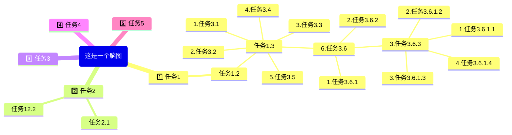
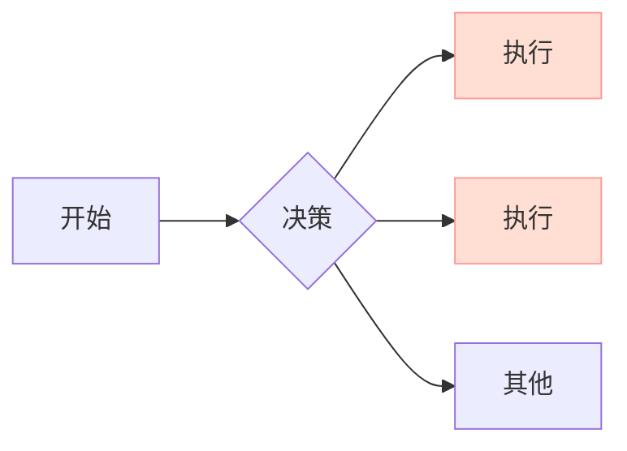
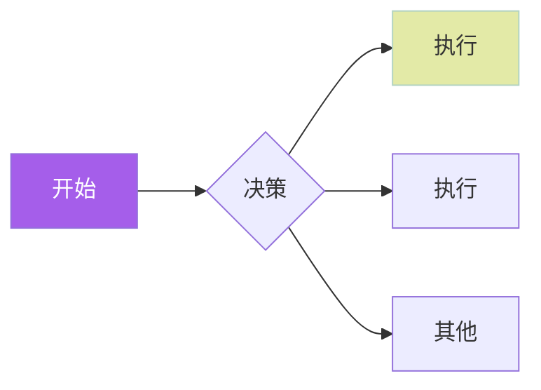

# 标题一
## 标题二
### 标题三
#### 标题四
##### 标题五
##### 标题六

> 这是一段引用

*斜体*

**加粗**

<u>下划线</u>

`printf（）`

:smile:

H~2~O , x^2^

==这是一段高亮文字==


有序列表：
1. 打开冰箱
2. 把大象塞进冰箱
3. 关上冰箱

无序列表：
- 风萧萧
- 芜湖
- 呜呼啦
* 哈哈
* 这也是无序哦

任务列表：
* [ ] 吃饭
* [ ] 睡觉
* [x] 打豆豆
  
代码块：
```c
int main() {
    return 0;
}
```

横线：

---


[百度](baidu.com "一个搜索引擎")


[百度][id]

[id]:baidu.com "一个搜索引擎"


请参考[标题一](#标题一)

ULR:
http://www.baidu.com


数学公式：
$$
\frac{\partial f}{\partial x} = 2\sqrt{a}x
$$

表格：
|姓名|年龄|成绩|
|:---|---:|:---:|
|张三|10|67|
|lisiwangwu|40|999|

|表格|右边|对齐|
|---:|---:|---:|
|25231111|34352222|34535346|

|表格|左边|对齐|
|:---|:---|:---|
|25231111|34352222|34535346|

|表格111|居中|对齐|
|:---:|:---:|:---:|
|25231111|34352222|34535346|

脚注：
一键三连[^三连]
[^三连]:点赞、投币、收藏。

[文件跳转](/123test.C)
[文件跳转➕注释](/123test.C "鼠标悬停注释")


**脑图：**









