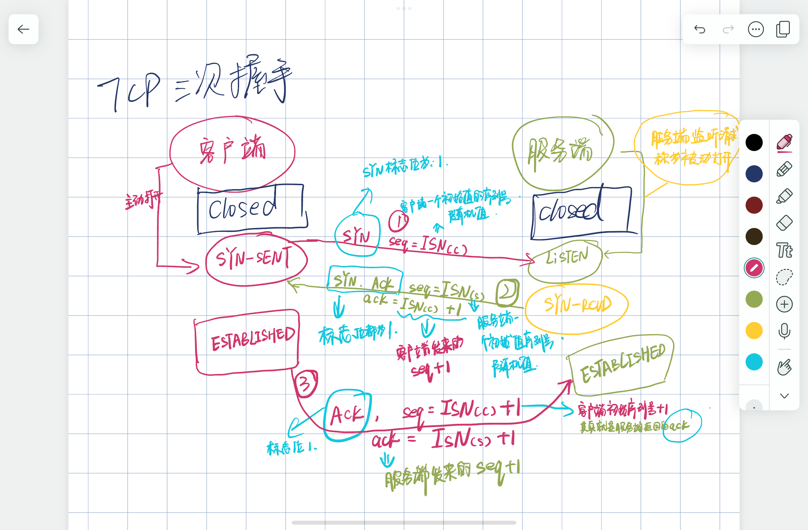
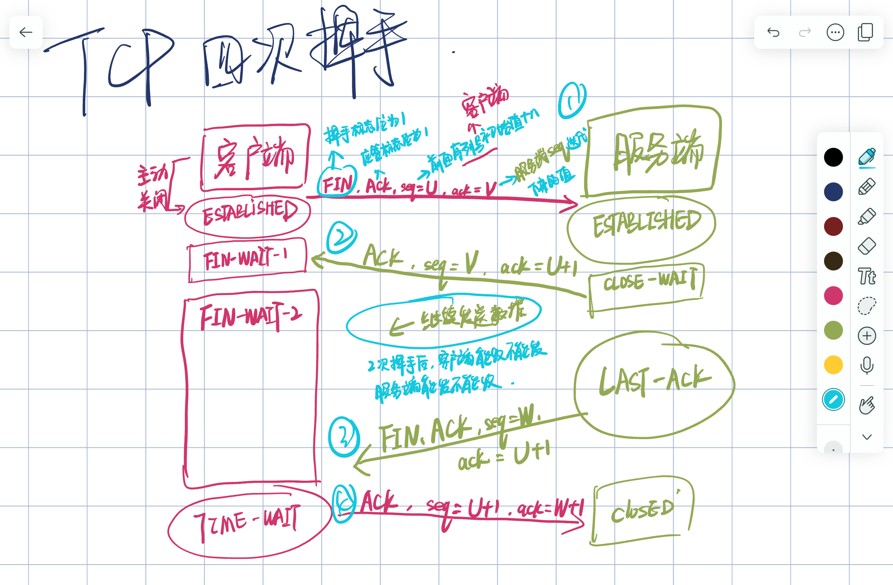
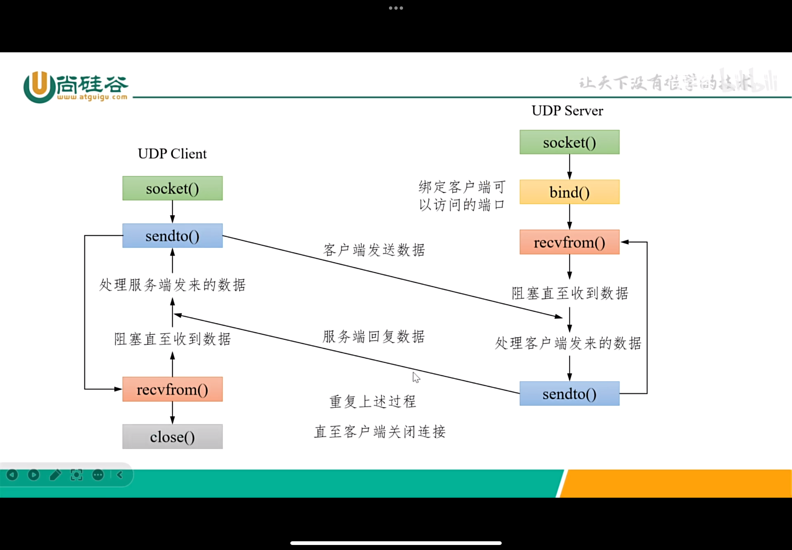

# ==网络编程==
### 计算机网络分类

#### 按地理位置分类
* **个人区域域网**

        通常是几米到几十米
        蓝牙、红外线通信
* **局域网**

        一个建筑物、办公室或校园的小范围高速数据传输和资源共享
        以太网、Wi-Fi
* **城域网** 

        一个城市或多个相邻城市 连接多个局域网 提供城域范围内的数据传输服务
        光纤网络、有线电视、DSL
* **广域网**
    
        国家、洲际或全球范围连接多个局域网、城域网 实现长距离数据传输
        互联网、企业专用网

#### 按网络拓扑分类
* **总线型拓扑**

        所有设备共享一条通信介质（总线）
        优点：布线简单、成本低
        缺点：总线故障将导致整个网络瘫痪

* **星型拓扑** 
  
        所有设备通过单独的通信链路连接到一个中央节点（交换机）
        优点：易于管理和扩展 单个设备故障不会影响整个网络
        缺点：中央节点故障会导致整个网络瘫痪

* **环型拓扑**
  
        每个设备连接到两个相邻设备 形成一个环
        优点：数据传输延迟低、适合实时通信
        缺点：任何一个节点或链路故障都会影响整个网络

* **网状拓扑**
  
        每个设备都有多个连接点 与多个其他设备直接相连
        优点：高度冗余 可靠性强 任意节点或链路故障不影响整体通信
        缺点：布线复杂 成本高 
    

### osi七层模型
- 物理层

        负责传输原始比特流  涉及物理设备及介质 
        如电缆类型、电信号传输和接收等

- 数据链路层
  
        确保物理链路上的无误传输  提供了如帧同步、流量控制及错误检测等功能

- 网络层

        负责数据包从源到目的地的传输和路由选择  定义了地址和路由的概念 
        如IP协议
- 传输层

        提供端到端的数据传输服务 保证数据的完整性 
        定义了如TCP和UDP协议

- 会话层

        管理会话  控制建立、维护和终止会话

- 表示层
  
        处理数据的表示、编码和解码 
        如加密和解密

- 应用层

        提供网络服务给终端用户的应用程序 
        如HTTP、FTP、SMTP等协议

**五层模型**
* 将应用层、表示层、会话层合并为应用层 其他层不变

### TCP/IP 四层模型（互联网协议套件）
##### 应用层
1. 用户直接交互的部分 是软件应用通过网络进行通信的地方 
   应用层使用下层提供的服务来创建用户数据 将数据传输给同一台机器或远程机器上的其他应用
2. 协议：SMTP、 FTP、 SSH、 HTTP等 实现客户端与服务器之间的通信和数据交换

##### 传输层
1. 传输层管理端到端通信 为不同主机上的应用程序提供数据传输 同时保证数据的完整性和可靠性
2. 主要协议有 ：TCP，提供顺序的、可靠的、双向的连接流，并管理报文段段发送 确保无错误、不丢失、不重复、按序到达
    UDP,提供无连接的服务，数据以数据报的形式发送，不保证顺序或响应

##### 互联网层
1. 处理跨网络界限的数据包交换 负责将数据报文段从源地址路由到目的地址 定义如何在各种网络结构中发送数据和接收数据 IP协议是构成Internet的基础 Internet上的主机都是通过==IP地址==来互相识别 IP协议不保证传输数据的可靠性 可能出现丢包等情况
2. 主要协议是IP 定义了数据包等路由方式和网络地址
   
##### 链路层
1. 涉及在物理网络上的数据通信 确保网络层传来的IP数据报可以在网络的物理链接上进行传输 负责处理与物理网络链接相关的问题 如MAC地址寻址、帧同步、错误检测和校正
2. 包括在物理网络链接中使用的所有协议 如以太网、 Wi-Fi、PPP
   

### 网络传输中的数据单元
* PDU
  协议数据单元 计算机网络各层对等实体间交换信息的数据单位 PDU包括头部和负载 不同层次的PDU有专门的术语 例如在网络层 PDU称为数据包 在传输出 PDU称为报文段或数据报 在数据链路层 PDU称为帧
    1. 数据包
            
            通常指网络层（如IP网络层）的数据单位
    
    2. 报文段

            通常用于描述传输层（TCP传输层）的数据单位
    
    3. 数据报

            通常用于描述UDP协议的数据单位 也是传输层的一个概念
   
* SDU
  服务数据单元 是在通信协议的特定层次上传递的数据单元 这些数据被传递给下一层 由下一层进行处理或封装 并附加控制信息 将其转换为那一层的PDU  SDU是用户数据或来自上一层的PDU 未包括当前层可能添加的头部或其他控制信息

* PCI
  协议控制信息 是PDU中的元数据部分 包括用于在网络中传输数据的控制信息 比如地址、端口号、控制标志、协议类型等  与SDU一起被封装成PDU PCI基本上是头部和尾部信息 它使得网络或传输实体能够理解如何处理包含的SDU

* **PDU =  PCI +  SDU**
  

### 传输层-TCP协议
 TCP是一种面向连接的、可靠的、基于字节流的传输层通信协议  旨在提供可靠的端到端通信 在发送数据之前 需要在两个通信端点之间建立连接 TCP通过一系列机制确保数据的可靠传输 这些机制包括序列号、确认应答、重传控制、流量控制和拥塞控制

* **TCP协议的特征**
    1. 面向连接 
        ==在数据交换之前 两个通信端必须先建立连接==  该连接通过一个三次握手过程（SYN、SYN-ACK、ACK）来建立 确保双方都准备好数据交换
    2. 可靠传输
        TCP通过==序列号==和==确认应答机制==确保数据的可靠传输 发送方为每个报文段分配一个序列号 接收方通过发送确认应答(ACK)来确认已经收到特定序列号的报文段 如果发送方没有在合理的超时时间内收到确认应答 它将重传该报文段
    3. 流量控制
        TCP使用窗口大小调整机制来进行流量控制 防止发送方过快地发送数据 导致接收方来不及处理 通过调整窗口大小 TCP能够动态地管理数据的传输速率 避免网络拥塞和数据丢失
    4. 拥塞控制
        TCP实现了拥塞控制算法（如慢启动、拥塞避免、快重传和快恢复） 以避免网络中的过度拥塞 这些算法根据网络条件动态调整数据发送速率 从而提高整个网络的效率和公平性
    5. 数据排序
        由于网络延迟和路由变化 TCP报文段可能会乱序到达接收方 TCP能根据序列号重新排序乱序到达的报文段 确保数据以正确的顺序交付给应用层
    6. 端到端通信
        每个TCP连接由四个关键元素唯一确定：源IP地址、源端口号、目标IP地址、目标端口号 确保数据能在复杂的网络环境准确地从一个端点传输到另一个端点
    
* **TCP三次握手**

* **四次挥手**

### TCP开发常用函数
* **socket**
    - 套接定义 
        套接字是计算机网络数据通信的基本概念和编程接口 允许不同主机上的进程通过网络进行数据交换 为应用层软件提供发送和接收数据的能力 套接字可以理解为==应用层调用网络服务的接口==
    - 套接字组成
        1. 网络地址
            通常是IP地址 用于标识网络上的设备
        2. 端口号 
            用于标识设备上的特定应用或进程 端口号是一个16位的数字 范围从0～65535
        3. 协议
            如TCP(传输控制协议) 或UDP(用户数据协议)  定义了数据传输的规则和格式
    - 套接字类型
        1. 流套接字
            基于TCP协议 提供面向连接、可靠的数据传输服务 数据像流水一样连续传输 接收方按顺序接收数据 适用于需要准确无误传输数据的应用 如网页服务器
        2. 数据报套接字
            基于UDP协议 提供无连接的数据传输服务 每个报文段独立传输 可能会丢失或无法保证顺序 适用于对传输速度要求高但可以容忍一定丢包率低应用 如在线视频会议
    - 套接字工作原理
        1. 套接字通过封装TCP/IP协议细节 提供一组API 允许应用程序创建套接字、绑定地址和端口、监听连接、接受连接、发送和接收数据 在网络通信中 通常一个套接字负责监听和接受外部连接（服务器套接字） 另一个套接字负责发起连接（客户端套接字）。

**shutdown（） 与 close（）的区别**

|特性  | shutdown（） | close（） |
|:---|:---|:---|
|立即终止连接|❌|✅|
|关闭部分通道|✅|❌|
|影响文件描述符|❌|✅|
|影响其他进程使用相同套接字|❌|✅|
|发送FIN包|✅|✅|

**服务器 创建步骤**
1. 创建结构体 ==struct sockaddr_in== 并初始化（设置端口号和地址等）
2. 创建套接字文件描述符 ==socket()==
3. 绑定端口号和地址 ==bind()==
4. 进入监听状态 ==listen()==
5. 接受客户端连接 ==accept()==
6. 连接后通信 (如创建线程 读写数据等)
7. 结束后 释放资源 ==close()==

**客户端 创建步骤**
1. 创建结构体 ==struct sockaddr_in== 并初始化（设置端口号和地址等）
2. 创建套接字文件描述符 ==socket()==
3. 绑定端口号和地址 ==bind()==  ==这一步可以省略 客户端不绑定 系统会自动分配空闲端口号==
4. 与服务器连接 ==connect()==
5. 连接后通信 (如创建线程 读写数据等)
6. 结束后 释放资源 ==close()==

### UDP通信流程

### 守护进程
[守护进程说明文档请参考](/socket_test/deamon_and_multiplex/daemon_test.c "daemon_test.c tcp_server.c tcp_client.c")
创建守护进程的文档为通用文档 此后若要创建守护进程 都可参考该文档

### I/O多路复用
[I/O多路复用使用示例](/socket_test/epoll/epoll_test.c "这只是服务端 客户端随便用一个就可以")