# workingData

### 计算机基础
* ==**BasisComputer/**==

### C语言学习
* ==**C/**==

### C++学习
* ==**C++/**==

### 数据结构
* ==**Data_structure/**==
  * **linklist/   -- 链表**
  * **sqlist/     -- 顺序表**
  * **Queue/  -- 队列**
    * ***Sequeue/  -- 顺序队列***
    * ***Listqueue/ -- 链式队列***
  * **Ballclock -- 球钟问题**
  * **Stack --  栈**
    *  ***Liststack -- 顺序栈***
    *  ***Sqstack -- 链式栈***
  * **Tree/ 树**

### FreeRTOS操作系统
* ==**FreeRTOS/**==
  * **Delay_function -- 延时函数**
  * **dynamicTaskCreateFunc/  --  动态创建任务函数**
  * **Event_flag_group/**
  * freertos-demo/
  * freertosfile/
  * Insertion_and_delection_of_list_items/
  * IRQ/
  * ISRmanageFunc/
  * Low-power_Tickless/
  * Memory_Management/
  * Query_of_task_status/
  * Queue_operations/
  * Queue_set_operation/
  * semaphore/
  * staticTaskCreateFunc/
  * Task_execution_time_statistics/
  * task_notification/
  * taskSuspendResumeFunc/
  * Time_slice_scheduling/

### 文件/标准IO
* ==**IO_file/**==
  * **Dynamic_library_test/**
  * Static_library_test/
  * fclose_test.c
  * fgetc_test.c
  * fgets_test.c
  * fopen_test.c
  * fprintf_test.c
  * fputc_test.c
  * fputs_test.c
  * fread_test.c
  * fscanf_test.c
  * fwrite_test.c
  * stdin_out_err_test.c
  * system_call_test.c
  * unistd_test.c

### 网络编程
* ==**Network_programming**==
  * **udp_client.c udp_server.c**
  * **single_conn_client.c single_conn_server.c**
  * **num_endianess_convert.c**
  * **multi_conn_threads_client.c multi_conn_threads_server.c**
  * **multi_conn_processes_client.c multi_conn_processes_server.c**
  * **inet_endian_convert.c**
  * **epoll/**
    * **epoll_test.c**
  * **deamon_and_multiplex/**
    * **tcp_client.c tcp_server.c**
    * **daemon_test.c**

### 进程
* ==**Process_file/**==
  * **consumer_test.c**
  * **execve_test.c**
  * **fifo_read_test.c**
  * **fifo_write_test.c**
  * **fork_execve_test.c**
  * **fork_fd_test.c**
  * **fork_test.c**
  * **parent_child_mq_test.c**
  * **procces_test.c**
  * **producer_test.c**
  * **pstree_test.c**
  * **shared_memory_block.c**
  * **shared_memory.c**
  * **signal_test.c**
  * **system_test.c**
  * **unnamed_pipe_test.c**
  * **waitpid_test.c**

### 线程
* ==**Thread_file/**==
  * **named_sem_bin.c**
  * **pthread_cancel_async_test.c**
  * **pthread_cancel_diable_test.c**
  * **pthread_cancel_test.c**
  * **pthread_detach_test.c**
  * **pthread_join_exit_test.c**
  * **pthread_lock_condition_var.c**
  * **race_condition_test.c**
  * **rwlock_test.c**
  * **rwlock_write_hungry_solved.c**
  * **rwlock_write_hungry_test.c**
  * **rwlock_write_unlock_test.c**
  * **Thread_create_test.c**
  * **thread_pool_test.c**
  * **unnamed_sem_bin_process.c**
  * **unnamed_sem_bin_thread.c**
  * **unnamed_sem_count_process.c**
  * **unnamed_sem_count_thread.c**

### 进程/线程安全
* ==**process_thread_theory/**==
  * **virtual_memory_test.c**

### STM32 学习（STM32F103C8 为例）
* ==**STM32/**==

### Makefile学习
* ==**Makefile_Learning/**==

### Markdown 学习手册
* ==**Markdown_manual/**==

### QT 学习
* ==**QT**==

### 工具集
* ==**Tools/**==
  * **GCC/**
  * **git/**
  * **JLINK/**
  * **Keil_manual/**
  * **tar_zip_7z/**
  * **XCOM/**
  * **xshell/**
  * **Xtfp/**

### 工作笔记?
* **workRecord/**

```mermaid
flowchart LR
    A[目录] --> B[计算机基础] --> C[BasisComputer/] 
    A --> D[C语言] --> E[C/]
    A --> F[C++语言] --> G[C++/]
    A --> H[数据结构] --> I[Data_structure/] 
        I --> 1[linklist/  -- 链表]
        I --> 2[sqlist/  -- 顺序表 ]
        I --> 3[Queue/  -- 队列 ]
            3 --> 7[Sequeue/  -- 顺序队列]
            3 --> 8[Listqueue/ -- 链式队列]
        I --> 4[Ballclock -- 球钟问题 ]
        I --> 5[Stack --  栈]
            5 --> 9[Liststack -- 顺序栈]
            5 --> 10[Sqstack -- 链式栈]
        I --> 6[Tree/ 树]

    A --> J[FreeRTOS操作系统] --> K[FreeRTOS/]
        K --> 11[Delay_function -- 延时函数]
        K --> 12[dynamicTaskCreateFunc/ -- 动态创建任务函数]
        K --> 13[Event_flag_group/ 事件标志组]
        K --> 14[freertos-demo/]
        K --> 15[freertosfile/]
        K --> 16[Insertion_and_delection_of_list_items/]
        K --> 17[IRQ/]
        K --> 18[ISRmanageFunc/]
        K --> 19[Low-power_Tickless/]
        K --> 20[Memory_Management/]
        K --> 21[Query_of_task_status/]
        K --> 22[Queue_operations/]
        K --> 23[Queue_set_operation/]
        K --> 24[semaphore/]
        K --> 25[staticTaskCreateFunc/]
        K --> 26[Task_execution_time_statistics/]
        K --> 27[task_notification/]
        K --> 28[taskSuspendResumeFunc/]
        K --> 29[Time_slice_scheduling/]

    A --> L[文件IO/标准IO] --> M[IO_file/]
        M --> 30[Dynamic_library_test/ ]
        M --> 31[Static_library_test/]
        M --> 32[fclose_test.c]
        M --> 33[fgetc_test.c]
        M --> 34[fgets_test.c]
        M --> 35[fopen_test.c]
        M --> 36[fprintf_test.c]
        M --> 37[fputc_test.c]
        M --> 38[fputs_test.c]
        M --> 39[fread_test.c]
        M --> 40[fscanf_test.c]
        M --> 41[fwrite_test.c]
        M --> 42[stdin_out_err_test.c]
        M --> 43[system_call_test.c]
        M --> 44[unistd_test.c]

    A --> N[网络编程] --> O[Network_programming/]
    A --> P[进程] --> Q[Process_file/]
    A --> R[线程] --> S[Thread_file/]
    A --> T[进程/线程安全] --> U[process_thread_theory/]
    A --> V[STM32学习 ] --> W[STM32/]
    A --> X[Makefile学习] --> Y[Makefile_Learning/]
    A --> Z[Markdown学习] --> a[Markdown_manual/]
    A --> b[QT/]
    A --> c[工作笔记] --> d[workRecord/]
    A --> e[工具集] --> f[Tools/]

        style A fill:#ca5ea0, color:#FFFF
        style B fill:#afafff, color:#333
        style C fill:#afafff, color:#333
        style D fill:#f9ca24, color:#333
        style E fill:#f9ca24, color:#333
        style F fill:#81eff1, color:#333
        style G fill:#81eff1, color:#333
        style H fill:#ff9fb3, color:#333
        style I fill:#ff9fb3, color:#333
        style J fill:#e3eaa7, color:#333
        style K fill:#e3eaa7, color:#333
        style L fill:#7bed9f, color:#333
        style M fill:#7bed9f, color:#333
        style N fill:#7bb291, color:#333
        style O fill:#7bb291, color:#333
        style P fill:#fad07e, color:#333
        style Q fill:#fad07e, color:#333
        style R fill:#38f9d7, color:#333
        style S fill:#38f9d7, color:#333
        style T fill:#81eff1, color:#333
        style U fill:#81eff1, color:#333
        style V fill:#7bed9f, color:#333
        style W fill:#7bed9f, color:#333
        style X fill:#7bb291, color:#333
        style Y fill:#7bb291, color:#333
        style Z fill:#e3eaa7, color:#333
        style a fill:#e3eaa7, color:#333
        style b fill:#ff9fb3, color:#333
        style c fill:#f8da10, color:#333
        style d fill:#f8da10, color:#333
        style e fill:#afafff, color:#333
        style f fill:#afafff, color:#333






```

