## 正点原子 STM32F103C8（MCU）（内核- ARM Cortex-M3） 物联网项目开发
### 环境搭建
- MDK5（Keil uVision5） - 工具 （软件） + 器件支持包（注意??：全英文路径）
  - 器件支持包下载好之后 双击就安装好了
- DAP - 仿真器 （ 硬件）
- XCOM - 串口调试工具（软件）

#### STM32 - HAL库介绍
HAL库：即硬件抽象层 是ST公司为STM32系列微控制器推出的一个软件开发库 HAL库的目的是简化硬件的操作和提高代码的移植性  通过调用API达到控制相关寄存器进而控制硬件的效果
- 下载路径 - ST官网
- **HAL库文件组织：**
  - Documentation：存放关于如何使用HAL库的英文说明文档
  - ==**Drivers：存放HAL库的核心驱动**==
    - BSP - 存放ST官方评估板外扩的一些硬件驱动文件  作用不大
    - **CMSIS** - 内核相关驱动
    - **STM32F1xx_HAL_Driver** - HAL库本库 
      - **Src** - 一些外设的.c文件（==**API函数 就是这里提供的**==）
      -  **Inc** - 头文件
  - **Middlewares：存放第三方中间件，如USB、FREERTOS、FATFS等**
    - 根据需求添加 用到哪些第三方组件就移植哪些文件
  - ==**??Projects：存放官方提供的基于IAR和MDK的示例工程**==
    - Examples - 用到的的外设 不知到怎么使用 就可以看这些示例
  - Utilities：存放ST评估板的HAL库例程的文件 作用不大

- （针对正点原子的视频项目）**必要文件移植**
  - Drivers
    - BSP - 内部全删 仅保留 BSP空文件 用于后期添加LED驱动、按键驱动的这些板级支持包
    - CMSIS - 保留 `Device` 和 `Include`即可
      - `Device` 中的 `ST - STM32F1xx - Source - Templates`文件中仅保留`arm` 编译器的启动文件（程序一开始执行的地方就是从启动文件开始） 及 `system_stm32f1xx.c`系统初始化文件
        - `arm` 中仅保留 `startup_stm32f103xb.s` 这个启动文件
          - **启动文件的选择：**
            - `x6`后缀 - 低容量 - flash容量 16～32KB
            - `xb`后缀 - 中容量 - flash容量 64KB～128KB
            - `xe`后缀 - 高容量 - flash容量 256KB～512KB
            - `xg`后缀 - 超大容量 - flash容量 > 512KB
            - STM32F103C8T6的Flash大小为64KB 所以启动文件选择 `startup_stm32f103xb.s`
        - `Device` 中的 `ST - STM32F1xx - Include` 文件中保留 `stm32f1xx.h`、`system_stm32f1xx.h` 及 `stm32f103xb.h`（这个文件根据启动文件选择）
    - `STM32F1xx_HAL_Driver` 仅保留 `Src` 和 `Inc`
  

### STM32引脚类型：
- GPIO引脚、电源引脚、晶振引脚、复位引脚、下载引脚、BOOT引脚
#### GPIO - 通用输入输出端口
- **GPIO电气特性**（数据手册可以看到）
  - 引脚输出电压 0～3.3v
  - 引脚输入电压 0～3.3v（部分引脚可以容忍5v）
  - 单个IO最大电流  25mA
-  **GPIO八种工作模式**
   - 四种输入：
      1. 浮空输入 - 关闭内部上下拉电阻 读引脚电平 状态不确定
      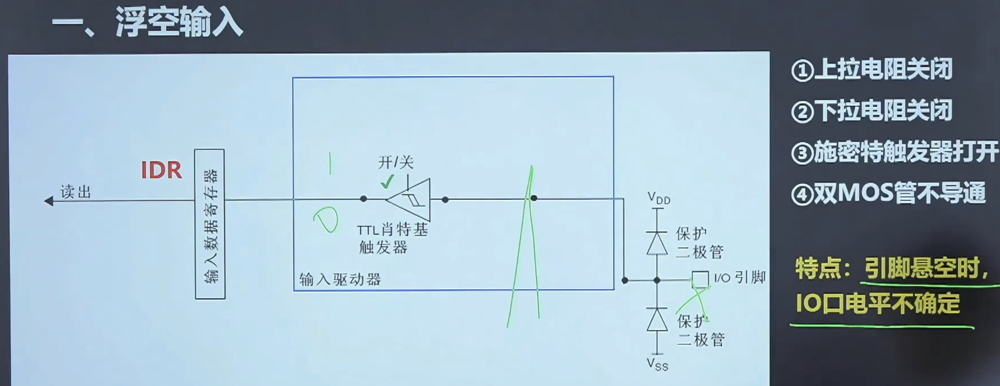
      2. 上拉输入 - 打开内部上拉电阻 读引脚电平 默认为高电平
      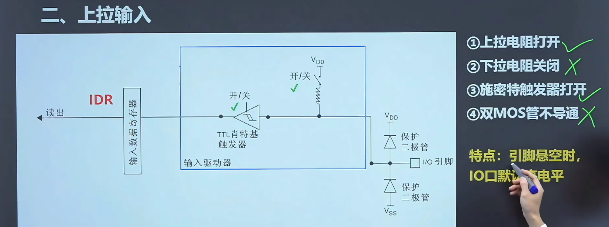
      3. 下拉输入 - 打开内部下拉电阻 读引脚电平 默认为低电平
      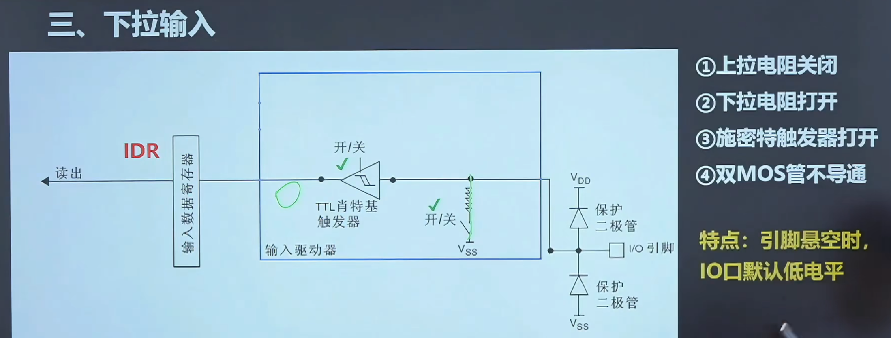
      4. 模拟功能 - GPIO寄存器控制输入输出无效 由ADC、DAC控制
      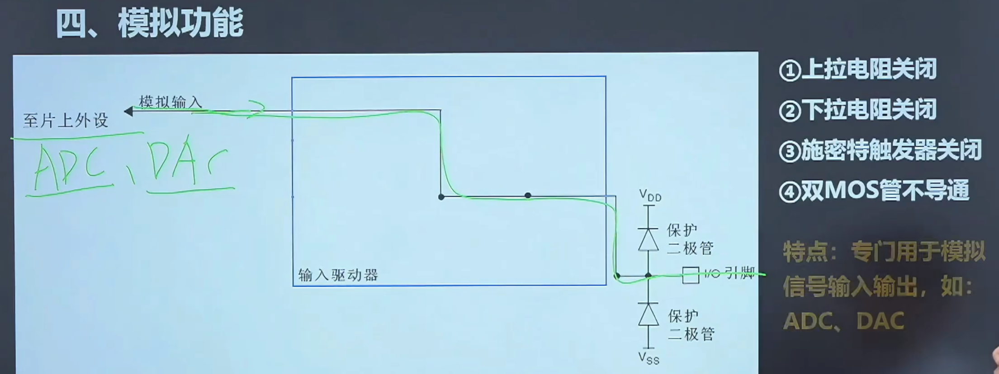 
   - 四种输出：
      1. 开漏输出 ： 引脚可输出高阻态、低电平
      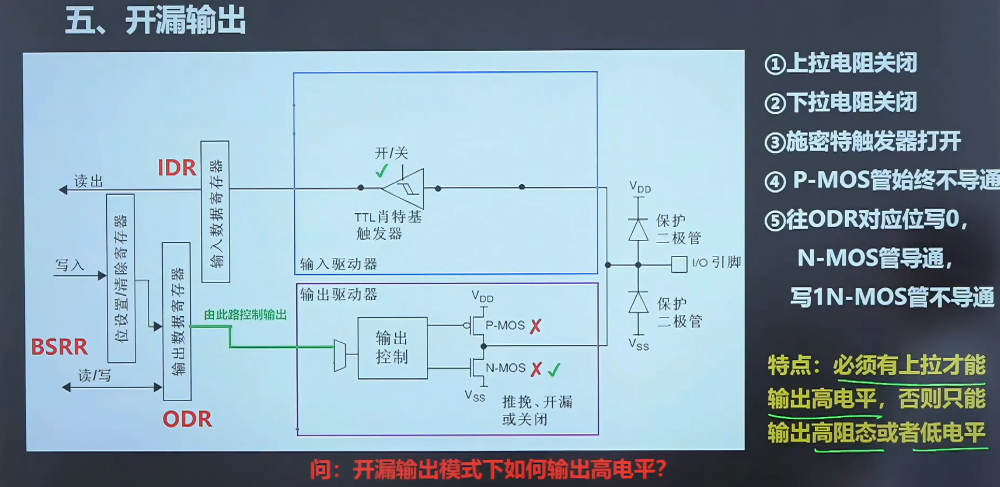
      2. 推挽输出 ： 引脚可输出高电平、低电平
      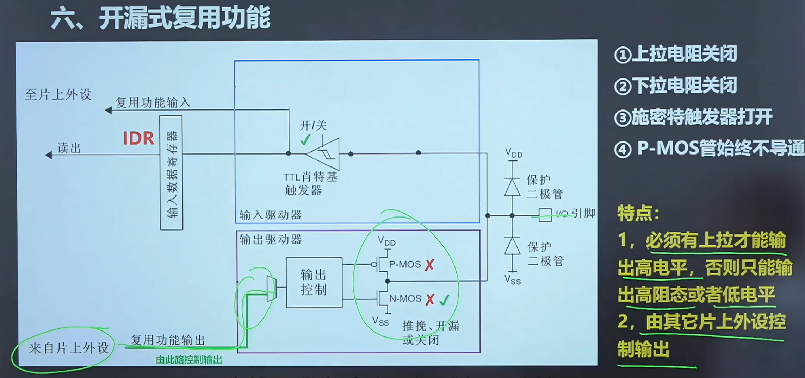
      3. 开漏式复用功能：由其他片上外设控制输出，引脚可输出高阻态、低电平
      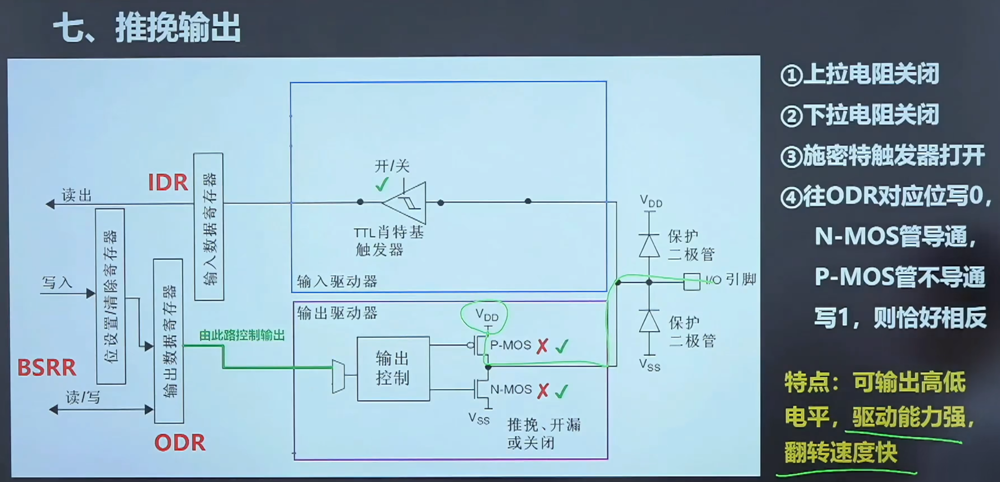
      4. 推挽式复用功能：由其他片上外设控制输出，引脚可输出高电平、低电平
      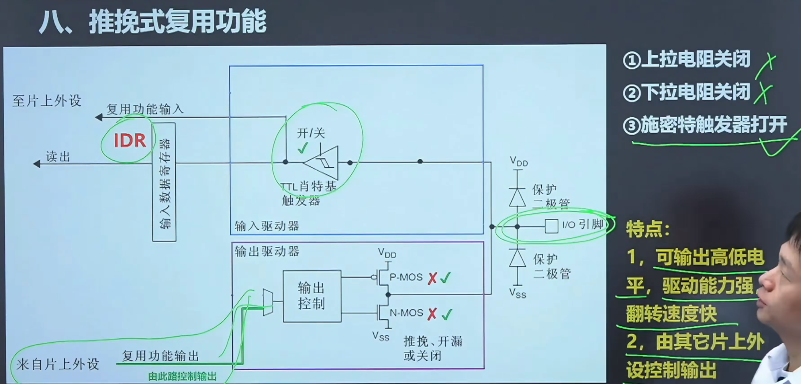 
- **GPIO输出配置步骤**
  1. 使能时钟 ： `_HAL_RCC_GPIOx_CLK_ENABLE()`
  2. 设置工作模式：`HAL_GPIO_Init()`
  3. 设置输出状态：`HAL_GPIO_WritePin()` 或 `HAL_GPIO_TogglePin() `
- **GPIO输入配置步骤**
  1. 使能时钟：`_HAL_RCC_GPIOx_CLK_ENABLE()`
  2. 设置工作模式: `HAL_GPIO_Init()`
  3. 读取输入状态：`HAL_GPIO_ReadPin()` 
- **继电器模块介绍**
- STM32是3.3V直流系统 灯泡是220V 交流系统 想要实现控制关系 需借助媒介 - 即继电器模块
- 继电器作用：弱电控制强电 即：小电流控制大电流、直流电控制交流电 实现电路的隔离
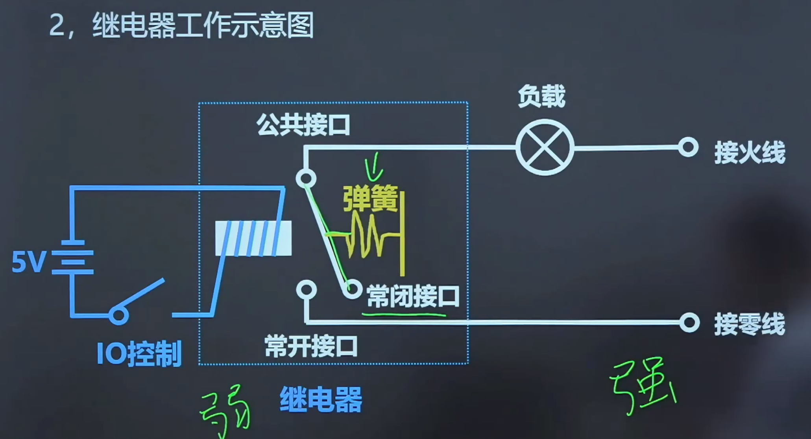

#### 电源引脚
- VSSA、VDDA - 模拟电源
- VSS、VDD - 数字电源
- 多组电源的好处：减小电源的阻抗 提高电源供电能力 分散芯片热量 减少干扰
#### 晶振引脚
- xx-OSCxx_IN 、 xx-OSCxx_OUT （正点原子这款接的是 32.768KHZ晶振 和 8MHZ晶振）
#### 复位引脚
- NRST
#### 下载引脚
- **定义**： 用于将编译好的程序代码从电脑（通过下载器/调试器）传输到MCU内部的Flash存储器中，并支持在线调试功能
- 类型：
  - SWD 用2个GPIO口（推荐）
    - SWDIO: 串行线数据输入/输出
    - SWCLK: 串行线时钟
  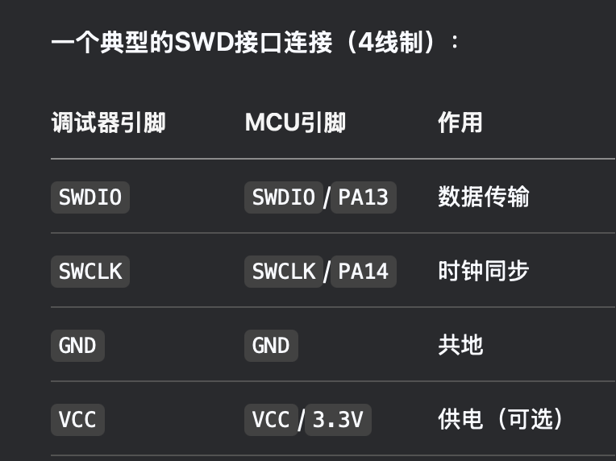 
  - JTAG 用5个GPIO口
#### BOOT引脚
定义：用于选择芯片上电或复位后从何处开始执行程序 即- 决定了MCU上电启动时的行为
- BOOT0、BOOT1
- MCU内部通常有多块可以存储程序的内存区域，最主要的有：
  - **主Flash存储器**：我们平时编译的程序就下载到这里。这是正常的工作模式。
  - **系统存储器**：芯片出厂时预置的一段只读的Bootloader程序。这个程序由芯片原厂编写，用于通过某种串行通信（如USART、USB、CAN等）来接收新程序并烧写到主Flash中。
  - **内置SRAM**：易失性存储器，断电后数据丢失，通常不用于存储程序，但也可以作为启动介质用于特殊调试。
- **BOOT引脚的作用，就是在芯片启动的瞬间，决定CPU是去执行主Flash里的用户程序，还是去执行系统存储器里的出厂Bootloader**。
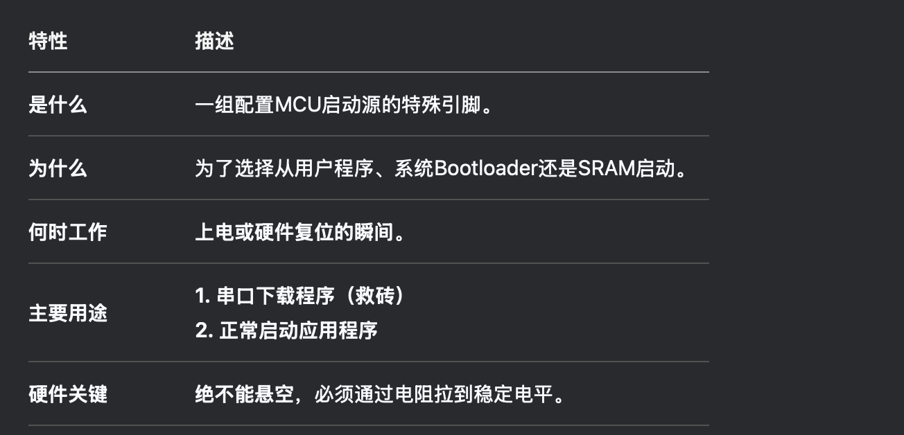
     
### 中断
- **中断**： 打断CPU执行正常程序 转而处理紧急程序 然后返回被打断的程序处继续执行
- **中断嵌套**：执行中断程序时 有另一个更高优先级的中断提出中断请求 CPU暂停当前中断程序 转而处理优先级更高的中断程序 完成后依次返回
- **轮询**：CPU以一定的周期去查询是否发生某事 若有执行相关程序 若无则继续查询 （占用CPU资源 处理不及时）
- **NVIC** 嵌套向量中断控制器 属于内核
  - NVIC支持：256个中断（16内核+240外部） 支持256个优先级 允许厂商裁剪
  - STM32F103XX ：10个内核中断、60个外部中断、16个中断优先级
- **中断优先级**
  - 抢占优先级：高抢占优先级**可以打断**正在执行的低抢占优先级中断
  - 响应优先级：当**抢占优先级相同时** 响应优先级高的先执行 但**不能打断**
  - 自然优先级：当抢**占和响应优先级都相同** 按中断向量表的优先级排序
- 以上三种优先级都是 ==**数值越小 优先级越高**==
- 每个中断的排队序号信息包括：抢占 + 响应 + 自然
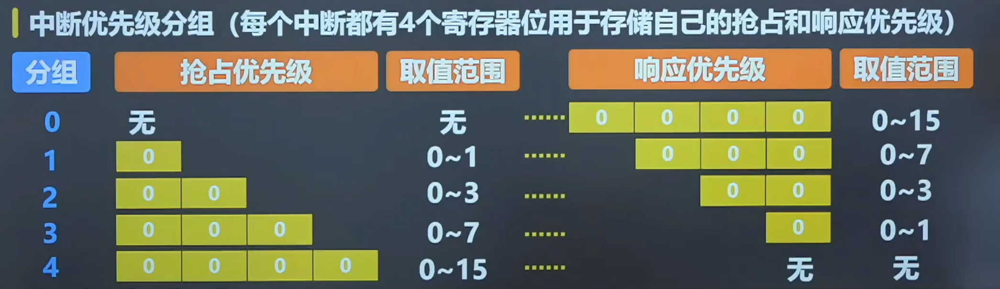
- **NVIC的使用**
  - 设置中断分组: `HAL_NVIC_SetPriorityGrouping()`
  - 设置中断优先级: `HAL_NVIC_SetPriority()`
  - 使能中断 : `HAL_NVIC_EnableIRQ()`
  
### EXTI
- EXTI - 外部**中断**/事件控制器
  - EXTI主要用于检测IO口电平变化 并向可NVIC提出中断请求 CPU可快速响应
  - EXTI支持20条EXTI线 每条EXTI线都支持单独配置：开启/屏蔽、触发方式等
    - 中断和事件
      - 中断：发生事件并向NVIC提出中断请求 CPU进入中断服务函数处理
      - 事件：发生事件不会通知NVIC 内部其它外设可对该事件进行响应 该过程不需要CPU参与 属于外设间联合工作（很少用）
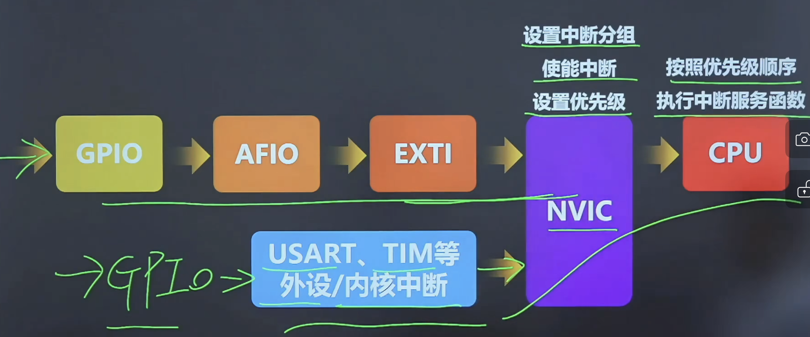
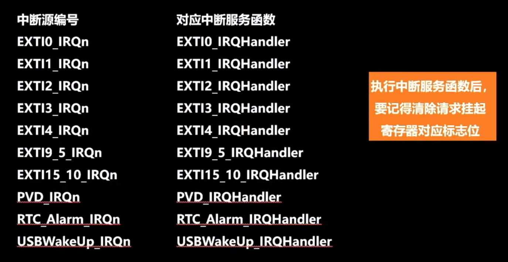
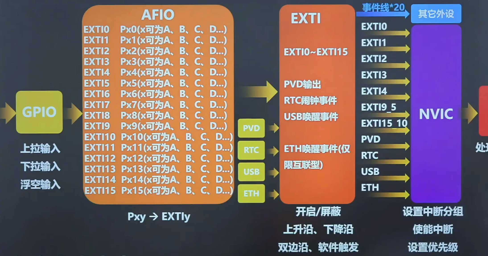 
- AFIO 即复用功能IO：调试IO配置、外部中断IO选择配置、重映射配置
  - 配置AFIO寄存器前要使能AFIO时钟：`__HAL_RCC_AFIO_CLK_ENABLE()`
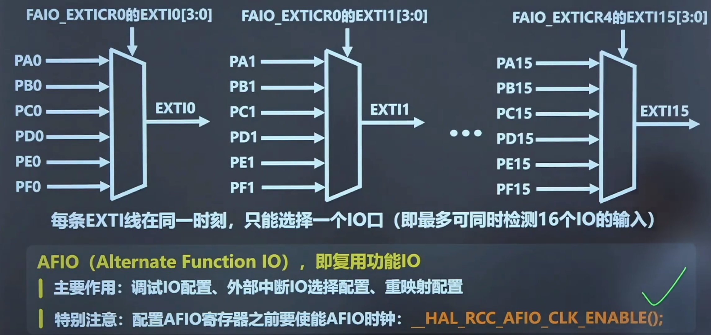 
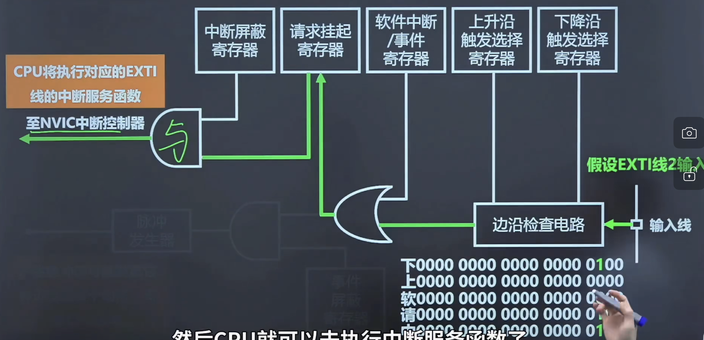
- **EXTI配置步骤** 
  1. 使能GPIO时钟：`__HAL_RCC_GPIOx_CLK_ENABLE()`
  2. GPIO/AFIO/EXTI：`HAL_GPIO_Init()` 一步到位
  3. 设置中断分组：`HAL_NVIC_SetPriorityGrouping()` 一次就好
  4. 设置中断优先级：`HAL_NVIC_SetPriority()`
  5. 使能中断：`HAL_NVIC_EnableIRQ()`
  6. 编写中断服务函数： `EXTIx_IRQHandler()` 完事记得清中断标志
     1. 获取中断事件是否发生：`__HAL_GPIO_EXTI_GET_IT()`
     2. 中断逻辑代码..
     3. 清除标志位：`__HAL_GPIO_EXTI_CLEAR_IT()`

### 时钟树
- **时钟** - 具有周期性的脉冲信号 通常是占空比50%的方波 时钟是单片机的脉搏
  - **时钟源**
    - 高速外部振荡器（HSE） -  频率：4～16MHz（本项目用的8MHz）
    - 低速外部振荡器（LSE） -  频率：32.768KHz 
    - 高速内部振荡器（HSI） -  频率：8MHz
    - 低速内部振荡器（LSI） -  频率：40KHz
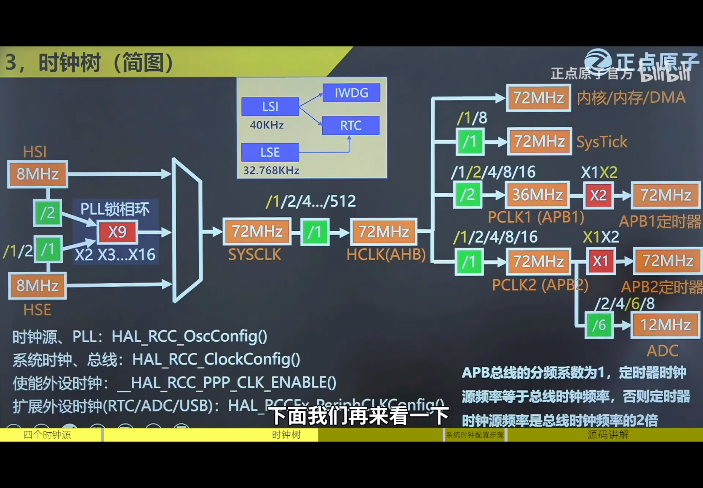
  - 时钟源、PLL(锁相环): `HAL_RCC_OscConfig()`
  - 系统时钟（SYSCLK）、总线（AHB、APB1、APB2）：`HAL_RCC_ClockConfig()`
  - 使能外设时钟： `__HAL_RCC_PPP_CLK_ENABLE()`
  - 扩展外设时钟（RTC/ADC/USB）：`HAL_RCCx_PeriphCLKConfig()`
- **系统时钟配置步骤**
  - 配置 `HSE_VALUE`: 告诉HAL库HSE的频率，`stm32f1xx_hal_conf.h`
  - 调用 `SystemInit()`（可选）：在启动文件中调用，在 `system_stm32f1xx.c`定义
  - 配置时钟源/锁相环：`HAL_RCC_OscConfig()`
  - 系统时钟源/总线分频器：`HAL_RCC_ClockConfig()`
  - 配置扩展外设时钟（可选）：`HAL_RCCx_PeriphCLKConfig()`
  - 使能某个外设时钟如：`__HAL_RCC_GPIOA_CLK_ENABLE()` /* 使能GPIOA时钟*/

### USART 串口
- 串口简介：通用同步异步收发器 用于两个设备之间传输数据
- 通信线：TX-发送 RX-接收 GND-参考地
- **串口外设相关**
  - **引脚** 
  - **波特率：** 每秒传输的位数 传输双方要使用相同的波特率
    - 每一位的传输时间间隔 = 1/波特率（单位s）如：1/115200 
    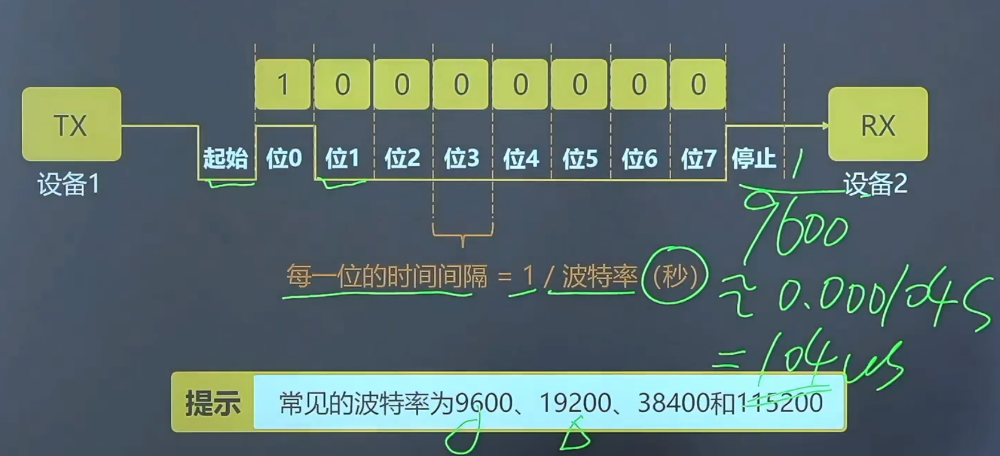
  - **字长：** 每次传输的数据位数 传输双方要使用相同的字长
    - 8位 或 9位（搭配校验位使用）
  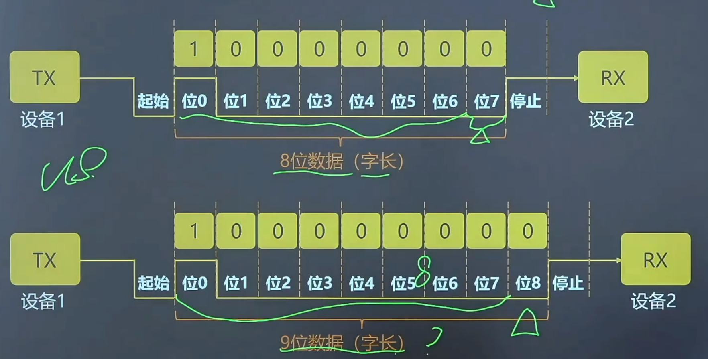 
  - **校验方式：** 为确保数据准确性 传输双方可约定数据校验的方式
    - 无校验
    - 奇校验
    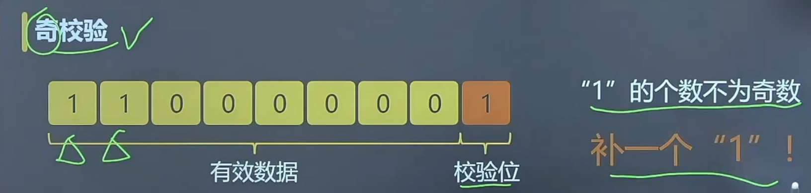 
    - 偶校验
    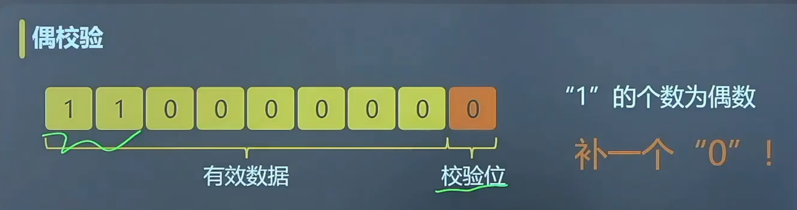
  - **停止位：** 用于标识数据包的结束 确保接收端有足够的时间处理接收到的数据
    - 停止位可选：0.5位 1位 1.5位 2位 一般用1位或2位 
      - 比如波特率为9600 那么2位停止位 就是（1/9600） * 2 
    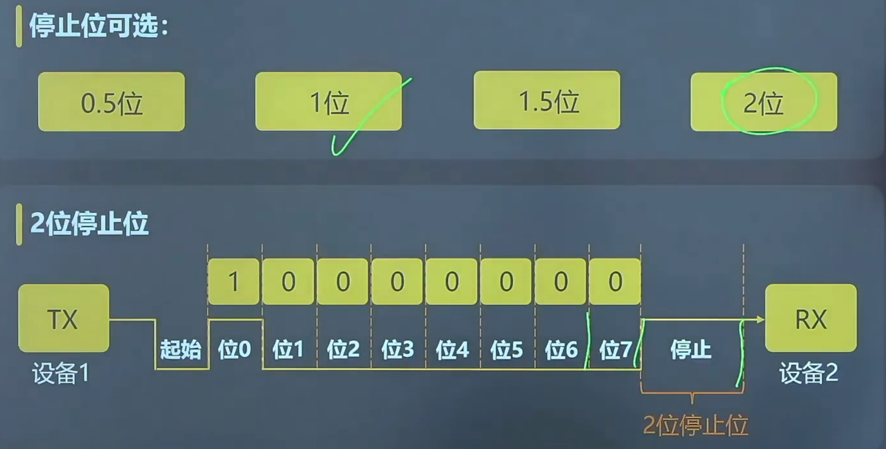  
  - **硬件流控：** 反馈接收端是否就绪 避免发送的数据丢失
    - 多一条连接线 `CTS --- RTS` 
    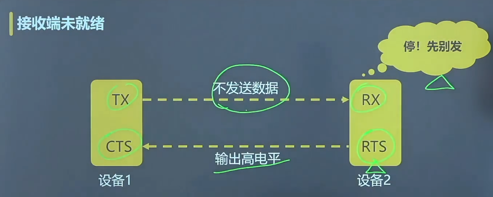
    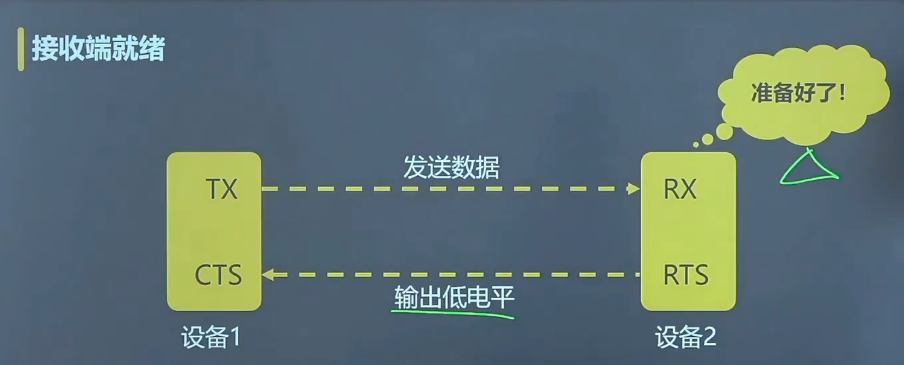
  - **模式：** 数据的接收和发送功能都可以单独开始或关闭
    - 仅发送
    - 仅接收
    - 收发
- USART串口的数据收发是通过**读写DR数据寄存器**实现的
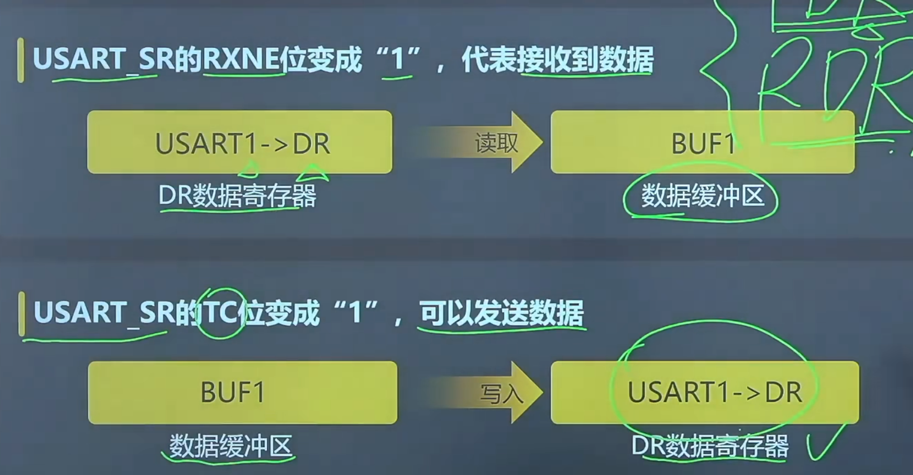
- **串口发送配置步骤**
  - 初始化GPIOx时钟：   `__HAL_RCC_GPIOx_CLK_ENABLE()`
    - GPIOx可为：GPIOA / GPIOB /GPIOC / ...
  - 使能USARTx时钟： `__HAL_RCC_USARTx_CLK_ENABLE()`
    - USARTx 即： USART1 / USART2 / ...
  - 初始化USARTx的引脚： `HAL_GPIO_Init()`
  - 初始化USARTx、配置波特率、字长、停止位、校验方式、硬件流控和模式: `HAL_UART_Init()`
  - 发送数据： `HAL_UART_Transmit()`
- **串口接收和发送配置步骤**
  - 相比发送步骤 多了一个 接收数据：`HAL_UART_Receive()`
- **串口接收中断**
  - 将串口接收从循环中分离出来 即保证数据接收的时效 又可以节省CPU占用资源
  - 进入中断机制：每接收到一个字节数据 就会进入到串口接收中断
  - **串口接收（中断方式）配置**
    - 使能GPIOx时钟、USARTx时钟，初始化USARTx的引脚
    - 使能串口1中断：`HAL_NVIC_EnableIRQ()`
      - 用串口几就使能串口几 我这里用串口1为例
    - 设置串口1中断优先级：`HAL_NVIC_SetPriority()`
    - 使能串口1接收中断：`__HAL_UART_ENABLE_IT()`
    - 进入`USART1_IRQHandler`函数 判断是否为接收中断：`__HAL_UART_GET_FLAG()`
    - 接收数据：`HAL_UART_Receive()`
- **串口接收数据包**
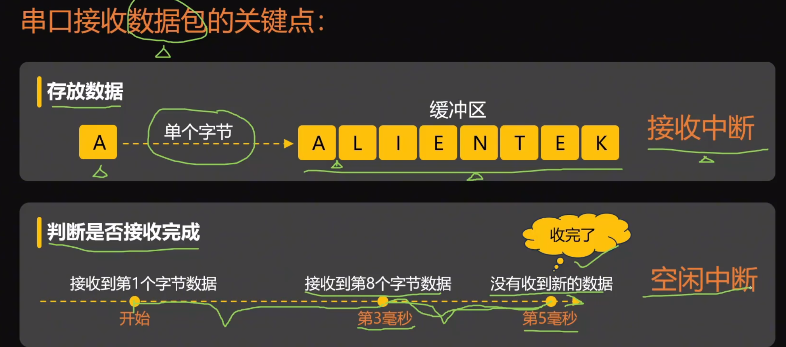
- **串口空闲中断：**
  - 作用：用于判断数据包是否接收完成
  - 进入中断的时机：串口开始接收数据后 如果隔一段时间没接收到新的数据  则进入空闲中断
  - **串口接收不定长度数据包配置**
    - 使能GPIOx时钟、USARTx时钟，初始化USARTx的引脚
    - 使能串口1中断、设置串口1中断优先级
    - 使能串口1空闲中断：`__HAL_UART_ENABLE_IT()`
    - 进入`USART1_IRQHandler`函数 判断是否为空闲中断：`__HAL_UART_GET_FLAG()`
    - 清除空闲中断标志位，记录接收完成：`__HAL_UART_CLEAR_IDLEFLAG()  `
    - 判断是否接收完成 接收完成数据包则发送数据：`HAL_UART_Transmit()`

### DMA控制器（外设）
- DMA - 直接存储器访问，可以在**存储器和存储器之间**或**外设和存储器之间**进行**高速数据传输** 其数据传输过程**不需要CPU干预**
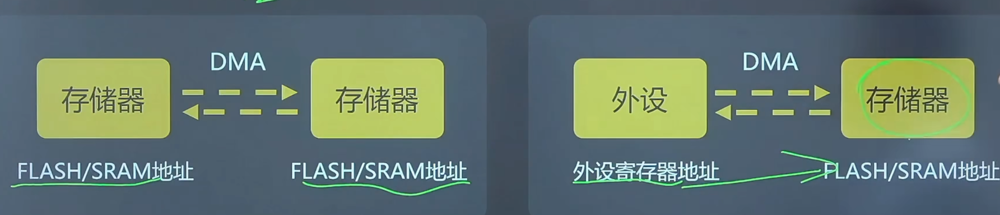 
- **DMA外设关键知识**
  - **通道：** 以正点原子使用的MCU为例 仅支持DMA1通道 1～7
    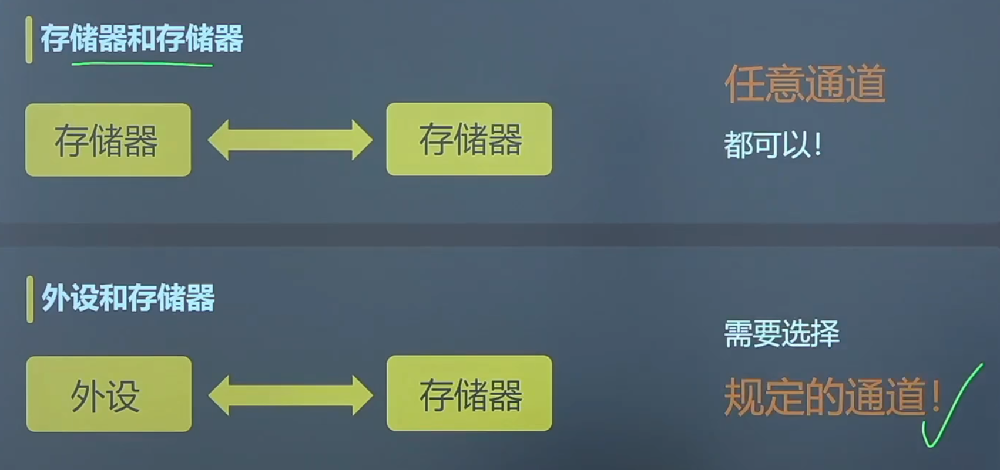 
  - 优先级：当多个通道同时触发传输请求 仲裁器会根据通道优先级来启动传输
    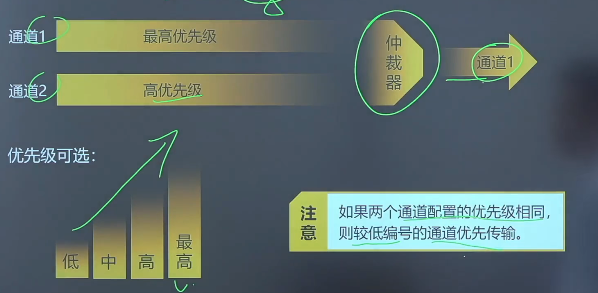 
  - **方向：** 存储器和存储器之间、外设和存储器之间
  - **地址：** 在DMA数据传输之前 用户需要指定数据的起源地址和目的地址
  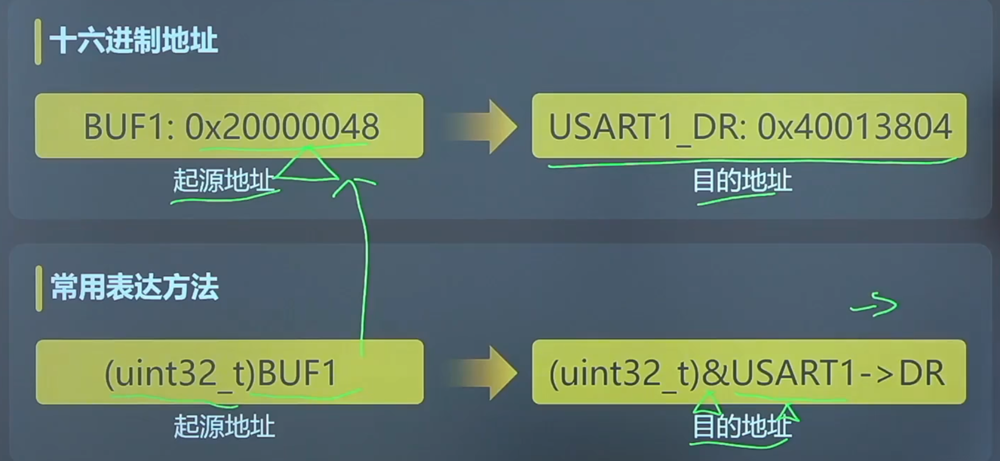
  - **地址增量：** 在DMA数据传输之前 用户可以设定数据的起源地址和目的地址是否自增 （一般：外设地址不自增 寄存器地址自增）
  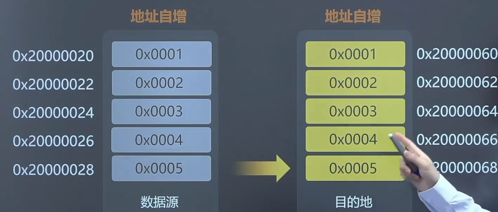
  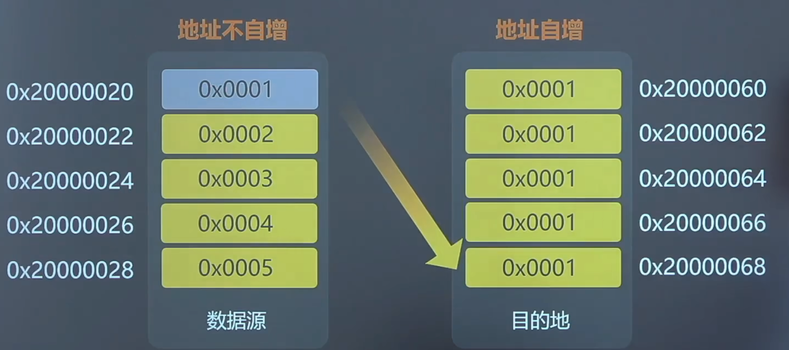 
  - **数据宽度：** 在DMA数据传输之前 用户需要指定传输双方的数据宽度 （8 / 16 / 32 位） 尽量保持双方数据宽度一致
  - **数据量**：（可以理解为计数器）在DMA数据传输之前 用户需要指定传输的数据量 可选 **0～65535**  ??重新配置数据量之前 需先关闭DMA通道
  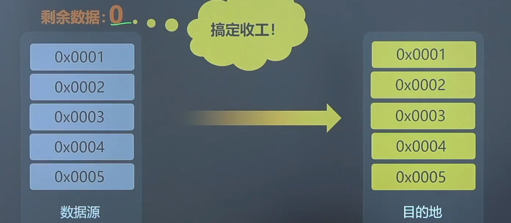 
  - **模式**
    - 正常模式：单次传输完成后停止传输 不自动重置数据量
    - 循环模式：单次传输完成后 自动重置数据量 再次开始传输 (**存储器到存储器方向不允许使用循环模式**)
  - **触发源**：DMA传输生效必须要有触发源（请求），其分为软件触发和硬件触发 （不用自己配置）
  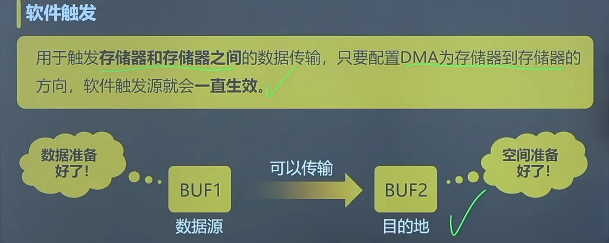
  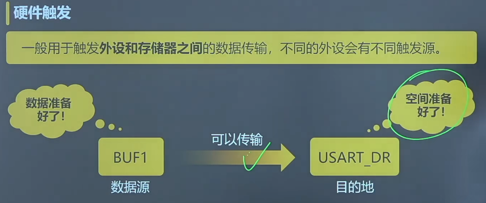 
  - **传输状态** 
    - 传输过半、传输完成、传输错误  
- **存储器到存储器** DMA配置步骤（以DMA1为例）
  - 使能DMA1时钟：`__HAL_RCC_DMA1_CLK_ENABLE()`
  - 初始化DMA1，配置通道、优先级、方向、地址增量、数据宽度、模式：`HAL_DMA_Init()`
  - 配置数据起源地址、目的地址和数据量，使能DMA1: `HAL_DMA_Start()`
  - 判断是否传输完成：`__HAL_DMA_GET_FLAG()`
  - 传输完成后打印数据 并清除完成标志：`__HAL_DMA_CLEAR_FLAG()`
- **存储器到外设** DMA配置步骤（以DMA1为例）
  - 使能DMA1时钟：`__HAL_RCC_DMA1_CLK_ENABLE()`
  - 关联DMA1和串口1: `__HAL_LINKDMA()`
  - 初始化DMA1，配置通道、优先级、方向、地址增量、数据宽度、模式：`HAL_DMA_Init()`
  - 配置数据起源地址、目的地址和数据量，使能DMA1: `HAL_DMA_Start()`
  - 使能串口1的DMA: `USART1->CR3 |= 1 << 7; `（数据手册上查看）
  - 判断是否传输完成：`__HAL_DMA_GET_FLAG()`
  - 传输完成后打印数据 并清除完成标志：`__HAL_DMA_CLEAR_FLAG()`

### ADC 模数转换器
- 将模拟量转换为数字量的器件 可用于测量直流电源电压 可测电压：0～3.3v（板子决定） 分辨率：12位 分辨率决定ADC值的范围：0 ～（2^12 - 1）即 0～4096 
- **ADC外设的关键知识点** （以STM32F103C8T6为例 ADC的时钟最大支持14MHz）
  - 时钟
    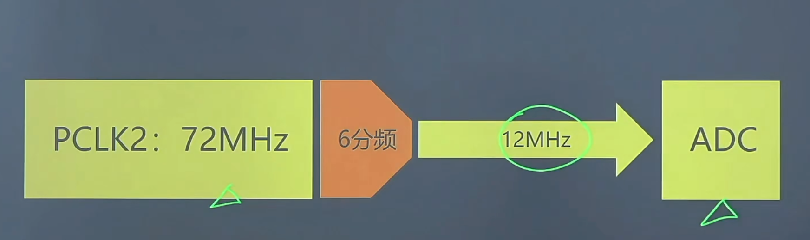 
  - 通道
    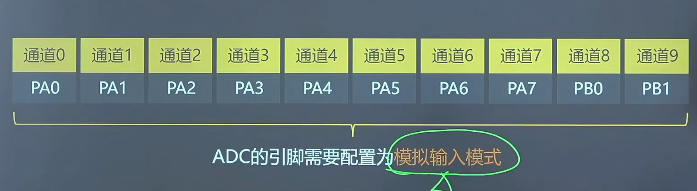 
  - 通道分组：
  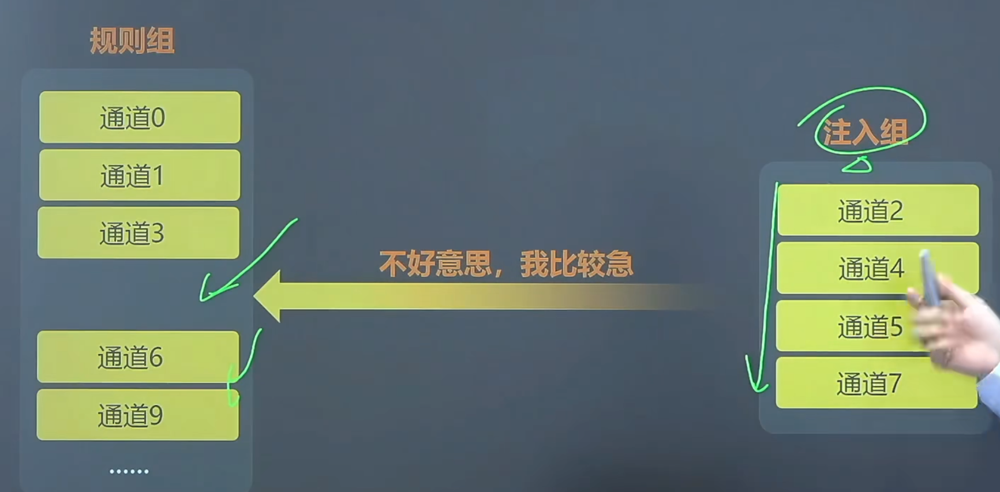
  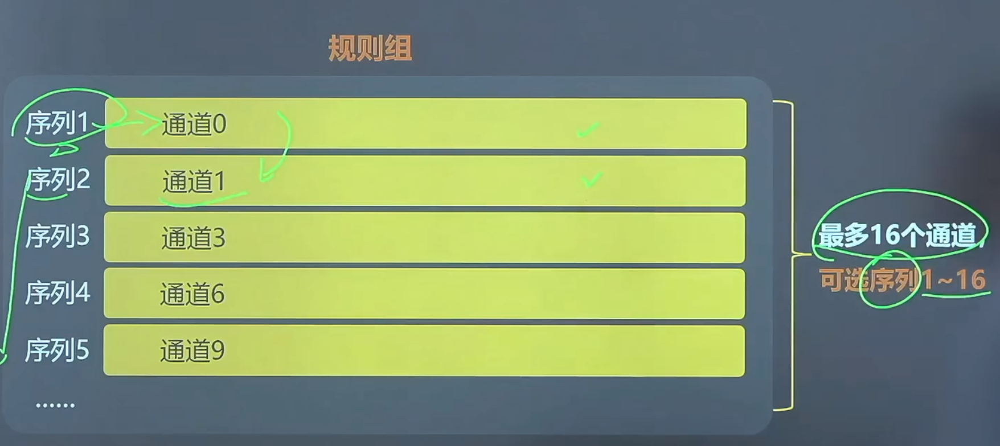
  - 扫描模式连续转换：ADC的扫描模式和连续转换模式都可以单独开启和关闭 以组合出不同的采集效果
  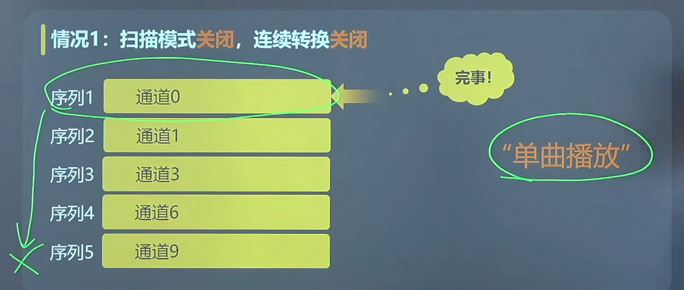
  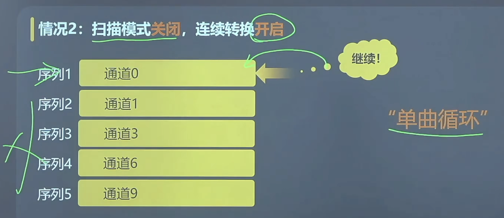
  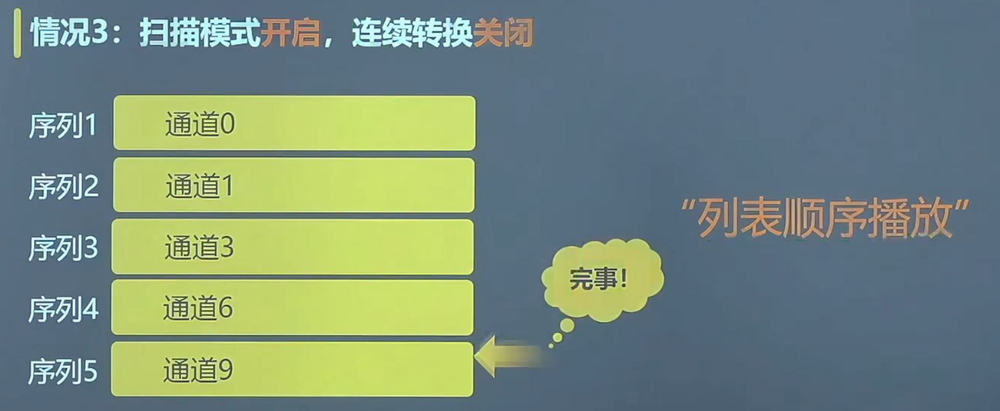
  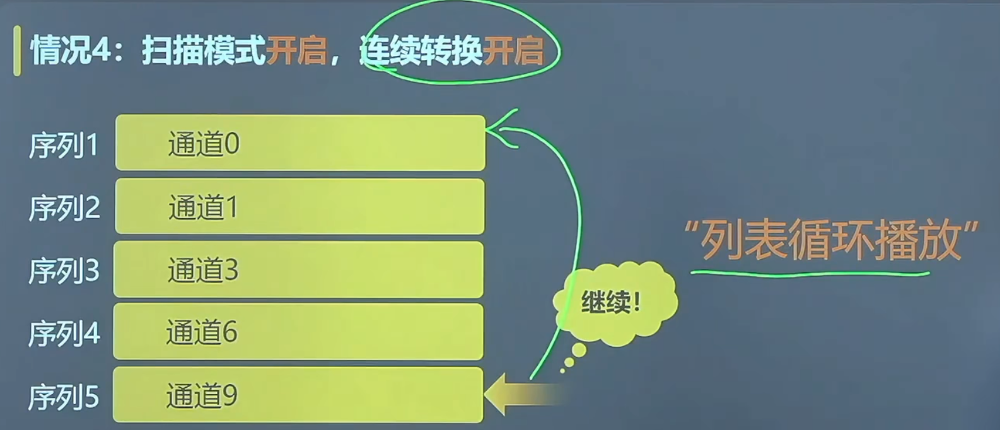
  - 数据对齐： 左对齐、右对齐（用的多）
  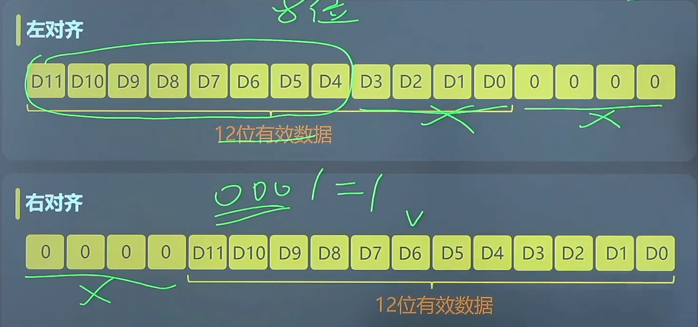 
  - 触发方式：
    - **软件触发：** 纯软件控制 软件使能ADC和转换即可（用的多）
    - 定时器触发：定时器外设的内部信号触发转换
    - EXTI线 ：外部引脚的信号触发转换
  - ADC采样时间： 采样时间越长 数据相对越准确 用户可根据需求选择采样时间
    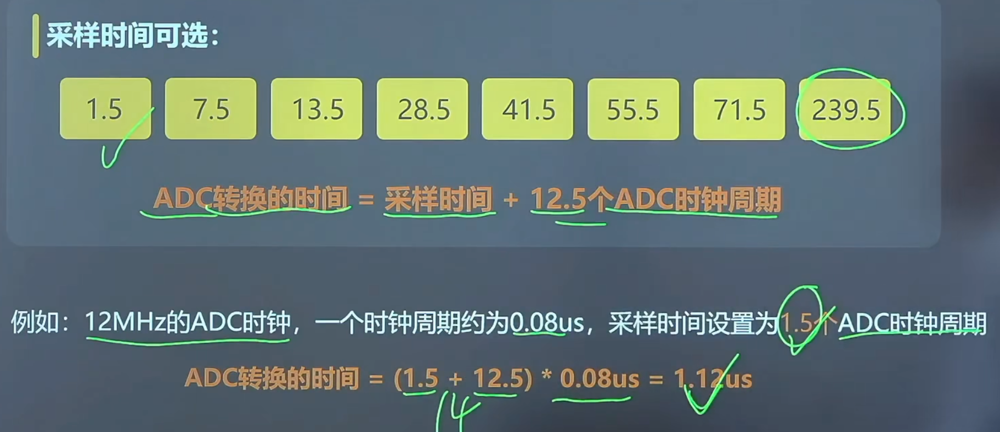
  - 数据读取：ADC通道转换完成后 用户可从ADC的DR数据寄存器中读取数据
（值的注意的是。当有多通道采集时。需要搭配DMA来迅速搬运数据 以免造成数据丢失） 
  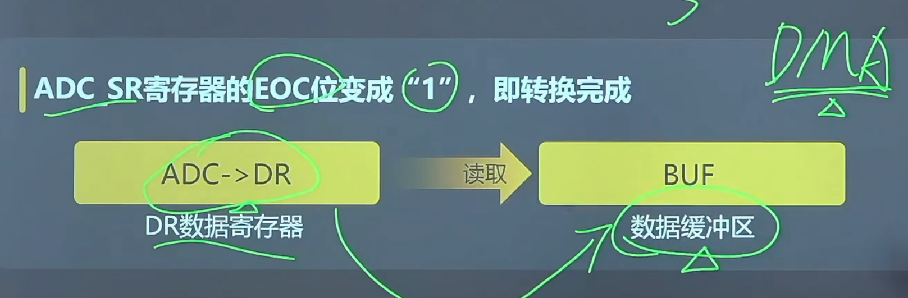  
- **ADC单通道采集 步骤**
  - 初始化部分
    - 使能GPIOA、ADC1时钟：`__HAL_RCC_ADC1_CLK_ENABLE()`
    - 将ADC时钟进行分频： `HAL_RCCEx_PeriphCLKConfig()`
    - 初始化ADC的引脚：`HAL_GPIO_Init()`
    - 初始化ADC1、配置对齐方式、扫描模式、连续转换、通道数量、触发方式：`HAL_ADC_Init()`
    - 校准ADC：`HAL_ADCEx_Calibration_Start()`
    - 配置ADC通道：包括通道号、序列和转换时间：`HAL_ADC_ConfigChannel()`
  - 读取数据部分
    - 使能ADC1, 触发转换：`HAL_ADC_Start()`
    - 等待ADC数据转换完成：`HAL_ADC_PollForConversion()`
    - 获取ADC转换后的原始数据：`HAL_ADC_GetValue()`
    - 计算电压值：（电压值 = （ADC值 / 4095）* 3.3v）

### 电位器模块 （分压）
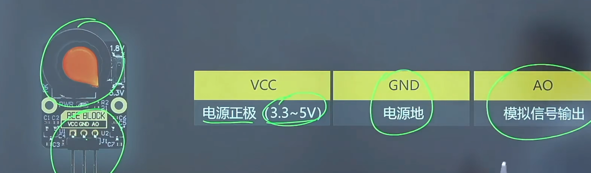
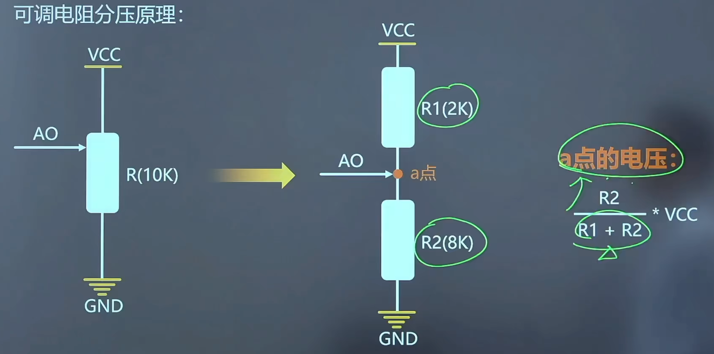
- 电位器模块电压读取 （直接可以选用ADC单通道采集的代码就行）

### I2C 通信
- I2C是串行通信协议 仅需两根信号线即可实现数据传输（半双工、主从模式、 同步通信）
  - SDA ：传输数据
  - SCL：提供数据传输的同步时钟信号
  - 半双工：数据在同一时间只能单向传输
  - 主从模式：主机发指令，从机响应执行，从机不能主动通信
  - 同步通信：总线设备使用同一时钟信号，协调数据传输，确保双方同步收发
  - 一主多从模式：设备地址通过数据手册查看 一个主设备上不可以连接两个相同设备地址的从设备
  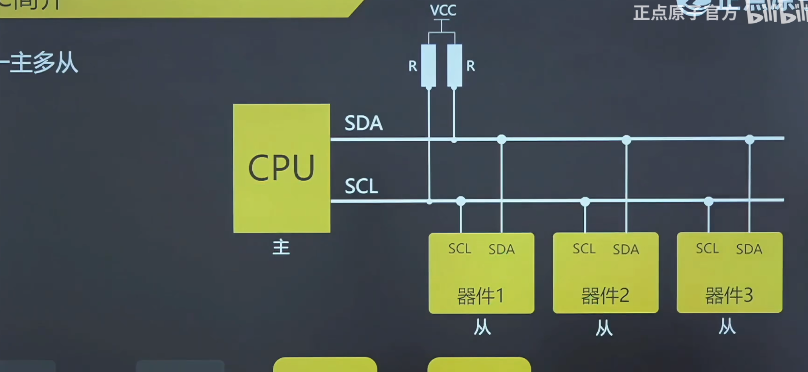 
  - 软件I2C的硬件配置
    - SCL接SCL,SDA接SDA
    - SCL配置为推挽输出，SDA配置为开漏输出，加弱上拉电阻电阻
  - **起始信号与停止信号**
    - 起始信号：SCL**高电平**期间 SDA从**高电平**切换到**低电平**
    - 停止信号：SCL**高电平**期间 SDA从**低电平**切换到**高电平**
    - ==**??：仅起始信号和停止信号，才会在SCL高电平期间，控制SDA变化**==
     
  - **确定数据有效性 与 数据传输**
    - 确定数据有效性：SCL低电平期间 确定数据有效性
    - 数据传输： 按位发送（高位在前）， 数据位在SCL高电平期间稳定有效
    - ==**总结：低电平变换 高电平采集**==
     
    
  - **应答信号（ACK/NACK）1bit**
   
  - **空闲状态：** SDA和SCL两条信号线同时处于高电平，规定总线为空闲状态
  - **指定地址写**
   
  - **指定地址读**
  

### EEPROM模块
- EEPROM ：非易失性存储器 断电后数据不丢失
  - I2C通信，适合存储少量需要掉电保存的数据 寿命长
- 以 `24C02` 为例

  - `24C02` **写**时序图逻辑实现
    
  - `24C02` **读**时序图逻辑实现
    
    
- 实现EEPROM模块的读写
  1. 软件IIC引脚初始化：使用**两个GPIO**、分别模拟**SDA数据线**和**SCL时钟线**
  2. 软件实现IIC协议：起始信号、停止信号、应答信号、传输数据
  3. 实现24C02读写函数：指定地址读写一个字节函数；指定地址读写任意字节函数

### SPI通信 同步 全双工 支持一主多从
- SPI ：**高速同步串行通信协议**
  - 常用于：存储器、显示屏、传感器等
  - SPI接线
  
  - SPI主从模式
   
- SPI协议
  - 数据的收发 
  
  - SPI的移出和移入数据
  
    - 时序模式
      - 模式0
         
      - 模式1
         
      - 模式2
         
      - 模式3 
        
      - SPI通信模式真值表
        
- SPI外设
  - 每个SPI都有对应的信号引脚 （看芯片手册） 
    - STM32每个SPI外设仅有一个固定的硬件NSS引脚
    - 如果需要挂载多个从设备 仅靠硬件片选无法满足需求
    - 以STM32F103的SPI2为例 进行引脚的初始化
    
  - SPI模式 （通信中的角色：主设备 or 从设备）
    - 主设备：控制通信时序 提供时钟信号 发起数据传输
    - 从设备：被动等待主设备发起通信 按照主设备时钟信号收发数据
  - 传输方向 决定数据传输的单向性或双向性
    - 双线全双工：使用两条数据线来进行全双工通信
    - 双线仅接收模式
    - 单线双向模式  
  - 数据帧格式：每次SPI数据传输时 数据的位数
    - 数据的传输单位是 ‘帧’
      - 8位： 每次传输1字节
      - 16位： 每次传输2字节
  - 数据帧顺序：每次SPI数据传输时 数据帧传输的首位是最高位还是最低位
    - 高位优先（MSB）、低位优先（LSB）
    
  - 时钟极性（CPOL）、时钟相位（CPHA）
  - 片选信号 NSS管理SPI通信中控制从设备选择的方式
    - 软件管理模式（需要灵活控制片选信号的场合）
      - NSS信号由软件手动控制
      - 主设备通过软件控制拉高和拉低NSS引脚 从而控制从设备的选择和数据传输
    - 硬件管理模式
      - NSS信号由硬件自动控制
      - 住设备通过拉低NSS引脚来选择从设备 数据传输自动开始和结束 
    - SPI波特率 SPI数据传输速率
    
  - 使用 `HAL_SPI_TransmitReceive()` 函数 可同时发送和接收数据 

### 常用通信协议对比


### 定时器
- 以F103为例
  - 基本定时器：TIM6、TIM7
  - 通用定时器：TIM2、TIM3、TIM4、TIM5
  - 高级定时器：TIM1、TIM8
  - 例程的芯片只有：TIM1 、 TIM2、  TIM3、 TIM4
- 时基单元
  - 定时器的本质就是计数器
   
  - 时基单元由：计数器、预分频器、自动重装载寄存器构成（16位）
  
  
   
  
- 输入捕获
- 输出比较
  - **PWM脉冲宽度调制** 周期固定 占空比可调
    - 占空比 = 高电平/周期 
    

### CAN
- CAN ： 一种多主机、高可靠性的控制器**局域网总线** 
  - 核心特点：
    - 多主模式：所有设备都是平等的 可以主动发送数据
    - 差分信号传输（CAN_H & CAN_L）：线路少，抗干扰能力强
    - 仲裁机制：保证高优先级的数据可以优先传输
    - 高可靠性：CRC校验，错误检测与自动重发机制等
    - 无需地址分配：基于消息ID进行通信 同时指定数据优先级（消息ID越小 优先级越高）
    - 传输方式：广播和请求
    - 通信速率：10kbps～1Mbps
  - 每个设备都通过CAN收发器连接至CAN总线
  - CAN收发器的作用：信号转换、数据采样、数据输出等
  
  - 高速CAN硬件连接
    
    - CAN控制器的TX/RX连接至收发器TX/RX 收发器的CAN_H/L对应连接至总线H/L
    - 两端添加120欧的终端电阻 用于阻抗匹配 以减少回波反射
  - 高速CAN电平标准
    - 差分信号：两线电压差
    
  - CAN协议
    - **数据帧** 用于传输实际数据的帧（广播式），格式：标准帧（11位）、扩展帧（29位）（ID位数不同） 
     
      - 起始位 SOF：标志帧开始 始终为**显性位（0）**
      - 消息ID：消息类型 、优先级指定、值越小越高
      - RTR：数据帧（固定为0） 遥控帧（固定为0） 
      - IDE：区分标准帧格式（0）还是扩展帧格式（1）
      - SRR：扩展帧 向下兼容
      - r0/r1：保留位
      - DLC：数据长度
      - Data：实际传输数据 0～8字节（应该与DLC配合使用）
      - CRC：校验
      - ACK：其他设备对帧进行应答确认
      - CRC/ACK界定符：为应答前后留下充足时间 确保数据正确解析
      - EOF：帧结束（7个1）
    - 遥控帧（请求式）：用于请求数据 格式：标准帧、扩展帧
       
    - 错误帧
     
    - 过载帧：
    
    - 帧间隔：两个连续CAN帧之间的时间间隔 
    
  - CAN波特率及位同步
    - CAN总线的波特率：每秒传输的位数 
      - CAN属于异步通信 没有时钟线  设备之间需设置相同波特率进行通信 125K ～ 1Mbps
  - CAN外设