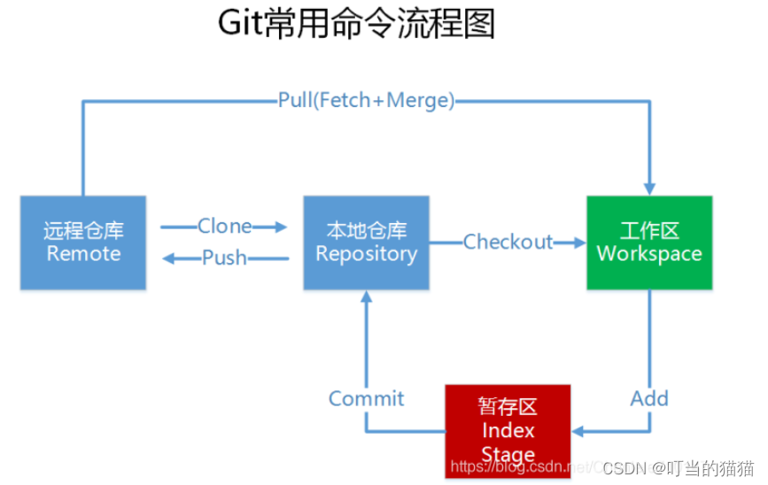

# Git

### git 与github的绑定
命令端获取密钥：
1. 获取 SSH keys
   * `cd ～/.ssh`   -- 查看是否有ssh key 
   * `ssh-keygen -t rsa -C “git账号”`  输入命令 一直 **enter** 就行
2. 按路径进入 `.ssh` ，里面存储的是两个ssh key的秘钥，`id_rsa.pub`文件里面存储的是公钥 这就是需要的文件
github端绑定：
1. 登陆github账号 进行绑定

至此git与github账号就绑定好了 就可以使用git从仓库里下载/上传代码了
?：小小配置（在之后的代码管理中 这个名字和邮箱就伴随着我们）
   * `git config --global user.name “gitname” `  配置用户名 
   * `git config --global user.email “git邮箱” `  配置邮箱

### git 常用命令集
* `sudo apt install git `     安装git
* `git clone git@github.com:zozo-919/workingData.git` 下载代码地址

    ??：可以自己配置脚本下载如 clone_x2100.sh 

* `git pull origin 分支名`        更新远程代码
* `git commit -m "修改信息" `       提交修改日志
* `git push origin 分支名   `       推送代码至远程分支
* `git push -f origin 分支名 `      推送并覆盖
* `git config core.fileMode false `     查看核心修改
* `git branch -a `                  查看所有分支
* `git diff filename(或commit id) `     查看文件差异
* `git status `                 查看修改内容
* `git commit --amend   `       重写上一次的提交
* `git remote -v `          查看git服务器地址
* `git reset --hard （commit id）`      回退到指定修改
* `git rebase -i commitid`      要合并的commit
* `git config --global core.editor vim `    将git编辑器改为vim
* `git reflog `       查看本地此git库所有提交 包括reset和删除的
* `git merge --squash `     合并各个分支的功能
* `git show commit_id --stat `
* `git checkout -b 分支名`    推送至新的分支
* `find . -name "msa.h"  查找文件`

1. **将几个commit合并成一个**
   1. step1 ：git rebase -i commitid                -------commitid 合并后 产生的新的commitid要跟的id
   2. step2：进入编辑界面后 初第一个pack 后的pack都改为s  然后`：wq` 保存退出(注意这里git编辑器是vim)
   3. step3：如果出现 冲突 则需先解决冲突 然后 git add ..... git rebase -- continue  如果想放弃合并 则用git rebase --abort 回到最初
   4. step4：待冲突都解决完了 continue后出现 successfuly 的字样代表合并成功

